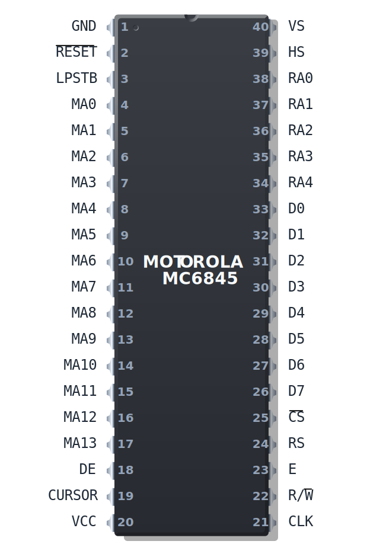
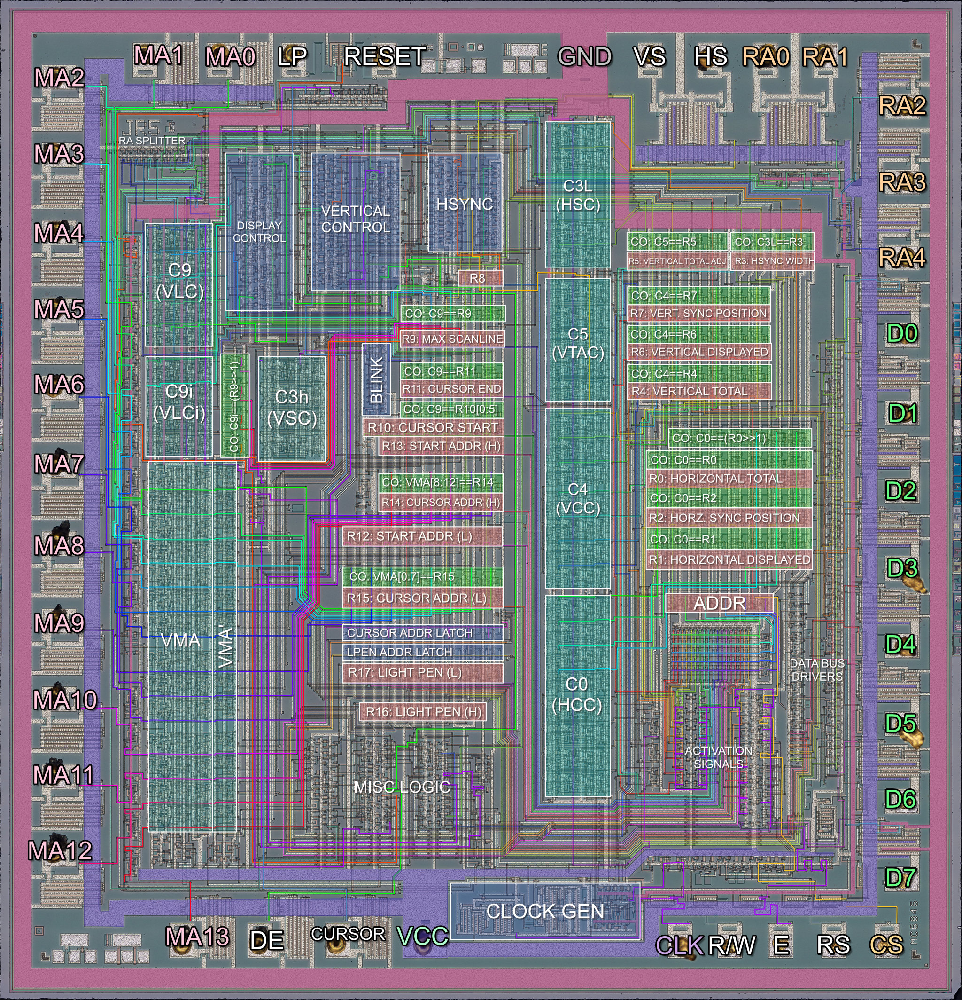
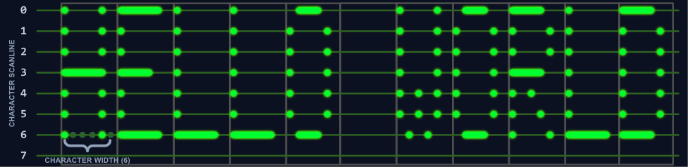
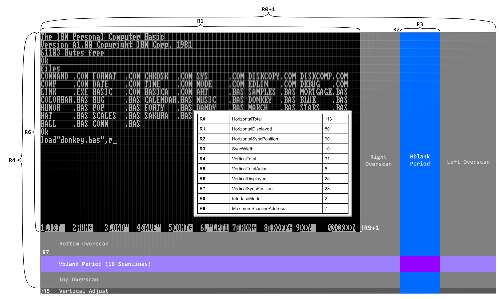

# The Motorola MC6845

  
  
<em>The Motorola MC6845</em>

The Motorola MC6845 is a **Cathode Ray Tube Controller** (CRTC). Its primary purpose is to generate video memory addresses and video synchronization signals as part of a larger raster display system. It contains a number of registers that together define a specific **video frame geometry**, and a number of counters that are incremented or decremented while being compared against the values stored in the register file. These comparisons happen continuously, via circuits attached to the registers themselves called **coincidence circuits**. That's just a fancy name for a simple equality comparator. 

You can see the coincidence circuits in the image below as the green boxes that sit above most of the pink registers.

  
  
<em>Motorola MC6845 Annotated Die Photo (Click to zoom)</em>

When certain counters **coincide** (become equal with) certain registers, various logic circuits may be triggered. For example, when the counter that holds the current character-column position becomes equal with the register that holds the total number of characters to be displayed, the MC6845 will indicate via an external pin that the display area has ended for the particular line. In this manner the MC6845 can produce the **display timing signals** corresponding to the configured frame geometry. 

As part of a video card or other display system, these signals trigger further logic on the card itself - for example, the `DE` or **Display Enable** pin, might be tied to logic that controls whether the video card outputs graphics data or emits a solid black color. The MC6845's `MA` pins will typically be used to address the video card's **video memory**.

## Character Cell Logic

The MC6845 is fundamentally designed to handle character-based or **text mode** displays. It assumes that your characters will all be of the same width and height, but they do not need to have exactly equal width and height. The MC6845 can handle characters up to 32 lines tall. In most implementations, a line from the MC6845's perspective is equal to a scanline on the monitor.

The rectangular bitmaps that define how characters appear on screen are called **character glyphs**. The MC6845 does not define any margins or spacing between glyphs - the requisite spacing must be encoded into the glyph bitmaps themselves. On the IBM PC, there is typically one pixel of spacing between each character, horizontally and vertically, but in certain circumstances a video card may override this. 

Here is a hypothetical example of a row of 6x8 character glyphs:

The MC6845 has no concept of how wide your character glyphs actually are. Most video standards for the PC will define a character that is either 8 or 9 pixels wide, usually producing a horizontal display resolution of `640` or `720` pixels when configured for an 80-column display. But you could have 64 pixel wide characters, or 4096 - the only limits are practicality and memory bandwidth. 

If we think about it, the MC6845 leaves us a lot of leeway to provide our own definition of what a 'character' even is. We could just as easily use the MC6845 to drive an array of LEDs. It is exactly this sort of flexible representation that allowed graphics vendors using the MC6845 to implement graphics modes on what was a fundamentally character-based chip. To learn more about how that was done, you'll need to read a chapter that discusses a specific card like the [IBM CGA](../display-graphics/cga.md).

The MC6845 has to draw every row of characters several times - as many times as the character height is defined in lines.  Each pass through a row draws the subsequent row of pixels of each character glyph. This is controlled by an internal counter **C9** (Vertical Line Counter), the contents of which are emitted on the CRTC's `RA` pins which in turn can be used to address an external **character (font) ROM**.

## Clocking the MC6845

The MC6845 receives a clock called the **character clock** which indicates how fast characters should go by on the screen, since that is what the MC6845 is managing. This is typically produced by taking the **dot clock** input of the card and dividing it by the current character width. 

For every new clock edge of the character clock, the MC6845 produces a memory address on its 14 `MA` address pins. 

## Memory Address Generation

The MC6845's address pins provide the address of the character that should be displayed at roughly that instant (ignoring rasterization latency). On each character clock, the internal memory address, a counter called `VMA`, is either incremented by one, reset, or set to a latched value, depending.

The address emitted by the MC6845 may not be a literal byte address. As discussed above, a `character address` can be interpreted liberally. In IBM CGA text mode, each character cell is a 16-bit value: pairs of ASCII **character codes** and CGA **attribute bytes**. The address may be further manipulated in other ways, sometimes using the `RA` counter - a common trick to create graphics modes.

## MC6845 Registers

The MC6845's register numbers are frequently given in either decimal or hexadecimal. Motorola's own references use decimal, so that is what we will use here.

| Index | Hex | Name     | Long Name                      | R/W | Size (Bits) |
| ----- | --- | ---------| ------------------------------ |-----| ----------- |
| -     | --- | **ADDR** | Address Register               | WO  | 5           |
| 0     | 00h | **R0**   | Horizontal Total               | WO  | 8           |
| 1     | 01h | **R1**   | Horizontal Displayed           | WO  | 8           |
| 2     | 02h | **R2**   | Horizontal Sync Position       | WO  | 8           |
| 3     | 03h | **R3**   | Sync Width                     | WO  | 4           |
| 4     | 04h | **R4**   | Vertical Total                 | WO  | 7           |
| 5     | 05h | **R5**   | Vertical Total Adjust          | WO  | 5           |
| 6     | 06h | **R6**   | Vertical Displayed             | WO  | 7           |
| 7     | 07h | **R7**   | Vertical Sync Position         | WO  | 7           |
| 8     | 08h | **R8**   | Interlace Mode and Skew        | WO  | 2           |
| 9     | 09h | **R9**   | Max Scan Line Address          | WO  | 5           |
| 10    | 0Ah | **R10**  | Cursor Start                   | WO  | 7           |
| 11    | 0Bh | **R11**  | Cursor End                     | WO  | 5           |
| 12    | 0Ch | **R12**  | Start Address (High)           | WO  | 6           |
| 13    | 0Dh | **R13**  | Start Address (Low)            | WO  | 8           |
| 14    | 0Eh | **R14**  | Cursor Address (High)          | RW  | 6           |
| 15    | 0Fh | **R15**  | Cursor Address (Low)           | RW  | 8           |
| 16    | 10h | **R16**  | Light Pen Latch Address (High) | RO  | 6           |
| 17    | 11h | **R17**  | Light Pen Latch Address (Low)  | RO  | 8           |

The MC6845 has two IO ports - an address port, and a data port. One should first select a register via the address port, which is done by holding the `RS` pin low. This is an electrical detail you are unlikely to need to emulate - the card on which the MC6845 has been included will decode a separate IO address for the MC6845's address and data register. See the chapter for the specific card you are emulating. From the CGA onwards, the CRTC registers are at `3D4h` and `3D5h`.

The address register, being 5 bits wide, will happily hold any value from 0-31, meaning an invalid selection may be stored. In this scenario, writing to the data register has no effect, and reading from the data register is ultimately implementation-specific but likely to return either 0x00 or 0xFF. The chapter for a specific card may have more details.

Most of the registers simply contain integer values, but pay close attention to their bit lengths, and perform the appropriate masking when writing to them.

Two exceptions to this rule are `R8`, which contains two flags relating to interlaced video, and `R10`, which contains two additional bits that control cursor blinking. Their formats are given here.

{{#bitfield mc6845_registers.toml#r8-interlace-mode}}

{{#bitfield mc6845_registers.toml#r10-cursor-start}}

Don't worry about the meaning of the fields in these registers just yet. The register definitions are provided here for completeness with the register table reference.

## MC6845 Counters

| Name   | Description                              | Bits | Compared to     |
|--------|------------------------------------------|------|-----------------|
| C0     | HCC (Horizontal Character Counter)       | 8    | R0,R1,R2        |
| C9     | VLC (Vertical Line Counter)              | 5    | R9,R10,R11      |
| C9.IVM | VLCi (Vertical Line Counter, Interlaced) | 4    | R9>>1           |
| C4     | VCC (Vertical Character Counter)         | 7    | R4,R6,R7        |
| C3h    | VSC (Vertical Sync Counter)              | 4    | Fixed: 16       |
| C3l    | HSC (Horizontal Sync Counter)            | 4    | R3              |
| C5     | VTAC (Vertical Total Adjust Counter)     | 5    | R5              |
| VMA    | Video Memory Address Counter             | 14   | R12,R13,R14,R15 |

The table above shows the various counter units on the MC6845. They will be largely referred to here by their names in the `Name` column.  If you read the source for other emulators, you may encounter names given in the `Description` column.  The new names for these counters come from the *Amstrad CPC CRTC Compendium*.

## Latches and Flags

The MC6845 has an important latch which is referred to as `VMA'` or **VMA Prime**. `VMA'` can be loaded with the value of the `VMA` counter, and the `VMA` counter can be loaded with either `VMA'` or the contents of the Start Address registers, `R12` and `R13`.

You can see the `VMA'` latch as the tall vertical section immediately to the right of the `VMA` counter in the die photo above.

Besides the `VMA'` latch, there are various bits of state that the MC6845 can keep as flags. These include a `last_line` flag.

## Defining a Frame

A **frame** is a single image displayed on a CRT monitor, typically delineated by VSYNC pulses. See [Display Concepts](./display-concepts.md) if this isn't already a familiar concept. The role of the MC6845 is managing the size and timings that define a single frame. The MC6845's registers define these parameters, and its counters are used to actually play out said timings - a process I will refer to as `scanout`. 

The most important concept to grasp when understanding how the MC6845 defines a frame is that it is not just defining the position and size of visible elements, but also timings for invisible events such as horizontal and vertical sync periods. It can be helpful to think of a MC6845 frame as a two dimensional time chart, or **field diagram** - this allows us to map areas where the raster beam may be moving around as simply a region of time. This book will often discuss this imaginary **display field**, and you may need to frequently refer back to this diagram for reference.

The diagram below demonstrates the typical parameters used to implement the standard 80x25 text mode display on an IBM CGA card.

  
  
<em>The CRTC Display Field Diagram (Click to zoom)</em>

### Frame Extents

The two-dimensional extents of the display field are defined by `R0` and `R4`.  They represent the width and height of the field, respectively, minus one. 

The extents of the display area are given by `R1` and `R6`. These contain the exact width and height of the display area. In the diagram above, you can see they are programmed for `80` and `25`, as expected.

The other parameters set up the positions (and sizes, where applicable) of the horizontal and vertical blanking/sync periods, which overlap each other, as several horizontal syncs will occur during vertical blanking. 

The rest of the screen is a sort of no-man's land we call the **overscan**. Some video cards will let you emit a solid color here. Not all cards have such large overscan areas.

It may not be possible to produce a screen using just a multiple of your character height that satisfies display requirements, such as NTSC's specification of 262 scanlines. For example, a field of 32 rows (`R4 == 31`), with 8 scanline tall characters, only produces 256 scanlines.  This may cause trouble with your monitor's vertical synchronization circuitry. Thus the register `R5` is provided to pad out the end of the frame by the indicated number of scanlines - in the above case, 6, until a full 262 scanlines are emitted.

### MC6845 Outputs

While still referring to the diagram, note that the MC6845 will raise its `HS` pin when it is within the blue `hblank` period. It will raise its `VS` pin when it is in the lighter blue `vblank` period. Both pins will be asserted when these periods intersect.

While the MC6845 is scanning out the region defined by `R1` and `R6`, it will assert its `DE` (Display Enable) pin, which should drive rasterization of text or graphics by the attached display system.

## Scanning out a Frame

The process of scanning out the frame or **display field** may be considered to start in the upper left corner of the display area.

`C0` and `C4`, our horizontal and vertical character counters will both be 0.
`C9`, our vertical line counter - indicating what row of a character we are drawing - will also be 0.

At the beginning of a frame, the MC6845 performs **Start-Of-Frame Management**.

### Start-Of-Frame Management

The `VMA` counter is loaded with the 14-bit start address taken from the `R12` and `R13` **start address** registers.
The `VMA'` latch is loaded with the same address at this time. Note that as `VMA` counts, `VMA'` retains the same value unless updated by some other event.

We will start in the active display area, so `DE` will be high. 

### Scanning out a Row

Every character clock, a number of comparisons are made that trigger various state changes. It may be helpful to think of these as occurring *before* the increment of any counter.

  - If `C0 == R1`, we leave the active display area and enter the right overscan period.
  - If `C0 == R2`, we enter the horizontal sync period, which we will gloss over for the moment.
  - If `C0 == R0`, we have reached the far end of the display field. 
    - If `C9 == R9`, we are on the last scanline of a row, in which case we enter **End-Of-Row Management**.
    - Otherwise, `C9` is incremented, `VMA` is updated with `VMA'` (to reset the memory address to the start of the row again), and the process repeats.

Each row is scanned out `R9 + 1` times. In our 80x25 text mode example, we can see that `R9` is **7**. Therefore each row will consist of **8** scanlines. 
    
### Frame Scanout, Visualized

The logic above for scanning out rows is repeated. During **End-Of-Row Management**, `C4` is incremented. When `C4 == R4` we have reached the end of the screen. At this point, if `R5` is nonzero, `C5` will be initialized with `R5` and the MC6845 will start scanning out `R5` scanlines in the **Vertical Total Adjust Period**. When this has elapsed, or if `R5` was zero, the frame ends and a new frame immediately begins.

You can see an animation of the full frame scanout process below, with certain internal counters visualized.

<video controls style="width: 100%;">
  <source src="../videos/crtc_scanout_01.mp4" type="video/mp4">
  Your browser does not support the video tag.
</video>

## Cursor Management

The MC6845 has a hardware cursor, with a dedicated `CURSOR` pin. This pin is typically active during character clocks when the current `VMA` matches the value configured by the **Cursor Address Registers (R14 & R15)** and the current value of `C9` is within the range defined by the **Cursor Start (R10)** and **Cursor End (R11)** registers.

The `CURSOR` signal will be suppressed for several frames for the same memory location as the cursor blinks off, unless blinking has been disabled. 

In a normal scenario, **Cursor Start** is programmed for a value less than **Cursor End**, and the cursor is drawn from the scanline represented by **Cursor Start** up to and including the scanline represented by **Cursor End**. If **Cursor Start** and **Cursor End** are equal, the cursor will be drawn for a single scanline.

The cursor on the IBM PC is usually two scanlines tall.

The cursor is typically configured to appear at the bottom of a character cell, but nothing prevents you from placing it at the top:

### Hiding the Cursor

There are three primary ways of hiding the cursor on a MC6845-based video card:
 
 - You can set the cursor address to a memory address outside of the current display area.
 - You can set the **Cursor Start** register to a value greater than `R9`. 
 - You can set the blink bits to `01` in the **Cursor Start** register.

### Cursor Tricks

Some odd things happen when you start playing around with non-standard configurations of cursor start and end. 

If you set the value of **Cursor End** > `R9`, then a full-block cursor is created.

More unexpectedly, if you configure **Cursor End** < **Cursor Start** < R9, you can get a "split" cursor:

The explanation for this behavior is really quite simple.  The MC6845 has an internal flag that we will call **Cursor Active** (`CA`). The cursor is not evaluated per character cell, it is evaluated per scanline. When we reach the end of each scanline while scanning out a row, the MC6845 checks if the new row scanline matches the value in **Cursor Start**. If it does, the `CA` flag is turned on. In a similar fashion, if the outgoing row scanline matches **Cursor End**, the `CA` flag is turned off.

What is important to understand here is that these comparisons against the cursor start and end are all that controls this global cursor flag. It is not reset upon VSYNC, or new frames. 

Let's reexamine the case of the solid block cursor.  By configuring **Cursor End** > `R9`, we ensure that the comparison that would otherwise turn the cursor off, can never be true. Therefore the `CA` flag is turned on, and stays on permanently. However, the cursor is only actually visible in the bounds of a single character cell when `VMA` matches the **Cursor Address**.

By making **Cursor End** < **Cursor Start** it should now be clear that this reverses or "inverts" the cursor definition. Instead of turning on and then off within a character row, it turns off and then on - remaining on as we proceed to the next row. In this sense, the cursor is now spanning across two rows at a time - it isn't "split" at all, it just appears that way given the limited aperture of a single character cell.

Ultimately, cursor visibility is a combination of `CA` **AND** `VMA == Cursor Address` **AND NOT** `blink`.

## Interlaced Mode

For most of the PC's history, the MC6845's interlaced mode was not used. On the IBM CGA, IBM even took measures to make sure it was nonfunctional. Only recently have demoscene coders started exploring the use of interlaced mode for various effects. This section will be expanded in the future.
