# The IBM Color Graphics Adapter

  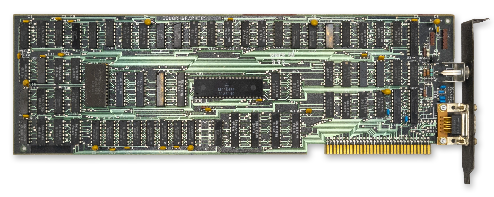
  
<em>The IBM CGA card</em>

The IBM Color Graphics Adapter (CGA) was one of the first video adapters available for the IBM PC, along with the IBM Monochrome Display Adapter and the third-party Hercules video adapter. It is perhaps the classic video card that comes to mind when people think of the IBM PC.

> [!IMPORTANT] 
> Like the MDA, the CGA is built around the [Motorola MC6845 CRTC](6845.md). Read that chapter first for a basic understanding of how the CRTC is used to define frame geometry and draw the screen.

## At a Glance

| Item                    | Description                                      |
| ----------------------- | ------------------------------------------------ |
| Video memory            | **16KiB** at `B800:0000`; mirrored at `BC00:0000` |
| Expansion ROM           | None                                             |
| Font ROM                | **8KiB** character generator ROM                  |
| Main display outputs    | TTL RGBI on DE-9; NTSC composite video jack      |
| Typical text modes      | **40x25** and **80x25**, 16 colors, 8x8 character cell|
| Standard graphics modes | **320x200**, 4 colors; **640x200**, 2 colors     |
| Standard resolution     | **640x200** @ 60Hz                               |
| Field Resolution        | **912x262**                                      |
| I/O address range       | `3D0h`-`3DFh`                                    |
| CRTC address port       | `3D4h` standard, `3D0h`, `3D2h`, `3D6h` alternate*|
| CRTC data port          | `3D5h` standard, `3D1h`, `3D3h`, `3D7h` alternate*|
| CGA control ports       | `3D8h` mode control, `3D9h` color control        |
| CGA status port         | `3DAh`                                           |
| Light pen latch ports   | `3DBh` clear latch, `3DCh` preset latch          |
| Interrupts              | None                                             |
| DMA                     | None                                             |

The CGA could be connected to a regular North American television set via its composite output connector, although most sets of the time would require an [RF modulator](https://en.wikipedia.org/wiki/RF_modulator) to do so. A [DE-9](https://en.wikipedia.org/wiki/DE9) connector provided a digital RGBI signal that could be used with an IBM 5153 Color Display. IBM left owners of the CGA waiting a bit for that particular monitor - it was only released in 1983, two years after the CGA's debut.

The CGA has 16KiB of DRAM dedicated to video memory, and an 8KiB font ROM that holds bit patterns for drawing text glyphs.

The CGA's 16KiB of DRAM at segment `B800:0` is incompletely decoded, causing a mirror of video memory that begins at `BC00:0`. You can use this mirroring to your advantage in certain circumstances.

The CGA has no on-board *video BIOS* or expansion ROM. All PC-compatible BIOS implementations must therefore know how to identify, initialize and operate a CGA card in order to provide standard [int 10h](https://en.wikipedia.org/wiki/INT_10H) services.

In text mode, the CGA card was capable of outputting 16 colors. In graphics mode, it was limited to 3 palettes of 3 fixed colors each, with a selectable background color. The CGA also had a high-resolution mode, with a single, selectable foreground color on black.

The CGA's standard display resolution is **640x200** at a refresh rate of approximately **60Hz**.

The CGA maps the [MC6845's two external registers](6845.md#mc6845-registers) at address `03D4h` for the address register and `03D5h` for the data register. 

> [!NOTE]
> **\*** Incomplete decoding of the CRTC registers means the two CRTC ports are repeated four times. At least one known game, [Prohibition](https://www.mobygames.com/game/18785/prohibition/), relies on this incomplete decoding.

## Operational Modes

The CGA has three primary modes of operation: text mode, medium-resolution graphics mode, and high-resolution graphics mode. A brief overview of each mode follows; each will be covered in greater depth later on.

### Text Mode

In text mode, the screen is constructed from a grid of *character glyphs*. IBM called this mode *Alphanumeric Mode (A/N)* in documentation.

The IBM PC boots into text mode, either in *40-column* or *80-column* mode depending on how certain DIP switches are set. 40-column mode makes each glyph twice as wide due to a halved *dot clock*. It was primarily intended for use with television sets, on which 80-column text was difficult to read. Various tweaked text modes were derived by inventive coders over the years that provided a different number of rows and columns, so these extents are not set in stone.

The standard text modes have black and white and color mode variants, although this typically only controls color when using the composite output.
The background and foreground color of each character cell can be controlled via *attribute bytes*.

In text mode, a blinking, hardware cursor is usually shown indicating where the user can type - or if the programmer doesn't bother hiding it, where the screen was last updated.

  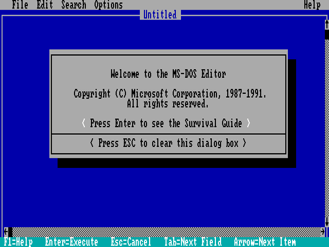
  
<em>CGA 80-column text mode - MS-DOS 5.0 EDIT</em>

### Medium Resolution Graphics Mode

In medium-resolution graphics mode, the screen is composed of a 320x200 grid of pixels. IBM called graphics mode *All-Points-Addressable (APA)* mode.

This is perhaps the most famous mode of the CGA, especially its cyan-magenta-white palette as seen in games like [Alley Cat](https://www.mobygames.com/game/190/alley-cat/).

In this mode, three basic 'palettes' are available, two of which are notorious for being ugly. These are not actually palettes as they are typically understood - more on that below. What might be thought of as index `0`, specifies the background color. The background color is usually black, but can actually be chosen from any of the CGA's 16 possible colors. Careful use of this "extra" palette entry can create interesting effects that also extend into the borders (or *overscan*) of the screen. Games could use this color to indicate status, such as flashing it red to indicate your player character had taken damage. The color would create a frame around the addressable display area that could have a surprisingly dramatic effect.

The cursor is disabled in this mode.

  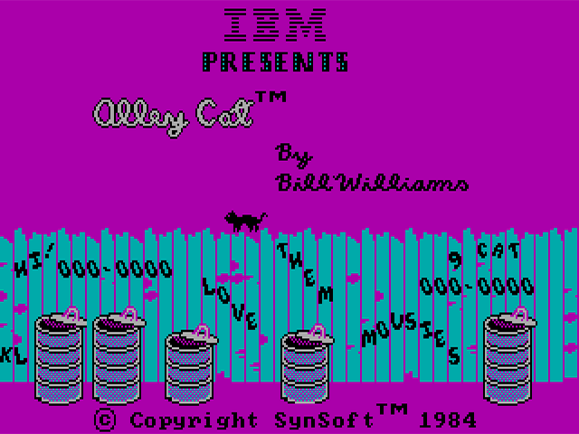
  
<em>CGA 320x200 graphics mode - Alley Cat by Bill Williams</em>

### High Resolution Graphics Mode

This mode provides a very stretched 640x200 monochromatic graphics mode. The foreground color used to draw can be selected from any of the 16 available CGA colors, but the background cannot be changed from black. This mode can be used, with the color burst turned on, to enable 16-color *composite artifact color* modes.

The cursor is disabled in this mode.

  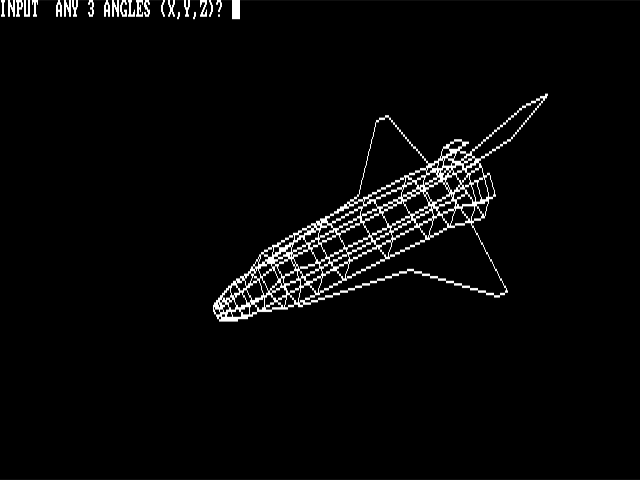
  
<em>CGA 640x200 graphics mode - SHUTTLE.BAS</em>

## The RGBI Color Gamut

The CGA has a digital DE-9 output connector. To produce color, the CGA controls four output pins — one for each of the primary colors: Red, Green, and Blue, along with an "intensity" signal. Four bits give us \\(2^4\\) or **16** possible colors. The intensity pin provides a repeat of the first eight colors, but brighter. 

The odd duck out here is non-intensified yellow, which has been conspicuously darkened to become brown. This was a deliberate decision by IBM, who perhaps found the rather sickly dim yellow unpleasant, or at least believed that a brown color would be more useful. Speculation abounds, but the interesting thing to note is that the conversion circuit to turn yellow into brown is not actually present on the CGA at all - the circuitry is within the **IBM 5153 Color Display** itself, and third party PC-compatible monitor manufacturers largely followed suit. You may see the original yellow color instead on some non-CGA compatible monitors.

<!-- cSpell:disable -->
<table>
	<thead>
		<tr>
			<th>Decimal</th>
			<th>R</th>
			<th>G</th>
			<th>B</th>
			<th>I</th>
			<th>Color</th>
			<th>Hex</th>
		</tr>
	</thead>
	<tbody>
		<tr>
			<td>0</td>
			<td>0</td>
			<td>0</td>
			<td>0</td>
			<td>0</td>
			<td style="background-color: #000000; width: 50px;">&nbsp;</td>
			<td>000000</td>
		</tr>
		<tr>
			<td>1</td>
			<td>0</td>
			<td>0</td>
			<td>1</td>
			<td>0</td>
			<td style="background-color: #0000AA; width: 50px;">&nbsp;</td>
			<td>0000AA</td>
		</tr>
		<tr>
			<td>2</td>
			<td>0</td>
			<td>1</td>
			<td>0</td>
			<td>0</td>
			<td style="background-color: #00AA00; width: 50px;">&nbsp;</td>
			<td>00AA00</td>
		</tr>
		<tr>
			<td>3</td>
			<td>0</td>
			<td>1</td>
			<td>1</td>
			<td>0</td>
			<td style="background-color: #00AAAA; width: 50px;">&nbsp;</td>
			<td>00AAAA</td>
		</tr>
		<tr>
			<td>4</td>
			<td>1</td>
			<td>0</td>
			<td>0</td>
			<td>0</td>
			<td style="background-color: #AA0000; width: 50px;">&nbsp;</td>
			<td>AA0000</td>
		</tr>
		<tr>
			<td>5</td>
			<td>1</td>
			<td>0</td>
			<td>1</td>
			<td>0</td>
			<td style="background-color: #AA00AA; width: 50px;">&nbsp;</td>
			<td>AA00AA</td>
		</tr>
		<tr>
			<td>6</td>
			<td>1</td>
			<td>1</td>
			<td>0</td>
			<td>0</td>
			<td style="background-color: #AA5500; width: 50px;">&nbsp;</td>
			<td>AA5500</td>
		</tr>
		<tr>
			<td>7</td>
			<td>1</td>
			<td>1</td>
			<td>1</td>
			<td>0</td>
			<td style="background-color: #AAAAAA; width: 50px;">&nbsp;</td>
			<td>AAAAAA</td>
		</tr>
		<tr>
			<td>8</td>
			<td>0</td>
			<td>0</td>
			<td>0</td>
			<td>1</td>
			<td style="background-color: #555555; width: 50px;">&nbsp;</td>
			<td>555555</td>
		</tr>
		<tr>
			<td>9</td>
			<td>0</td>
			<td>0</td>
			<td>1</td>
			<td>1</td>
			<td style="background-color: #5555FF; width: 50px;">&nbsp;</td>
			<td>5555FF</td>
		</tr>
		<tr>
			<td>10</td>
			<td>0</td>
			<td>1</td>
			<td>0</td>
			<td>1</td>
			<td style="background-color: #55FF55; width: 50px;">&nbsp;</td>
			<td>55FF55</td>
		</tr>
		<tr>
			<td>11</td>
			<td>0</td>
			<td>1</td>
			<td>1</td>
			<td>1</td>
			<td style="background-color: #55FFFF; width: 50px;">&nbsp;</td>
			<td>55FFFF</td>
		</tr>
		<tr>
			<td>12</td>
			<td>1</td>
			<td>0</td>
			<td>0</td>
			<td>1</td>
			<td style="background-color: #FF5555; width: 50px;">&nbsp;</td>
			<td>FF5555</td>
		</tr>
		<tr>
			<td>13</td>
			<td>1</td>
			<td>0</td>
			<td>1</td>
			<td>1</td>
			<td style="background-color: #FF55FF; width: 50px;">&nbsp;</td>
			<td>FF55FF</td>
		</tr>
		<tr>
			<td>14</td>
			<td>1</td>
			<td>1</td>
			<td>0</td>
			<td>1</td>
			<td style="background-color: #FFFF55; width: 50px;">&nbsp;</td>
			<td>FFFF55</td>
		</tr>
		<tr>
			<td>15</td>
			<td>1</td>
			<td>1</td>
			<td>1</td>
			<td>1</td>
			<td style="background-color: #FFFFFF; width: 50px;">&nbsp;</td>
			<td>FFFFFF</td>
		</tr>
	</tbody>
</table>
<!-- cSpell:enable -->

In text mode, any of these sixteen colors can be referenced within a *character attribute byte*.

In graphics modes, the CGA operates in what we might term *direct color* mode, where the bits set in video memory directly influence the Red and Green output pins.

The CGA only has one true palette register as we typically define one, as in a register that holds an arbitrary color. It is the background/overscan color field in the [Color Control Register](#color-control-register).

## The CGA Registers

{{#bitfield h3 cga_registers.toml#mode-control-register}}

The **CGA Mode Register** generates the main control signals that drive the logic of the card. Most descriptions of what these bits do, even in IBM's own references, only give you an approximation of their actual function. To enter a standard graphics mode, besides reprogramming the CRTC, the correct mode bits must be set. 

- The **HIRES** bit enables the 14.31818MHz dot clock and high-resolution character clock for 80-column text mode. It should not be used in conjunction with the **GFX** or **HIRES_GFX** bits.
- The **GFX** bit enables graphics mode, and triggers replacement of memory address `A13` with `RA0`; a further explanation is given in the [medium-resolution graphics section](#medium-resolution-graphics-mode-1).
- The **B/W** bit disables the **composite color burst**. It will produce a black and white or grayscale image on a composite monitor or television set. RGBI displays such as the IBM 5153 Color Display will still display color as normal with this bit set, although a third graphics palette can be selected via this bit in medium-resolution graphics mode.
- The **VIDEO** bit is described by IBM as disabling the video signal - **this is not accurate**. This bit pulls low the \\(\overline{\mathrm{CLR}}\\) pins of the CGA's graphics serializers, U7 and U8. The effect of this is the appearance that all video memory contains `0`.  This often does result in a black screen, but where conditions allow display of color, such as the border/overscan color being set, color will still be displayed.
- The **HIRES_GFX** bit enables logic on the card to rapidly enable and disable the CGA's **color multiplexers**. This bit should not be used in conjunction with **HIRES** or the text on the screen will become corrupted.

There are several combinations of mode bits that are invalid, and may have strange and interesting effects.

| Mode Bits | Display Mode | Effect                                    |
| --------- | ------------ | ----------------------------------------- |
| `00100`   | Mode 0       | 40-Column, B/W Text Mode                  |
| `00000`   | Mode 1       | 40-Column, Color Text Mode                |
| `00101`   | Mode 2       | 80-Column, B/W Text Mode                  |
| `00001`   | Mode 3       | 80-Column, Color Text Mode                |
| `00011`   | invalid      | Glitched mode: "Text and Graphics"        |
| `00010`   | Mode 4       | 320x200 Graphics Mode                     |
| `00110`   | Mode 5       | 320x200 Graphics Mode (Alternate Palette) |
| `10110`   | Mode 6       | 640x200 Graphics Mode                     |
| `10001`   | Invalid      | Glitched mode: Text Mode with black bars  | 

{{#bitfield cga_registers.toml#color-control-register}}

The **color control** (or **color select**) register contains the CGA's only real color palette entry - an RGBI color may be specified that provides the background/overscan color.  This color definition has three distinct use cases - in text mode, it provides the border/overscan color. In medium-resolution graphics mode, it provides the color to use when a pair of bits are both `0`, in addition to providing the border/overscan color. In high-resolution graphics mode, it controls the color used to represent `1` pixels. Note that I have deliberately avoided calling this the "foreground color". See the section on high-resolution graphics mode for the reason why.

The *overscan* or *border* is an infamously large area around the visible or *active display area* of the IBM CGA. Here is a fairly accurate representation of its extents on an IBM 5153 monitor. If you look closely, you can even see the command that has just set the overscan color to cyan:

  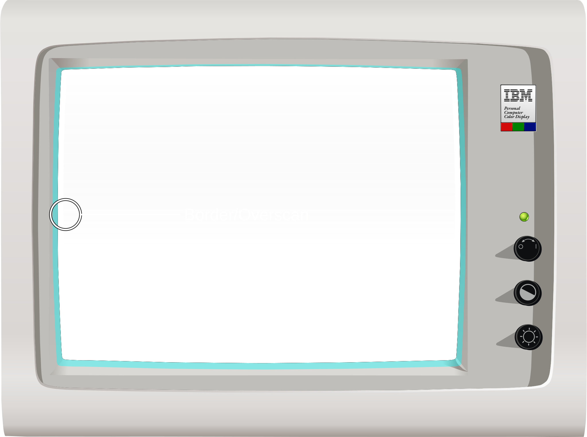
  
<em>The CGA overscan/border region, set to cyan via the CC register (Click to Zoom)</em>

The other two bits in the color control register, **PAL_I** and **PAL_B**, provide the **intensity** and **blue** components of all colors generated in medium-resolution graphics mode. They effectively select from four different color gamuts.

{{#bitfield cga_registers.toml#status-register}}

The CGA **status register** contains two essential bits for synchronizing graphics with the display. Bit `0`, \\(\overline{\mathrm{DE}}\\), is the inverted `DE` pin from MC6845. Therefore it will be `0` when the MC6845 is scanning across the active display area, when the native `DE` pin is `1`.  

Bit `3`, **VR**, is the non-inverted `VS` pin from MC6845 latched on the next **hclock**. When **VR** is `1` we are in the MC6845's *vertical blanking* period. Note that, unless some serious CRTC abuse is occurring, \\(\overline{\mathrm{DE}}\\) will always be `1` when **VR** is `1`.

The CGA's memory access and rasterization latency produces one character of *display enable skew*. Therefore, \\(\overline{\mathrm{DE}}\\) will flip to `0` one character clock before the CGA starts drawing the active display area, and will flip back to `1` one character clock before the end of the active display area is drawn. 

The following diagram may help clarify the values of these two status bits at different points on the screen:

  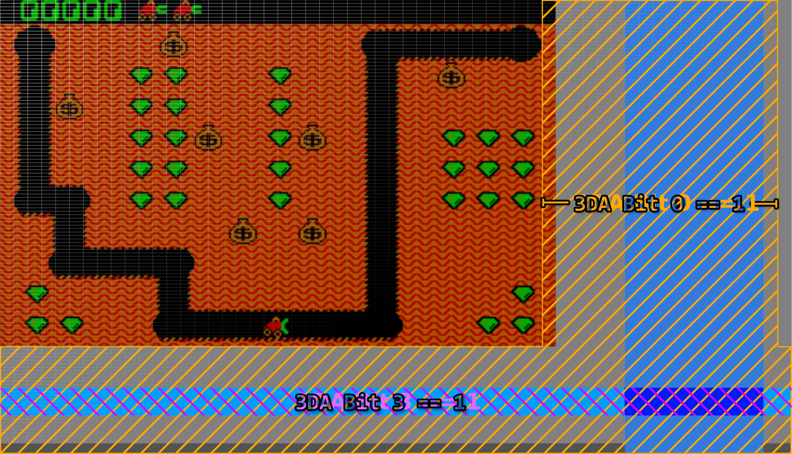
  
<em>A visualization of the /DE and VR bits in the CGA Status Register (Click to Zoom)</em>

The two other bits in the CGA status register concern themselves with light pen operation. 
 - The **LPT** bit is the state of the *light pen strobe* trigger. The term *trigger* can evoke the sense of a physical trigger or button on the light pen, but this is not the case. The light pen trigger is fired when the **photodiode** within the attached light pen detects light (the *strobe*) from the CRT raster beam. When this bit is `1`, the MC6845's *light pen latch* registers should contain the valid approximate position of the light pen. This bit is latched via a flip-flop on the CGA, and will remain set indefinitely unless cleared by writing any value to port `3DBh`, after which a new strobe trigger may fire and a new light-pen position latched by the MC6845. The strobe trigger may be manually fired without input from the pen by writing to port `3DCh`.  It is possible to crudely determine the current raster position of the display with this method, but it is highly unreliable. Even so, it didn't stop games like [Jungle Hunt](https://www.mobygames.com/game/133/jungle-king/) from using it to perform mid-frame palette swaps.

 - The **LPS** bit is the immediate state of any switch connected to the light pen header's switch pin. The light pen switch signal is *active-low*, explaining why this bit is logically reversed. This is simply the immediate state of any switch present on the light pen - this switch may be at the tip of the pen on high-quality light pens. The switch is typically used for taking actions such as initiating a drawing operation. IBM's documentation warns us that this signal is not debounced in any way, but a high quality pen should debounce the switch for us.

## Text Mode

In text mode, video memory is organized conceptually as a grid of *character cells*. The dimensions of this grid are directly configured on the CRTC, and are typically 80x25. Each logical cell consists of a pair of bytes in video memory, the first byte being a *character code* and the second byte being a *character attribute*. 

The character code, combined with the vertical line counter of the CRTC, is used to resolve a byte contained in the CGA's *font ROM* representing 8 pixels (or *span*) of a character glyph. You can see the standard CGA character glyphs below.

### CGA Character Glyphs (Standard Font)

<!-- cSpell:disable -->

<table class="cga-ascii-table">
	<tr>		<th class="corner" aria-hidden="true"></th>		<th scope="col">0</th>		<th scope="col">1</th>		<th scope="col">2</th>		<th scope="col">3</th>		<th scope="col">4</th>		<th scope="col">5</th>		<th scope="col">6</th>		<th scope="col">7</th>		<th scope="col">8</th>		<th scope="col">9</th>		<th scope="col">A</th>		<th scope="col">B</th>		<th scope="col">C</th>		<th scope="col">D</th>		<th scope="col">E</th>		<th scope="col">F</th>	</tr>
	<tr>		<th scope="row">0</th>		<td class="glyph-cell"></td>		<td class="glyph-cell"></td>		<td class="glyph-cell"></td>		<td class="glyph-cell"></td>		<td class="glyph-cell"></td>		<td class="glyph-cell"></td>		<td class="glyph-cell"></td>		<td class="glyph-cell"></td>		<td class="glyph-cell"></td>		<td class="glyph-cell"></td>		<td class="glyph-cell"></td>		<td class="glyph-cell"></td>		<td class="glyph-cell"></td>		<td class="glyph-cell"></td>		<td class="glyph-cell"></td>		<td class="glyph-cell"></td>	</tr>
	<tr>		<th scope="row">1</th>		<td class="glyph-cell"></td>		<td class="glyph-cell"></td>		<td class="glyph-cell"></td>		<td class="glyph-cell"></td>		<td class="glyph-cell"></td>		<td class="glyph-cell"></td>		<td class="glyph-cell"></td>		<td class="glyph-cell"></td>		<td class="glyph-cell"></td>		<td class="glyph-cell"></td>		<td class="glyph-cell"></td>		<td class="glyph-cell"></td>		<td class="glyph-cell"></td>		<td class="glyph-cell"></td>		<td class="glyph-cell"></td>		<td class="glyph-cell"></td>	</tr>
	<tr>		<th scope="row">2</th>		<td class="glyph-cell"></td>		<td class="glyph-cell"></td>		<td class="glyph-cell"></td>		<td class="glyph-cell"></td>		<td class="glyph-cell"></td>		<td class="glyph-cell"></td>		<td class="glyph-cell"></td>		<td class="glyph-cell"></td>		<td class="glyph-cell"></td>		<td class="glyph-cell"></td>		<td class="glyph-cell"></td>		<td class="glyph-cell"></td>		<td class="glyph-cell"></td>		<td class="glyph-cell"></td>		<td class="glyph-cell"></td>		<td class="glyph-cell"></td>	</tr>
	<tr>		<th scope="row">3</th>		<td class="glyph-cell"></td>		<td class="glyph-cell"></td>		<td class="glyph-cell"></td>		<td class="glyph-cell"></td>		<td class="glyph-cell"></td>		<td class="glyph-cell"></td>		<td class="glyph-cell"></td>		<td class="glyph-cell"></td>		<td class="glyph-cell"></td>		<td class="glyph-cell"></td>		<td class="glyph-cell"></td>		<td class="glyph-cell"></td>		<td class="glyph-cell"></td>		<td class="glyph-cell"></td>		<td class="glyph-cell"></td>		<td class="glyph-cell"></td>	</tr>
	<tr>		<th scope="row">4</th>		<td class="glyph-cell"></td>		<td class="glyph-cell"></td>		<td class="glyph-cell"></td>		<td class="glyph-cell"></td>		<td class="glyph-cell"></td>		<td class="glyph-cell"></td>		<td class="glyph-cell"></td>		<td class="glyph-cell"></td>		<td class="glyph-cell"></td>		<td class="glyph-cell"></td>		<td class="glyph-cell"></td>		<td class="glyph-cell"></td>		<td class="glyph-cell"></td>		<td class="glyph-cell"></td>		<td class="glyph-cell"></td>		<td class="glyph-cell"></td>	</tr>
	<tr>		<th scope="row">5</th>		<td class="glyph-cell"></td>		<td class="glyph-cell"></td>		<td class="glyph-cell"></td>		<td class="glyph-cell"></td>		<td class="glyph-cell"></td>		<td class="glyph-cell"></td>		<td class="glyph-cell"></td>		<td class="glyph-cell"></td>		<td class="glyph-cell"></td>		<td class="glyph-cell"></td>		<td class="glyph-cell"></td>		<td class="glyph-cell"></td>		<td class="glyph-cell"></td>		<td class="glyph-cell"></td>		<td class="glyph-cell"></td>		<td class="glyph-cell"></td>	</tr>
	<tr>		<th scope="row">6</th>		<td class="glyph-cell"></td>		<td class="glyph-cell"></td>		<td class="glyph-cell"></td>		<td class="glyph-cell"></td>		<td class="glyph-cell"></td>		<td class="glyph-cell"></td>		<td class="glyph-cell"></td>		<td class="glyph-cell"></td>		<td class="glyph-cell"></td>		<td class="glyph-cell"></td>		<td class="glyph-cell"></td>		<td class="glyph-cell"></td>		<td class="glyph-cell"></td>		<td class="glyph-cell"></td>		<td class="glyph-cell"></td>		<td class="glyph-cell"></td>	</tr>
	<tr>		<th scope="row">7</th>		<td class="glyph-cell"></td>		<td class="glyph-cell"></td>		<td class="glyph-cell"></td>		<td class="glyph-cell"></td>		<td class="glyph-cell"></td>		<td class="glyph-cell"></td>		<td class="glyph-cell"></td>		<td class="glyph-cell"></td>		<td class="glyph-cell"></td>		<td class="glyph-cell"></td>		<td class="glyph-cell"></td>		<td class="glyph-cell"></td>		<td class="glyph-cell"></td>		<td class="glyph-cell"></td>		<td class="glyph-cell"></td>		<td class="glyph-cell"></td>	</tr>
	<tr>		<th scope="row">8</th>		<td class="glyph-cell"></td>		<td class="glyph-cell"></td>		<td class="glyph-cell"></td>		<td class="glyph-cell"></td>		<td class="glyph-cell"></td>		<td class="glyph-cell"></td>		<td class="glyph-cell"></td>		<td class="glyph-cell"></td>		<td class="glyph-cell"></td>		<td class="glyph-cell"></td>		<td class="glyph-cell"></td>		<td class="glyph-cell"></td>		<td class="glyph-cell"></td>		<td class="glyph-cell"></td>		<td class="glyph-cell"></td>		<td class="glyph-cell"></td>	</tr>
	<tr>		<th scope="row">9</th>		<td class="glyph-cell"></td>		<td class="glyph-cell"></td>		<td class="glyph-cell"></td>		<td class="glyph-cell"></td>		<td class="glyph-cell"></td>		<td class="glyph-cell"></td>		<td class="glyph-cell"></td>		<td class="glyph-cell"></td>		<td class="glyph-cell"></td>		<td class="glyph-cell"></td>		<td class="glyph-cell"></td>		<td class="glyph-cell"></td>		<td class="glyph-cell"></td>		<td class="glyph-cell"></td>		<td class="glyph-cell"></td>		<td class="glyph-cell"></td>	</tr>
	<tr>		<th scope="row">A</th>		<td class="glyph-cell"></td>		<td class="glyph-cell"></td>		<td class="glyph-cell"></td>		<td class="glyph-cell"></td>		<td class="glyph-cell"></td>		<td class="glyph-cell"></td>		<td class="glyph-cell"></td>		<td class="glyph-cell"></td>		<td class="glyph-cell"></td>		<td class="glyph-cell"></td>		<td class="glyph-cell"></td>		<td class="glyph-cell"></td>		<td class="glyph-cell"></td>		<td class="glyph-cell"></td>		<td class="glyph-cell"></td>		<td class="glyph-cell"></td>	</tr>
	<tr>		<th scope="row">B</th>		<td class="glyph-cell"></td>		<td class="glyph-cell"></td>		<td class="glyph-cell"></td>		<td class="glyph-cell"></td>		<td class="glyph-cell"></td>		<td class="glyph-cell"></td>		<td class="glyph-cell"></td>		<td class="glyph-cell"></td>		<td class="glyph-cell"></td>		<td class="glyph-cell"></td>		<td class="glyph-cell"></td>		<td class="glyph-cell"></td>		<td class="glyph-cell"></td>		<td class="glyph-cell"></td>		<td class="glyph-cell"></td>		<td class="glyph-cell"></td>	</tr>
	<tr>		<th scope="row">C</th>		<td class="glyph-cell"></td>		<td class="glyph-cell"></td>		<td class="glyph-cell"></td>		<td class="glyph-cell"></td>		<td class="glyph-cell"></td>		<td class="glyph-cell"></td>		<td class="glyph-cell"></td>		<td class="glyph-cell"></td>		<td class="glyph-cell"></td>		<td class="glyph-cell"></td>		<td class="glyph-cell"></td>		<td class="glyph-cell"></td>		<td class="glyph-cell"></td>		<td class="glyph-cell"></td>		<td class="glyph-cell"></td>		<td class="glyph-cell"></td>	</tr>
	<tr>		<th scope="row">D</th>		<td class="glyph-cell"></td>		<td class="glyph-cell"></td>		<td class="glyph-cell"></td>		<td class="glyph-cell"></td>		<td class="glyph-cell"></td>		<td class="glyph-cell"></td>		<td class="glyph-cell"></td>		<td class="glyph-cell"></td>		<td class="glyph-cell"></td>		<td class="glyph-cell"></td>		<td class="glyph-cell"></td>		<td class="glyph-cell"></td>		<td class="glyph-cell"></td>		<td class="glyph-cell"></td>		<td class="glyph-cell"></td>		<td class="glyph-cell"></td>	</tr>
	<tr>		<th scope="row">E</th>		<td class="glyph-cell"></td>		<td class="glyph-cell"></td>		<td class="glyph-cell"></td>		<td class="glyph-cell"></td>		<td class="glyph-cell"></td>		<td class="glyph-cell"></td>		<td class="glyph-cell"></td>		<td class="glyph-cell"></td>		<td class="glyph-cell"></td>		<td class="glyph-cell"></td>		<td class="glyph-cell"></td>		<td class="glyph-cell"></td>		<td class="glyph-cell"></td>		<td class="glyph-cell"></td>		<td class="glyph-cell"></td>		<td class="glyph-cell"></td>	</tr>
	<tr>		<th scope="row">F</th>		<td class="glyph-cell"></td>		<td class="glyph-cell"></td>		<td class="glyph-cell"></td>		<td class="glyph-cell"></td>		<td class="glyph-cell"></td>		<td class="glyph-cell"></td>		<td class="glyph-cell"></td>		<td class="glyph-cell"></td>		<td class="glyph-cell"></td>		<td class="glyph-cell"></td>		<td class="glyph-cell"></td>		<td class="glyph-cell"></td>		<td class="glyph-cell"></td>		<td class="glyph-cell"></td>		<td class="glyph-cell"></td>		<td class="glyph-cell"></td>	</tr>
</table>

<!-- cSpell:enable -->

The standard CGA font implements [IBM Code Page 437](https://en.wikipedia.org/wiki/Code_page_437). The vast majority of CGA cards were shipped with this font ROM, however there were variants sold for the international market that contained alternate code pages.[^1]

The CGA ostensibly provides a second "thin" font selectable by a jumper, but on most examples of the IBM CGA this jumper is not populated on the PCB, requiring some soldering to actually utilize. Why IBM changed their mind about making this font user-selectable is up for debate. However, an emulator author can certainly choose to make the font more easily selectable.

A visualization of the character font ROM is shown below, with bytes reversed and wrapping vertically to fit into a square image. The first half of the ROM is dedicated to the MDA's 8x14 font, each glyph of which is split into two parts. The latter half of the ROM consists of the 'hidden' thin font, followed by the standard CGA font.

  
  
<em>The MDA/CGA character font ROM (byte-reversed)</em>

The character font ROM is not accessible from the host PC. It can only be read by the CGA itself. `int 10h` services include routines for drawing text in graphics modes - to accomplish this, a copy of the standard CGA font is present in the IBM PC BIOS as well. 

{{#bitfield h3 attribute_byte.toml#attribute-byte}}

The *character attribute byte* defines the foreground and background colors the CGA should use when rendering a glyph. The lower four bits provide the color to paint `1` bits which represent the foreground in the raw data from the font ROM. The upper three or four bits provide the color to paint `0` bits which represent the background. Bit `7` is a bit special - the CGA has an optional mode that enables *text blinking*.  When this mode is enabled, bit `7` of the attribute byte controls whether the text blinks or not. This means that only three bits are now available for the background color, so backgrounds are limited to the first 8 "darker" shades when blinking is enabled. See the section on text blinking for more information.

  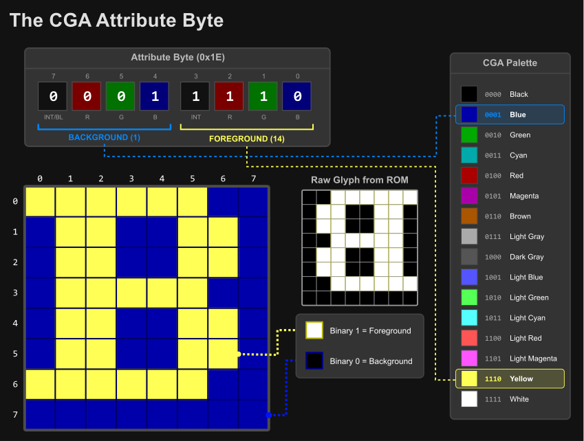
  
<em>CGA attribute byte visualization</em>

Since each character cell has a character code and attribute byte, each character takes one 16-bit word of memory. Thus it takes 4KiB of memory to display a single 80x25 text mode screen. This means up to four text-mode screens can fit in the CGA's 16KiB of memory, and a program can switch between each screen by adjusting the CRTC's start address registers. 

When multiple screens can be fit into video memory, they are called *video pages*. Switching between video pages is referred to as *page-switching* or *page-flipping* when used for fast animation, but there are many other uses - a help page could be stored separately from a text editor's main interface, allowing the program to switch to the help screen and back without having to redraw either page.

Alternatively, a single large screen of up to 80x100 could be stored in memory and the visible 80x25 region panned or *scrolled* down through it by adjusting the start address registers one row at a time.

### Cursor Blinking

The Motorola MC6845 CRTC provides a dedicated **CURSOR** pin and internally handles blinking at a rate of either 16 (8 frames on, 8 frames off) or 32 fields (16 frames on, 16 frames off). It is possible to configure the MC6845 to disable blinking entirely, which would normally leave a solid, static cursor, and indeed, this is how the IBM PC BIOS configures the MC6845 by default. The cursor blinks anyway, because the CGA card has its own independent blinking logic which is combined with the **CURSOR** signal from the MC6845. 

The CGA's blink logic is implemented as two 4-bit binary counters, tied to the VSYNC output of the MC6845 as seen below. The \\(\overline{\mathrm{CURSOR\\_BLINK}}\\) signal controls the cursor blinking rate, and will always blink at a rate of 16 fields, equivalent to the normal blink rate of the MC6845.  The \\(\overline{\mathrm{BLINK}}\\) signal controls [text blinking](#text-blinking) and blinks at half the rate due to being output from the next bit of the binary counter chain. 

  
  
<em>CGA blink signal generation</em>

If the MC6845 is configured for normal blink timings, the CGA's blink logic will match it perfectly. If the 'slow' blink rate is selected, then the CGA's blink logic and the MC6845's blink logic will be out of phase; when these signals are effectively AND'd together, the cursor will blink off twice as long as it will blink on:

  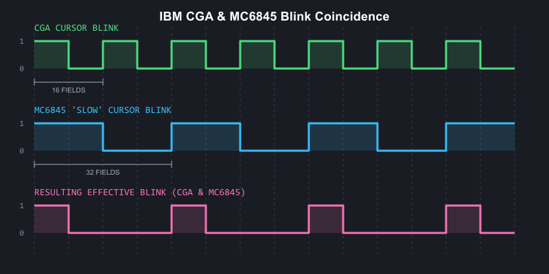
  
<em>CGA and MC6845 blink coincidence visualized</em>

Besides blinking, the cursor can be disabled a number of ways, or even 'split' into two sections. See the [MC6845 chapter's section on cursor tricks](./6845.md#cursor-tricks).

### Text Blinking

Text blinking must first be globally enabled by setting bit `5` of the [mode control register](#mode-control-register). When enabled, bit `7` of each *character attribute byte* determines whether that character cell will blink.

Blinking text blinks at half the rate of the cursor - 16 frames on, 16 frames off.  When text blinks 'off', the background attribute is displayed for the entire character cell, allowing for blinking with reverse-video. 

  
  
<em>Blinking text on the IBM CGA</em>

A subtle, easily-missed detail regarding text blinking on the CGA is that when the MC6845's cursor signal is active, text blinking is disabled. This only affects the rows of a glyph within the cursor extents. Remember that the MC6845's cursor is normally configured not to blink. This means that when the CGA's own blinking disables the cursor, the rows of the glyph subsequently revealed will not blink along with the rest of the glyph.

If the MC6845's cursor blinking is enabled at either rate, as you can imagine the intended behavior of non-blinking text will be disturbed as the no longer steady `CURSOR` signal will toggle on and off, periodically enabling and disabling text blinking in the cursor area.

## Medium-Resolution Graphics Mode

In the CGA's 320x200, 4-color graphics mode, pairs of bits (referred to as **C0** and **C1**) are interpreted by the CGA's *color multiplexer* more-or-less directly as **red** and **green**.

This is an important distinction - the CGA has no traditional graphics palettes as we typically understand them, other than the palette entry used for the background color (when both **C0** and **C1** are `0`). Two bits of each color to be emitted by the CGA are provided from video memory, with the other two bits provided by the **PAL_B** and **PAL_I** bits of the [**color control**](#color-control-register) register. 

Medium-resolution graphics mode is enabled by setting the `GFX` bit in the [mode control register](#mode-control-register).

With the [**color control**](#color-control-register) register set to its default of `0`, we are left with the traditional red-green-brown palette. 

  <table>
    <tbody>
      <tr>
        <td class="sprite-cell"></td>
        <td class="description">Bytes from video memory are serialized as pairs of bits, C0 and C1.</td>
      </tr>
      <tr>
        <td class="sprite-cell"></td>
        <td class="description">These bits drive the Red and Green channels.</td>
      </tr>
      <tr>
        <td class="sprite-cell"></td>
        <td class="description">When both Red and Green are active, yellow is produced...</td>
      </tr>
      <tr>
        <td class="sprite-cell"></td>
        <td class="description">...but is converted to brown by the IBM 5153 monitor.</td>
      </tr>
    </tbody>
  </table>

You can easily see that each of the four traditional 'palettes' of the CGA have identical red and green components, differing only in the presence or absence of blue or intensity bits:

### Primary Palette (Blue Disabled)

	

		<table>
			<thead>
				<tr>
					<th>R</th>
					<th>G</th>
					<th>B</th>
					<th>I</th>
					<th>Color</th>
					<th>Hex</th>
				</tr>
			</thead>
			<tbody>
				<tr>
					<td>0</td>
					<td>0</td>
					<td>0</td>
					<td>0</td>
					<td class="cga-bg-swatch" style="width: 50px;">&nbsp;</td>
					<td>Overscan</td>
				</tr>
				<tr>
					<td>0</td>
					<td>1</td>
					<td>0</td>
					<td>0</td>
					<td style="background-color: #00AA00; width: 50px;">&nbsp;</td>
					<td>00AA00</td>
				</tr>
				<tr>
					<td>1</td>
					<td>0</td>
					<td>0</td>
					<td>0</td>
					<td style="background-color: #AA0000; width: 50px;">&nbsp;</td>
					<td>AA0000</td>
				</tr>
				<tr>
					<td>1</td>
					<td>1</td>
					<td>0</td>
					<td>0</td>
					<td style="background-color: #AA5500; width: 50px;">&nbsp;</td>
					<td>AA5500</td>
				</tr>
			</tbody>
		</table>
	

	

		<table>
			<thead>
				<tr>
					<th>R</th>
					<th>G</th>
					<th>B</th>
					<th>I</th>
					<th>Color</th>
					<th>Hex</th>
				</tr>
			</thead>
			<tbody>
				<tr>
					<td>0</td>
					<td>0</td>
					<td>0</td>
					<td>1</td>
					<td class="cga-bg-swatch" style="width: 50px;">&nbsp;</td>
					<td>Overscan</td>
				</tr>
				<tr>
					<td>0</td>
					<td>1</td>
					<td>0</td>
					<td>1</td>
					<td style="background-color: #55FF55; width: 50px;">&nbsp;</td>
					<td>55FF55</td>
				</tr>
				<tr>
					<td>1</td>
					<td>0</td>
					<td>0</td>
					<td>1</td>
					<td style="background-color: #FF5555; width: 50px;">&nbsp;</td>
					<td>FF5555</td>
				</tr>
				<tr>
					<td>1</td>
					<td>1</td>
					<td>0</td>
					<td>1</td>
					<td style="background-color: #FFFF55; width: 50px;">&nbsp;</td>
					<td>FFFF55</td>
				</tr>
			</tbody>
		</table>
	

### Secondary Palette (Blue Enabled)

	

		<table>
			<thead>
				<tr>
					<th>R</th>
					<th>G</th>
					<th>B</th>
					<th>I</th>
					<th>Color</th>
					<th>Hex</th>
				</tr>
			</thead>
			<tbody>
				<tr>
					<td>0</td>
					<td>0</td>
					<td>0</td>
					<td>0</td>
					<td class="cga-bg-swatch" style="width: 50px;">&nbsp;</td>
					<td>Overscan</td>
				</tr>
				<tr>
					<td>0</td>
					<td>1</td>
					<td>1</td>
					<td>0</td>
					<td style="background-color: #00AAAA; width: 50px;">&nbsp;</td>
					<td>00AAAA</td>
				</tr>
				<tr>
					<td>1</td>
					<td>0</td>
					<td>1</td>
					<td>0</td>
					<td style="background-color: #AA00AA; width: 50px;">&nbsp;</td>
					<td>AA00AA</td>
				</tr>
				<tr>
					<td>1</td>
					<td>1</td>
					<td>1</td>
					<td>0</td>
					<td style="background-color: #AAAAAA; width: 50px;">&nbsp;</td>
					<td>AAAAAA</td>
				</tr>
			</tbody>
		</table>
	

	

		<table>
			<thead>
				<tr>
					<th>R</th>
					<th>G</th>
					<th>B</th>
					<th>I</th>
					<th>Color</th>
					<th>Hex</th>
				</tr>
			</thead>
			<tbody>
				<tr>
					<td>0</td>
					<td>0</td>
					<td>0</td>
					<td>1</td>
					<td class="cga-bg-swatch" style="width: 50px;">&nbsp;</td>
					<td>Overscan</td>
				</tr>
				<tr>
					<td>0</td>
					<td>1</td>
					<td>1</td>
					<td>1</td>
					<td style="background-color: #55FFFF; width: 50px;">&nbsp;</td>
					<td>55FFFF</td>
				</tr>
				<tr>
					<td>1</td>
					<td>0</td>
					<td>1</td>
					<td>1</td>
					<td style="background-color: #FF55FF; width: 50px;">&nbsp;</td>
					<td>FF55FF</td>
				</tr>
				<tr>
					<td>1</td>
					<td>1</td>
					<td>1</td>
					<td>1</td>
					<td style="background-color: #FFFFFF; width: 50px;">&nbsp;</td>
					<td>FFFFFF</td>
				</tr>
			</tbody>
		</table>
	

### Alternate Palette (Conditional Blue)

There is a third, undocumented palette of cyan, red and white. Many find it to be the most aesthetically pleasing of all the CGA palettes. This particular palette was only implemented to provide better contrast when displaying medium-resolution graphics mode on a monochrome composite display, such as a black-and-white television set. It was not implemented for its color aesthetics, and thus IBM probably didn't see fit to document it as a distinct palette option. After all, later revisions of the CGA could have always disabled the need for it by adjustments to the composite output circuitry. 

The palette is enabled by setting the `BW` bit in the [mode register](#mode-control-register). The color modification is produced via miscellaneous logic on the CGA that enables the blue video output unless **C0** and **C1** decode to `10` (red).  

<!-- cSpell:disable -->

	

		<table>
			<thead>
				<tr>
					<th>R</th>
					<th>G</th>
					<th>B</th>
					<th>I</th>
					<th>Color</th>
					<th>Hex</th>
				</tr>
			</thead>
			<tbody>
				<tr>
					<td>0</td>
					<td>0</td>
					<td>0</td>
					<td>0</td>
					<td class="cga-bg-swatch" style="width: 50px;">&nbsp;</td>
					<td>Overscan</td>
				</tr>
				<tr>
					<td>0</td>
					<td>1</td>
					<td>1</td>
					<td>0</td>
					<td style="background-color: #00AAAA; width: 50px;">&nbsp;</td>
					<td>00AAAA</td>
				</tr>
				<tr>
					<td>1</td>
					<td>0</td>
					<td>0</td>
					<td>0</td>
					<td style="background-color: #AA0000; width: 50px;">&nbsp;</td>
					<td>AA0000</td>
				</tr>
				<tr>
					<td>1</td>
					<td>1</td>
					<td>1</td>
					<td>0</td>
					<td style="background-color: #AAAAAA; width: 50px;">&nbsp;</td>
					<td>AAAAAA</td>
				</tr>
			</tbody>
		</table>
	

	

		<table>
			<thead>
				<tr>
					<th>R</th>
					<th>G</th>
					<th>B</th>
					<th>I</th>
					<th>Color</th>
					<th>Hex</th>
				</tr>
			</thead>
			<tbody>
				<tr>
					<td>0</td>
					<td>0</td>
					<td>0</td>
					<td>1</td>
					<td class="cga-bg-swatch" style="width: 50px;">&nbsp;</td>
					<td>Overscan</td>
				</tr>
				<tr>
					<td>0</td>
					<td>1</td>
					<td>1</td>
					<td>1</td>
					<td style="background-color: #55FFFF; width: 50px;">&nbsp;</td>
					<td>55FFFF</td>
				</tr>
				<tr>
					<td>1</td>
					<td>0</td>
					<td>0</td>
					<td>1</td>
					<td style="background-color: #FF5555; width: 50px;">&nbsp;</td>
					<td>FF5555</td>
				</tr>
				<tr>
					<td>1</td>
					<td>1</td>
					<td>1</td>
					<td>1</td>
					<td style="background-color: #FFFFFF; width: 50px;">&nbsp;</td>
					<td>FFFFFF</td>
				</tr>
			</tbody>
		</table>
	

<!-- cSpell:enable -->

The key point is that medium-resolution graphics mode bit-pairs do not form palette indices in the more typical sense. Instead, they directly form part of an RGBI signal that is completed by the bits in the color control register or alternate external logic.

### Graphics Mode Function

If you have read the [MC6845 chapter](./6845.md), you may be curious how a text-oriented display controller can be utilized to implement a graphics-oriented mode. The MC6845 still counts out word addresses on the CGA, and for each *low-resolution character clock*, two bytes are fetched and 8 pixels are emitted. The CGA utilizes the same pair of byte serializers that it uses to serialize the character glyph byte and character attribute byte in text mode, although the *color multiplexer* is set for input 2.

This is all fine for scanning out individual rows of graphics data, but one immediate issue is present: the vertical total register, vertical displayed register, and vertical character counters of the MC6845 are all only 7 bits. That limits us to a total of 128 logical rows. Medium-resolution graphics mode is 320x200. Clearly, 200 will not fit into 128, so some workaround is needed.

#### The 8KiB Interleave

IBM came up with a clever solution to this problem, but one that would make programming software for the CGA's graphics mode fairly cumbersome. In standard graphics modes, rows are set to be two scanlines tall by configuring **R9** as `1` (recall this defines the line height of a character row, minus 1). The number of displayed rows, **R6**, is then set to `100`. 

This creates 100 logical rows, each two scanlines tall, to give us the desired 200 total visible scanlines. The MC6845 will scan out each logical row twice, with the MC6845's row counter pin 0, **RA0**, counting from `0` to `1` for the second scanline.

The memory address line **A13** is then exchanged for **RA0**. This substitution is made when the `GFX` bit of the [mode control](#mode-control-register) is set. 

This creates an 8KiB offset in memory for all odd scanlines. Since an extra row-counting bit has been added, we can now define up to 256 scanlines, easily fitting in our 200-line graphics mode, at the cost of an annoying interleaving scheme. Programmers could not simply copy bitmaps or sprites into the CGA's video memory without taking this interleaving into account.

  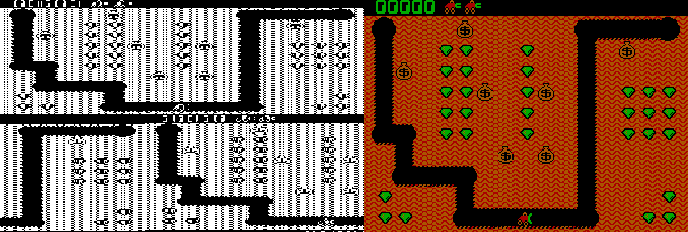
  
<em>The CGA graphics mode 8KiB offset - video memory visualized side by side with gameplay of 'Digger'</em>

## High-Resolution Graphics Mode

This is a 640x200 monochromatic, 1bpp graphics mode. The CGA operates at the *low-resolution character clock* in this mode, despite the 640 columns of resolution. Each character clock, two bytes from video memory are fetched and 16 pixels are emitted. The color used for drawing `1` bits is the color defined in the [color control register](#color-control-register).  

This is sometimes referred to as the foreground color in this mode, but it is actually still the background color. If that sounds paradoxical, it is explained by the way that this mode is implemented: in high-resolution graphics mode, the CGA's color multiplexers are set to always draw the border/overscan color. The CGA then *rapidly enables and disables the color multiplexers themselves*. So in this mode, the foreground is actually the background, and the background is actually just "off."

You can, of course, leave the color defined in the color control register set to 0, but you will not see anything drawn.

Like medium-resolution graphics mode, an 8KiB offset is created between odd and even scanlines via substitution of `A13` with `RA0`.

High-resolution graphics mode is enabled by setting the **GFX** and **HIRES_GFX** bits in the [mode control register](#mode-control-register).  Interestingly, the **HIRES_GFX** bit controls the rapid toggling of the CGA's color multiplexers, and it is possible to enable this mode at other times - such as in 80-column text mode, and watch as the CGA dutifully toggles the screen on and off as text mode is drawn, leading to a bizarre, striped appearance. 

If the **B/W** bit is set to `0` in this mode, the NTSC *color burst* is turned on for the composite video output. In this mode, four high-resolution pixels map to a single cycle of the NTSC's 3.579545MHz *color clock*, and thus a 16-color video mode is enabled. The exact colors produced are dependent on the value programmed into the [color control register](#color-control-register).

  

    
    
<em>The black-and-white raw CGA output of Sierra On-line's <cite>&quot;Space Quest I&quot;</cite> title screen</em>

  

  

    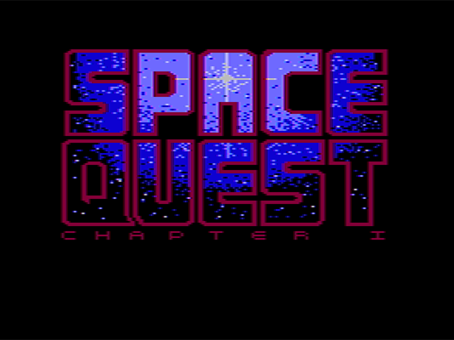
    
<em>The same <cite>&quot;Space Quest I&quot;</cite> title screen as viewed on a color composite monitor</em>

  

## Low-Resolution "Graphics" Mode

Although not actually a graphics mode at all, some games on the PC effectively created a low-resolution graphics mode by setting up a tweaked text mode to display pixel art at an effective resolution of either **80x100** or **160x100**.

It is important to differentiate this mode from BIOS video mode `08h` which is a true 160x100 graphics mode available only on IBM PCjr and Tandy 1000 systems. 

The trick of this mode is to fill video memory with either of two specific CGA character codes:

<table class="cga-ascii-table cga-lowres-glyph-table">
  <tr>
    <th scope="col">Hex</th>
    <th scope="col">Glyph</th>
  </tr>
  <tr>
    <td>DD</td>
    <td class="glyph-cell"></td>
  </tr>
  <tr>
    <td>DE</td>
    <td class="glyph-cell"></td>
  </tr>
</table>

Each of these glyphs evenly divides the 8-pixel span of a character cell into half foreground and half background. 

Next, the value of **R9** on the CRTC is set to `1`, making each logical row of character cells two scanlines tall. 

Since we can independently control foreground and background colors via character attribute bytes, this essentially creates an all-points-addressable display, with each character cell forming two 4x2 pixel wide 'pixels'. Updating the screen now involves writing only to the CGA attribute bytes. 

Given the CGA's drastically stretched aspect ratio, these end up displaying as square - as seen below in an aspect-corrected screenshot of the PC shareware title, [Round 42](https://www.mobygames.com/game/209/round-42/):

  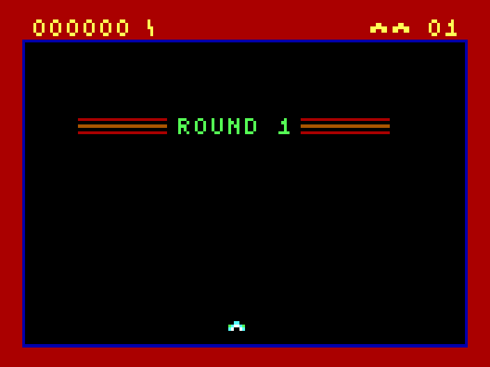
  
<em>Low-resolution "Graphics" mode in <a href="https://www.mobygames.com/game/209/round-42/">Round 42</a> by Mike Pooler</em>

Of course, nothing strictly limits you to only using the two convenient 'split-block' characters. If we consider using the top two rows of the standard CGA font, many potentially useful patterns can be found:

  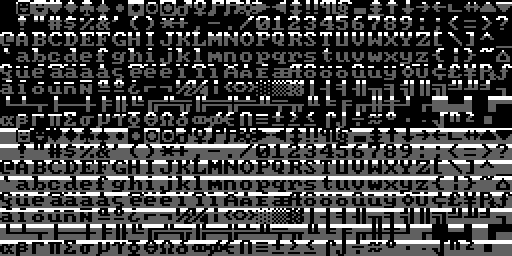
  
<em>The top two rows of the IBM CGA code page 437 character set</em>

Several titles by the developer [Macrocom](https://www.mobygames.com/company/132/macrocom-inc/) utilized this technique, and so it became known in some circles as the "Macrocom Method", or alternatively, "ANSI from Hell"[^2].

Here's an example of how the player character 'sprite' in Macrocom's [ICON: Quest for the Ring](https://www.mobygames.com/game/178/icon-quest-for-the-ring/) is built up from standard character glyphs, as seen with varying values for the MC6845's Maximum Scanline register, **R9**:

  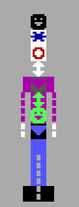
  
<em>A visualization of the the ASCII-rendered player character in Macrocom's ICON: Quest for the Ring</em>

In 2022, a demo for the PC was released that pushed this technique to its absolute limits: [Area 5150](https://www.pouet.net/prod.php?which=91938). Through many clever additional CRTC tricks, it was able to make it nearly impossible to tell that any of the demo's effects were actually running in text mode. 

<table style="width: 100%; margin: 1.5em 0;">
  <thead>
    <tr>
      <th scope="col">R9==7</th>
      <th scope="col">R9==1</th>
    </tr>
  </thead>
  <tbody>
    <tr>
      <td style="width: 50%; text-align: center; vertical-align: middle;">
        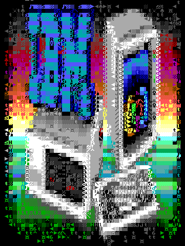
      </td>
      <td style="width: 50%; text-align: center; vertical-align: middle;">
        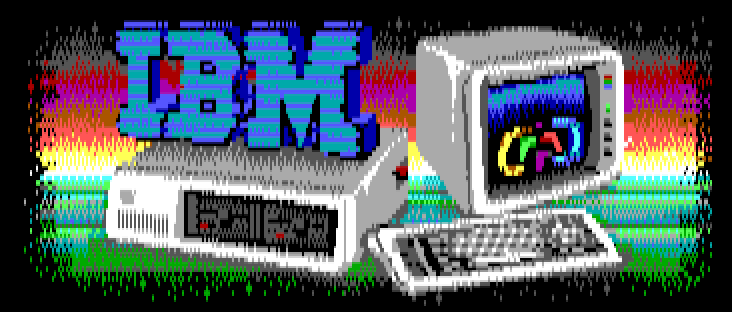
      </td>
    </tr>
  </tbody>
</table>

For a rather comprehensive review of the various titles that have used a tweaked text-mode over the years, see [this excellent post on the blog Nerdly Pleasures](https://nerdlypleasures.blogspot.com/2014/09/cga-16-color-rgb-graphics-modes.html).

## Light Pen

The IBM CGA provided a header for attaching a light pen. This header supported a pen with active-low *strobe* and *switch* signals.

  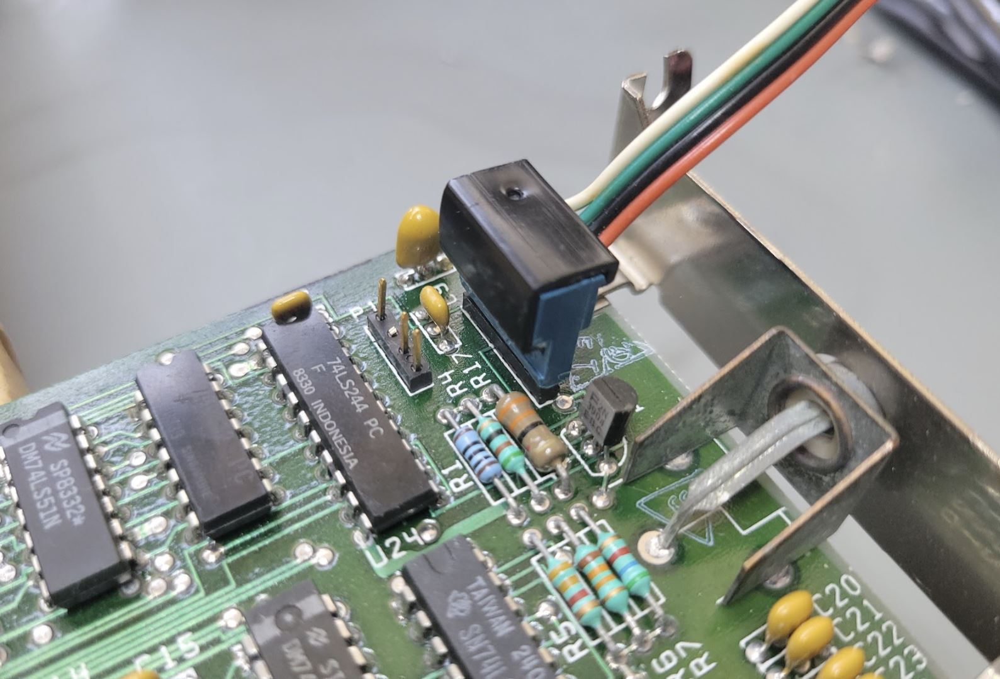
  
<em>The light pen header (with attached cable) on the IBM CGA card.</em>

The header pinout is: 

| Pin | Signal        |
| --- | ------------- |
| 1   | `/LPEN_INPUT` |
| 2   | NC            |
| 3   | `/LPEN_SW`    |
| 4   | GND           |
| 5   | +5V           |
| 6   | +12V          |

Since the light pen functionality was provided via the MC6845, resolution was limited to character cells. In text mode, this is perfectly acceptable - however it made the light pen less useful in graphics modes. In medium-resolution graphics mode, the horizontal resolution of the pen is limited to **80x200**. In high-resolution graphics mode, effective resolution drops to **40x200**.

Light pen interface cards were offered by most light pen manufacturers to avoid these limitations. The light pen header on the CGA was rarely used, and very few software titles exist on the PC that natively support the light pen.

## Display Timings

Unlike the MDA, the CGA does not have its own crystal. IBM designed the main system crystal of the PC itself around the NTSC display standard, with the apparent intent of simplifying the production of the CGA and other television-compatible peripherals.

The 5150 has a single main system crystal with a frequency of 14.31818MHz. This frequency is exactly four times the [NTSC](https://en.wikipedia.org/wiki/NTSC) color subcarrier frequency.

The crystal frequency can be expressed as a fraction:

$$f_{crystal} = \frac{315}{22} \text{ MHz} = 14.318181\overline{81} \text{ MHz}$$

The CGA's output is almost but not quite entirely NTSC-conforming.  A real NTSC signal provides two interlaced fields of 262.5 scanlines, whereas the CGA outputs 262 progressive scanlines at approximately 60fps. This 525 vs 524 scanline difference is minor enough for television sets to ignore.

The CGA produces a display field of \\(912 \times 262\\) or \\(238,944\\) hdots. 

The exact vertical refresh rate of the CGA can be calculated as:

$$f_{refresh} = \frac{14{,}318{,}181}{238{,}944} = 59.92 \text{ Hz}$$ 

The horizontal retrace rate can be calculated as:

$$f_{hsync} = \frac{14{,}318{,}181}{912} = 15.70 \text{ kHz}$$

This is a significant number in that you will often hear monitors capable of displaying 200-line resolution modes produced by the CGA and EGA video cards described as [15kHZ displays](https://www.dosdays.co.uk/topics/15khz_monitors.php).

## Aspect Ratio

The CGA's display field of 912x262 is quite far from square. The IBM 5153 Color Display has an aspect ratio of approximately **4:3**, but this is hardly the final word on the matter - see [this VCF forum thread](https://forum.vcfed.org/index.php?threads/what-is-the-proper-aspect-ratio-adjustment-of-the-ibm-5153-cga-monitor.52357/) for a surprisingly in-depth discussion of the topic. 

The CGA's aspect ratio is of primary importance when displaying circles - non-circular circles will be immediately obvious to the user. Many monitors had vertical and horizontal adjustment knobs, which a user could use to adjust their display if circles appeared more like ellipses; however, they might find that different adjustments were needed for different software applications that made different assumptions. An emulator author could do worse than to make the effective aspect ratio user-configurable. 

A 4:3 aspect ratio applied to a 640-pixel wide image produces the familiar 640x480 resolution. The images in this chapter have all been aspect-corrected to 4:3.

## CGA Clocks

The 14.31818MHz clock of the CGA can be used directly as the dot clock, which is the case in the CGA's high-resolution *80-column* text mode. Alternatively, it can be divided by two to produce a 7.159MHz dot clock, which is done in *40-column* text mode, and for all of the CGA's graphics modes. The effect of halving the dot clock effectively doubles the width of each pixel, as the card toggles its RGBI outputs at half the rate, while the monitor continues scanning out at the same rate as always.

The CGA further divides the dot clock by 8 to produce a *character clock*. In 80-column text mode, this clock runs at 1.79MHz and is called the high-resolution character clock, or **hclock**. In graphics mode, or 40-column text mode, the CGA accordingly uses the low-resolution character clock or **lclock** that runs at 895kHz.

When using the **hclock**, the CGA typically outputs 640 pixels per scanline. When using the **lclock**, the card typically outputs 320 pixels per scanline, as the effective width of each pixel is doubled since the raster beam continues to scan out the screen at the same rate. The CGA's high resolution graphics mode is an exception to this, as it has a little trick up its sleeve - it draws by modulating the CGA's color multiplexers on and off at a rate driven by the original 14MHz dot clock.

Since both the dot and character clocks have the same relationships, it can be useful to discuss the CGA's effective *clock divisor* for a given mode. This is fairly easy: for 80-column text mode, the clock divisor is `1` or undivided - for all other modes it is `2`.

With either clock, the number of vertical scanlines remains the same, but the horizontal timings programmed into the CRTC must be adjusted to account for the particular dot clock in use.

## BIOS Video Modes

The PC BIOS maintains video services via the `int 10h` service. The first function available, `00`, requests that a video mode be set. This led to several [standard video mode definitions](https://book.martypc.net/appendices/bios-video-modes), the first seven of which, `00h-06h`, are modes compatible with the CGA. 

<table>
  <thead>
  <tr>
    <th style="text-align:center; width: 50px;">&nbsp;</th>
    <th scope="col" style="text-align:center; width: 70px;">Text / Graphics</th>
    <th scope="col" style="text-align:center; width:100px;">Size</th>
    <th scope="col" style="text-align:center; width:120px;">Mono / Color / Grayscale</th>
    <th scope="col" style="text-align:center; width:90px;">Colors</th>
    <th scope="col" style="text-align:center; width:110px;">Character Cell</th>
  </tr>
  </thead>
  <tbody>
  <tr>
    <th scope="row">00h</th>
    <td>Text</td>
    <td>40x25 chars</td>
    <td>Grayscale*</td>
    <td>16 shades</td>
    <td>8x8</td>
  </tr>
  <tr>
    <th scope="row">01h</th>
    <td>Text</td>
    <td>40x25 chars</td>
    <td>Color</td>
    <td>16 colors</td>
    <td>8x8</td>
  </tr>
  <tr>
    <th scope="row">02h</th>
    <td>Text</td>
    <td>80x25 chars</td>
    <td>Grayscale</td>
    <td>16 shades</td>
    <td>8x8</td>
  </tr>
  <tr>
    <th scope="row">03h</th>
    <td>Text</td>
    <td>80x25 chars</td>
    <td>Color</td>
    <td>16 colors</td>
    <td>8x8</td>
  </tr>
  <tr>
    <th scope="row">04h</th>
    <td>Graphics</td>
    <td>320x200</td>
    <td>Color</td>
    <td>4 colors</td>
    <td>8x2</td>
  </tr>
  <tr>
    <th scope="row">05h</th>
    <td>Graphics</td>
    <td>320x200</td>
    <td>Grayscale</td>
    <td>4 shades</td>
    <td>8x2</td>
  </tr>
  <tr>
    <th scope="row">06h</th>
    <td>Graphics</td>
    <td>640x200</td>
    <td>Mono</td>
    <td>1 color</td>
    <td>16x2</td>
  </tr>
  </tbody>
</table>

**\*** Grayscale video will only be displayed on a composite monitor or television set.

## CRTC Parameters

For each video mode, the MC6845 CRTC needs to be configured with the correct parameters for registers **R0—R9**. The standard CRTC parameters are given below.

<table class="crtc-params-table">
  <thead>
    <tr>
      <th rowspan="2">Register</th>
      <th rowspan="2">Name</th>
      <th class="header-group" colspan="3">Text Mode</th>
      <th class="header-group" colspan="2">Graphics Mode</th>
    </tr>
    <tr>
      <th class="header-group-member header-group-first">40 Column</th>
      <th class="header-group-member">80 Column</th>
      <th class="header-group-member header-group-last">"160x100"</th>
      <th class="header-group-member header-group-first">320x200</th>
      <th class="header-group-member header-group-last">640x200</th>
    </tr>
  </thead>
  <tbody>
    <tr>
      <th>R0</th>
      <td>HorizontalTotal</td>
      <td>56</td>
      <td>113</td>
      <td>113</td>
      <td>56</td>
      <td>56</td>
    </tr>
    <tr>
      <th>R1</th>
      <td>HorizontalDisplayed</td>
      <td>40</td>
      <td>80</td>
      <td>80</td>
      <td>40</td>
      <td>40</td>
    </tr>
    <tr>
      <th>R2</th>
      <td>HorizontalSyncPosition</td>
      <td>45</td>
      <td>90</td>
      <td>90</td>
      <td>45</td>
      <td>45</td>
    </tr>
    <tr>
      <th>R3</th>
      <td>SyncWidth</td>
      <td>10</td>
      <td>10</td>
      <td>10</td>
      <td>10</td>
      <td>10</td>
    </tr>
    <tr>
      <th>R4</th>
      <td>VerticalTotal</td>
      <td>31</td>
      <td>31</td>
      <td>127</td>
      <td>127</td>
      <td>127</td>
    </tr>
    <tr>
      <th>R5</th>
      <td>VerticalTotalAdjust</td>
      <td>6</td>
      <td>6</td>
      <td>6</td>
      <td>6</td>
      <td>6</td>
    </tr>
    <tr>
      <th>R6</th>
      <td>VerticalDisplayed</td>
      <td>25</td>
      <td>25</td>
      <td>100</td>
      <td>100</td>
      <td>100</td>
    </tr>
    <tr>
      <th>R7</th>
      <td>VerticalSync</td>
      <td>28</td>
      <td>28</td>
      <td>112</td>
      <td>112</td>
      <td>112</td>
    </tr>
    <tr>
      <th>R8</th>
      <td>InterlaceMode</td>
      <td>2</td>
      <td>2</td>
      <td>2</td>
      <td>2</td>
      <td>2</td>
    </tr>
    <tr>
      <th>R9</th>
      <td>MaximumScanLineAddress</td>
      <td>7</td>
      <td>7</td>
      <td>1</td>
      <td>1</td>
      <td>1</td>
    </tr>
  </tbody>
</table>

## Video Memory

The 16KiB of DRAM on the CGA is not expandable. It is also *single-ported*, meaning that only either the CPU or the CGA can access the video memory at any given time. This is a bit of a problem as the CGA needs to be reading video memory constantly as it rasterizes the screen. We will cover those issues in the next section, [Memory Contention](#memory-contention).

The 16KiB of video memory is composed of 8 separate 16Kbit DRAM chips, each of which provides a single bit. These bits are organized logically as a 128x128 grid - to address a single bit, a 7-bit *column address* must be provided followed by a 7-bit *row address*.  The CGA produces these **RAS** and **CAS** addresses from the **MA** pins of the 6845 with some additional manipulation, such as substituting **RA0** for `A13` in graphics modes.

## Memory Contention

The CGA has some circuitry for attempting to arbitrate access to memory between the CPU and the card itself (which IBM refers to, somewhat confusingly, as the *CRT*). This is done via manipulation of the `IO_CH_READY` pin of the ISA bus. When this pin is pulled low, any attempts by the CPU to access the CGA's video memory will stall, with the CPU performing *wait states* until the pin is released. In this manner the card can guarantee exclusive access to video memory for itself - but only at the slower, 7MHz dot clock. The higher bandwidth requirements of 80-column text mode make this scheme fall apart.

### CGA Snow

In 80-column text mode, attempts to access video memory by the CPU while the CGA is rasterizing the active display area will cause a phenomenon called *snow* - random glitches will briefly appear on the screen, whenever the CGA happens to read data placed on its internal data bus by the CPU while it was attempting to read character glyphs or attribute bytes. 

Due to the CGA's wait state circuitry, even columns are protected from experiencing snow, which only appears on odd columns.

IBM worked around this in BIOS routines that scrolled the screen - such as when you execute the `DIR` command in DOS - by rapidly disabling and re-enabling the display, causing noticeable flicker. Some people find this flicker more annoying than the snow itself!

## Datasheet

 - (archive.org) [IBM Color Graphics Monitor Adapter](https://archive.org/details/ibm_pc_datasheets/Expansion%20Cards/IBM%20Color%20Graphics%20Monitor%20Adapter/)

## Primary References

 - (seasip.info) [Colour Graphics Adapter: Notes](https://www.seasip.info/VintagePC/cga.html)
 - (int10h.org) [The IBM 5153's True CGA Palette and Color Output](https://int10h.org/blog/2022/06/ibm-5153-color-true-cga-palette/)
 - (int10h.org) [8088 MPH Final: Old vs. New CGA (and Other Gory Details)](https://int10h.org/blog/2015/08/8088-mph-final-old-vs-new-cga-gory-details/)
 - (int10h.org) [CGA in 1024 Colors - a New Mode: the Illustrated Guide](https://int10h.org/blog/2015/04/cga-in-1024-colors-new-mode-illustrated/)
 - (github.org) [IBM Colour Graphics Adapter schematics redrawn in KiCad](https://github.com/hkzlab/CGA_Schematics)
 - (nerdlypleasures.blogspot.com) [CGA 16 Color RGB Graphics Modes](https://nerdlypleasures.blogspot.com/2014/09/cga-16-color-rgb-graphics-modes.html)

### Additional Reading

 - (reenigne.org) [CRTC emulation for MESS](https://www.reenigne.org/blog/crtc-emulation-for-mess/)
 - (martypc.blogspot.com) [Exploring CGA Wait States](https://martypc.blogspot.com/2023/05/exploring-cga-wait-states.html)
 - (github.com) [CGA Accuracy Improvements](https://github.com/joncampbell123/dosbox-x/issues/256)
 
### Reference Implementations

 - (github.com) [A digital logic simulation of the IBM CGA card](https://github.com/dbalsom/cga_sim)

[^1]: VileR, [Name the Non-Standard PC Code Page](https://int10h.org/blog/2024/08/name-the-nonstandard-pc-codepage/), August 7, 2024.

[^2]: VileR, [CGA in 1024 Colors - a New Mode: the Illustrated Guide](https://int10h.org/blog/2015/04/cga-in-1024-colors-new-mode-illustrated/#the_macrocom_method), April 2015.
