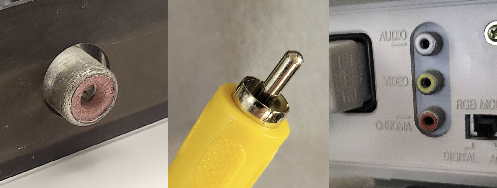
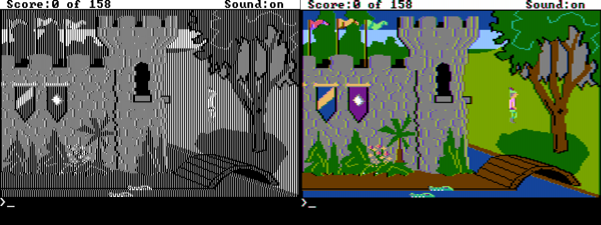
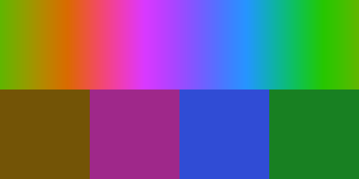
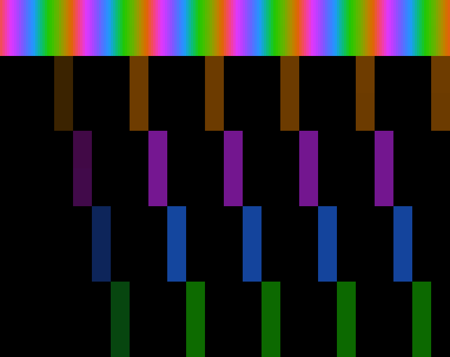
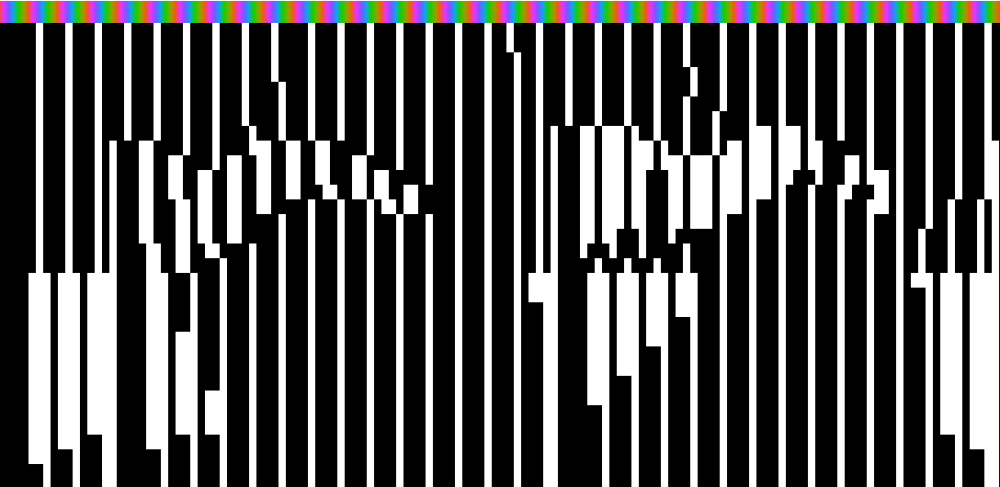
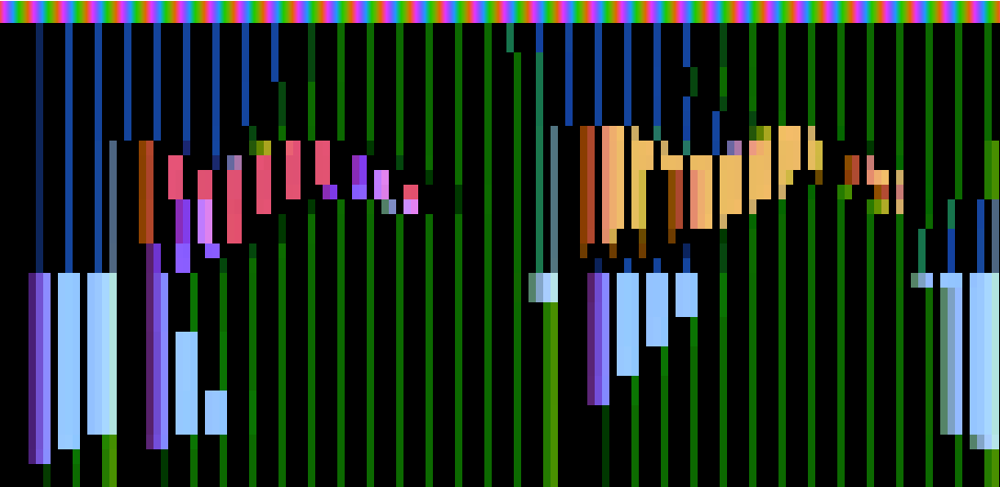
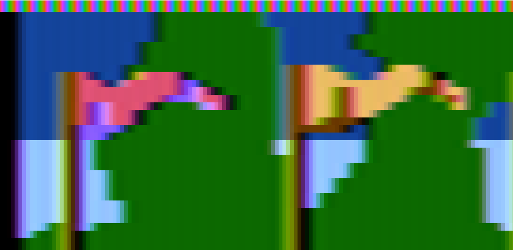
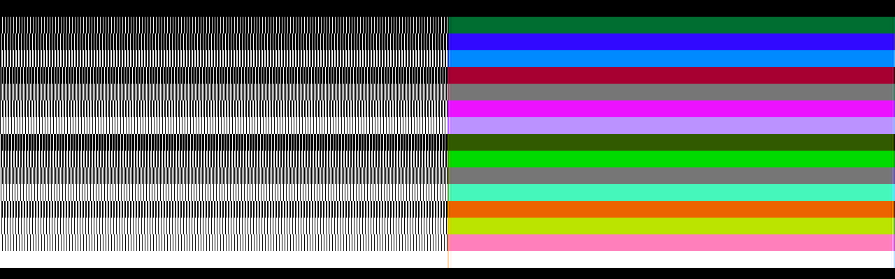
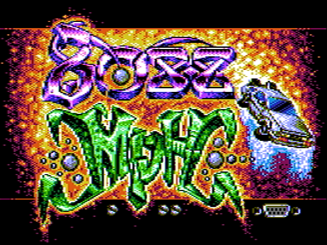
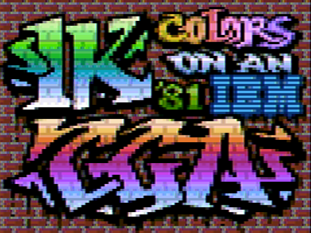

# Composite Video

The IBM CGA card supported [composite video](https://en.wikipedia.org/wiki/Composite_video) output via a female [RCA connector](https://en.wikipedia.org/wiki/RCA_connector).

  
  
<em>The CGA composite output, an RCA jack, and a monitor's composite input</em>

Composite video is a standard by which *luminance*, *chrominance* and synchronization signals such as VSYNC and HSYNC are modulated together on a single wire. Obviously this requires some tradeoffs in image quality. Later video standards, such as [S-Video](https://en.wikipedia.org/wiki/S-Video) and [Component video](https://en.wikipedia.org/wiki/Component_video) would improve picture quality by separating these signals onto individual conductors.

An in-depth discussion of the NTSC video display standard is out of scope for this book. Instead, we will discuss the particular aspects of the CGA card's composite video output that are relevant for emulation.

> [!WARNING]
> The various color diagrams used in this chapter are intended for conceptual visualization only. They are not mathematically rigorous.

## The Color Burst

The NTSC broadcast television standard was originally black and white. When color was added to the broadcast signal, it needed to be added in a way that was backwards compatible with black and white television sets. Part of how this was accomplished was by adding a signal called the *color burst* that only color television sets would understand.

The *color burst* is a 3.57954MHz reference clock signal emitted during the *back porch* of a scanline. It is a sine wave about 2.5 microseconds in duration that provides a *phase reference* for decoding color for that particular scanline. You can see the color burst from an IBM CGA card captured on an oscilloscope below.

  
  
<em>The CGA color burst</em>

Without a color burst signal, the composite video signal for that scanline will be interpreted as luminance only, producing a grayscale picture.

## Additive Chrominance

To allow for color to be *added* to an existing luminance-only signal, we must take the color signal and subtract luminance from it, producing a signal called *chrominance*. This signal is generally represented by two axes. One possible way to represent a chrominance signal is with a *blue* axis (with yellow as its complement) and a *red* axis (with green as its complement). If we call the luminance component Y, these two axes become **B-Y** and **R-Y**, since we have subtracted the luminance component from each.

Two proportional terms can be established:

$$
U \propto B' - Y'
$$

$$
V \propto R' - Y'
$$

This is the basic derivation of the [Y'UV color space](https://en.wikipedia.org/wiki/Y%E2%80%B2UV).

## Phase and the Unit Circle

Color is encoded in a composite signal by comparing the phase offset of the color signal contained within the 3.57954MHz color carrier with the reference phase of the color burst. 

We can map YUV colors to the [unit circle](https://en.wikipedia.org/wiki/Unit_circle), assigning an angle to each hue. This produces the YUV color wheel. The color burst represents a reference at 180 on this wheel, mapping to the color yellow. Sometimes you will see the color burst referred to as the *yellow burst* as a consequence.

  
  
<em>The YUV color wheel (approximate)</em>

## YIQ Color Space

Actual NTSC video broadcasts do not directly encode color in the YUV color space. Instead, a rotated color space is used, primarily centered on an axis called **I** along which most human skin-tones fall. Engineers designing the NTSC video standard could then dedicate more video bandwidth to this axis. **I** is referred to as the *in-phase component*, and **Q**, being 90° from **I** is called the *quadrature component*. This is the [YIQ color space](https://en.wikipedia.org/wiki/YIQ).

  
  
<em>The YUV color wheel with IQ axes (approximate)</em>

## The CGA Composite Color Clocks

The CGA produces six square waves representing six unique *color clocks*. These represent a 3-bit or 8 color "palette", with black and white not requiring a dedicated clock as they represent a constant low and high logic level, respectively.

An octal 74LS151 multiplexer selects one of the color clocks depending on the internally generated **B**, **G** and **R** color signals. Note that intensity is not used for color clock selection, but contributes to luma instead.

| B | G | R | Clock |
|---|---|---|-------|
| 0 | 0 | 0 | Black |
| 1 | 0 | 0 | Blue |
| 0 | 1 | 0 | Green |
| 1 | 1 | 0 | Cyan |
| 0 | 0 | 1 | Red |
| 1 | 0 | 1 | Magenta |
| 0 | 1 | 1 | Yellow |
| 1 | 1 | 1 | White |

Each clock is shifted out of phase in respect to the color burst, which is equivalent to the yellow color clock.

  
  
<em>The IBM CGA composite color clocks</em>

This mapping enables a ballpark reproduction of the CGA's standard graphics palettes on a composite monitor, with the exception that yellow makes a reappearance where the IBM 5153 monitor would have produced brown. The CGA's infamous magenta also becomes more of a purple shade.

  
  
<em>"AlleyCat" by Bill Williams in CGA Composite</em>

In medium-resolution graphics mode, two pixels fit into a single NTSC *color cycle*. Therefore where high frequency contrast changes occur, color fringing can be observed. These fringes are generally called *color artifacts*. 

  
  
<em>Composite color artifacting</em>

Although color artifacting was usually undesirable when displaying graphics designed for RGBI monitors, clever artists could intentionally use pairs of pixels that produce specific *artifact colors*. If done carefully, the result can be acceptable on both RGBI and composite displays. Notice in this screenshot from [*The Ancient Art of War at Sea*](https://www.mobygames.com/game/188/the-ancient-art-of-war-at-sea/) how the stripes in the RGBI graphics produce solid colors on a composite display, notably turning a magenta beard into an actual brown.

  
  
<em>Intentional color artifacting in "The Ancient Art of War at Sea"</em>

Individual pixels will no longer render as white, instead transmuted into a specific color depending on their phase relationship. Notice here how the single-pixel stars in the background of the fourth and six panels become yellow-orange and blue. This particular type of color artifacting will be very familiar to anyone familiar with the Apple II.

## Composite and High-Resolution Graphics Mode

Like the Apple II, it is possible to produce a color composite video signal using the CGA's high-resolution monochrome video mode, relying solely on the effect of color artifacting.

With double the horizontal resolution, four pixels in high-resolution graphics mode fit into a single NTSC color cycle, producing an effective 4-bit or 16-color "palette." This is not an accident; IBM designed the 14.31818MHz clock of the PC — and thus the dot clock of the IBM CGA — to be exactly four times the frequency of the NTSC color carrier.

  
  
<em>Artifact color in "King's Quest"</em>

Each *color cycle* represents a traversal of the color wheel. A single lit pixel represents an average of the corresponding quarter of the wheel. Since luminance and chrominance are modulated together, all single-pixel colors are somewhat dark. Additional lit pixels produce brighter, additive colors.

  
  
<em>An NTSC color cycle, with quarter-wheel averages</em>

  
  
<em>Single-pixel artifact colors, mapped to color cycles</em>

If we zoom in to the upper-left of the *King's Quest* screenshot with two of the pennants in view, we can analyze how the high-resolution black and white graphics become color.

  
  
<em>Black and white graphics in "King's Quest"</em>

Each pixel or run of pixels maps to the corresponding average of the color wheel which the pixels cover, with the total luma a function of how many pixels are lit within a color cycle.

  
  
<em>Color cycle mappings in "King's Quest"</em>

The luminance of the image is sampled at a lower frequency than chrominance; therefore regular patterns of pixels produce solid colors. Note that due to the coupling of luminance and chrominance it is impossible to change between certain colors without a corresponding *luminance fringe* due to the change in color phase inducing an increase or decrease in immediate luminance. This is most visible at the left edge of the green tree canopy where the shift from blue to green moves 90°.

  
  
<em>Composite artifact color in "King's Quest"</em>

### The High-Resolution CGA Composite Color Gamut 

The following references assume that the foreground color of the CGA's high-resolution graphics mode is set to bright white. Any other color will produce one of 14 alternate composite palettes. However, almost every title that uses artifact color graphics uses bright white in practice.

The combination of any four lit pixels produces \\(2^{4}\\) or **16** possible colors. If each pattern is repeated along 4-pixel color cycles, they produce solid bars of color.

  
  
<em>Composite artifact color in high-resolution graphics mode (NewRisingSun)</em>

<!-- cSpell:disable -->
<table>
	<thead>
		<tr>
			<th>B0</th>
			<th>B1</th>
			<th>B2</th>
			<th>B3</th>
			<th>Color</th>
			<th>Hex</th>
		</tr>
	</thead>
	<tbody>
		<tr>
			<td>0</td>
			<td>0</td>
			<td>0</td>
			<td>0</td>
			<td style="background-color: #000000; width: 50px;">&nbsp;</td>
			<td>000000</td>
		</tr>
		<tr>
			<td>0</td>
			<td>0</td>
			<td>0</td>
			<td>1</td>
			<td style="background-color: #00680C; width: 50px;">&nbsp;</td>
			<td>00680C</td>
		</tr>
		<tr>
			<td>0</td>
			<td>0</td>
			<td>1</td>
			<td>0</td>
			<td style="background-color: #212BBD; width: 50px;">&nbsp;</td>
			<td>212BBD</td>
		</tr>
		<tr>
			<td>0</td>
			<td>0</td>
			<td>1</td>
			<td>1</td>
			<td style="background-color: #0D9ED5; width: 50px;">&nbsp;</td>
			<td>0D9ED5</td>
		</tr>
		<tr>
			<td>0</td>
			<td>1</td>
			<td>0</td>
			<td>0</td>
			<td style="background-color: #85096C; width: 50px;">&nbsp;</td>
			<td>85096C</td>
		</tr>
		<tr>
			<td>0</td>
			<td>1</td>
			<td>0</td>
			<td>1</td>
			<td style="background-color: #757376; width: 50px;">&nbsp;</td>
			<td>757376</td>
		</tr>
		<tr>
			<td>0</td>
			<td>1</td>
			<td>1</td>
			<td>0</td>
			<td style="background-color: #AF36FF; width: 50px;">&nbsp;</td>
			<td>AF36FF</td>
		</tr>
		<tr>
			<td>0</td>
			<td>1</td>
			<td>1</td>
			<td>1</td>
			<td style="background-color: #9BA9FF; width: 50px;">&nbsp;</td>
			<td>9BA9FF</td>
		</tr>
		<tr>
			<td>1</td>
			<td>0</td>
			<td>0</td>
			<td>0</td>
			<td style="background-color: #514700; width: 50px;">&nbsp;</td>
			<td>514700</td>
		</tr>
		<tr>
			<td>1</td>
			<td>0</td>
			<td>0</td>
			<td>1</td>
			<td style="background-color: #42BD00; width: 50px;">&nbsp;</td>
			<td>42BD00</td>
		</tr>
		<tr>
			<td>1</td>
			<td>0</td>
			<td>1</td>
			<td>0</td>
			<td style="background-color: #707470; width: 50px;">&nbsp;</td>
			<td>707470</td>
		</tr>
		<tr>
			<td>1</td>
			<td>0</td>
			<td>1</td>
			<td>1</td>
			<td style="background-color: #5DF47A; width: 50px;">&nbsp;</td>
			<td>5DF47A</td>
		</tr>
		<tr>
			<td>1</td>
			<td>1</td>
			<td>0</td>
			<td>0</td>
			<td style="background-color: #E5541D; width: 50px;">&nbsp;</td>
			<td>E5541D</td>
		</tr>
		<tr>
			<td>1</td>
			<td>1</td>
			<td>0</td>
			<td>1</td>
			<td style="background-color: #D7CB19; width: 50px;">&nbsp;</td>
			<td>D7CB19</td>
		</tr>
		<tr>
			<td>1</td>
			<td>1</td>
			<td>1</td>
			<td>0</td>
			<td style="background-color: #FF81F2; width: 50px;">&nbsp;</td>
			<td>FF81F2</td>
		</tr>
		<tr>
			<td>1</td>
			<td>1</td>
			<td>1</td>
			<td>1</td>
			<td style="background-color: #FDFFFC; width: 50px;">&nbsp;</td>
			<td>FDFFFC</td>
		</tr>
	</tbody>
</table>
<!-- cSpell:enable -->

The composite colors can alternatively be sorted by hue:

<!-- cSpell:disable -->
<table>
	<thead>
		<tr>
			<th>B0</th>
			<th>B1</th>
			<th>B2</th>
			<th>B3</th>
			<th>Color</th>
			<th>Hex</th>
		</tr>
	</thead>
	<tbody>
		<tr>
			<td>0</td>
			<td>0</td>
			<td>0</td>
			<td>1</td>
			<td style="background-color: #00680C; width: 50px;">&nbsp;</td>
			<td>00680C</td>
		</tr>
		<tr>
			<td>1</td>
			<td>0</td>
			<td>0</td>
			<td>1</td>
			<td style="background-color: #42BD00; width: 50px;">&nbsp;</td>
			<td>42BD00</td>
		</tr>
		<tr>
			<td>1</td>
			<td>0</td>
			<td>1</td>
			<td>1</td>
			<td style="background-color: #5DF47A; width: 50px;">&nbsp;</td>
			<td>5DF47A</td>
		</tr>
		<tr>
			<td>0</td>
			<td>0</td>
			<td>1</td>
			<td>0</td>
			<td style="background-color: #212BBD; width: 50px;">&nbsp;</td>
			<td>212BBD</td>
		</tr>
		<tr>
			<td>0</td>
			<td>0</td>
			<td>1</td>
			<td>1</td>
			<td style="background-color: #0D9ED5; width: 50px;">&nbsp;</td>
			<td>0D9ED5</td>
		</tr>
		<tr>
			<td>0</td>
			<td>1</td>
			<td>1</td>
			<td>1</td>
			<td style="background-color: #9BA9FF; width: 50px;">&nbsp;</td>
			<td>9BA9FF</td>
		</tr>
		<tr>
			<td>0</td>
			<td>1</td>
			<td>0</td>
			<td>0</td>
			<td style="background-color: #85096C; width: 50px;">&nbsp;</td>
			<td>85096C</td>
		</tr>
		<tr>
			<td>0</td>
			<td>1</td>
			<td>1</td>
			<td>0</td>
			<td style="background-color: #AF36FF; width: 50px;">&nbsp;</td>
			<td>AF36FF</td>
		</tr>
		<tr>
			<td>1</td>
			<td>1</td>
			<td>1</td>
			<td>0</td>
			<td style="background-color: #FF81F2; width: 50px;">&nbsp;</td>
			<td>FF81F2</td>
		</tr>
		<tr>
			<td>1</td>
			<td>0</td>
			<td>0</td>
			<td>0</td>
			<td style="background-color: #514700; width: 50px;">&nbsp;</td>
			<td>514700</td>
		</tr>
		<tr>
			<td>1</td>
			<td>1</td>
			<td>0</td>
			<td>0</td>
			<td style="background-color: #E5541D; width: 50px;">&nbsp;</td>
			<td>E5541D</td>
		</tr>
		<tr>
			<td>1</td>
			<td>1</td>
			<td>0</td>
			<td>1</td>
			<td style="background-color: #D7CB19; width: 50px;">&nbsp;</td>
			<td>D7CB19</td>
		</tr>
	</tbody>
</table>
<!-- cSpell:enable -->

Or by hue and luminance:

<!-- cSpell:disable -->
<table class="composite-hue-luma-table">
	<thead>
		<tr>
			<th>B0</th>
			<th>B1</th>
			<th>B2</th>
			<th>B3</th>
			<th>Color</th>
			<th>Hex</th>
			<th>B0</th>
			<th>B1</th>
			<th>B2</th>
			<th>B3</th>
			<th>Color</th>
			<th>Hex</th>
			<th>B0</th>
			<th>B1</th>
			<th>B2</th>
			<th>B3</th>
			<th>Color</th>
			<th>Hex</th>
		</tr>
	</thead>
	<tbody>
		<tr>
			<td>0</td>
			<td>0</td>
			<td>0</td>
			<td>1</td>
			<td style="background-color: #00680C; width: 50px;">&nbsp;</td>
			<td>00680C</td>
			<td>1</td>
			<td>0</td>
			<td>0</td>
			<td>1</td>
			<td style="background-color: #42BD00; width: 50px;">&nbsp;</td>
			<td>42BD00</td>
			<td>1</td>
			<td>0</td>
			<td>1</td>
			<td>1</td>
			<td style="background-color: #5DF47A; width: 50px;">&nbsp;</td>
			<td>5DF47A</td>
		</tr>
		<tr>
			<td>0</td>
			<td>0</td>
			<td>1</td>
			<td>0</td>
			<td style="background-color: #212BBD; width: 50px;">&nbsp;</td>
			<td>212BBD</td>
			<td>0</td>
			<td>0</td>
			<td>1</td>
			<td>1</td>
			<td style="background-color: #0D9ED5; width: 50px;">&nbsp;</td>
			<td>0D9ED5</td>
			<td>0</td>
			<td>1</td>
			<td>1</td>
			<td>1</td>
			<td style="background-color: #9BA9FF; width: 50px;">&nbsp;</td>
			<td>9BA9FF</td>
		</tr>
		<tr>
			<td>0</td>
			<td>1</td>
			<td>0</td>
			<td>0</td>
			<td style="background-color: #85096C; width: 50px;">&nbsp;</td>
			<td>85096C</td>
			<td>0</td>
			<td>1</td>
			<td>1</td>
			<td>0</td>
			<td style="background-color: #AF36FF; width: 50px;">&nbsp;</td>
			<td>AF36FF</td>
			<td>1</td>
			<td>1</td>
			<td>1</td>
			<td>0</td>
			<td style="background-color: #FF81F2; width: 50px;">&nbsp;</td>
			<td>FF81F2</td>
		</tr>
		<tr>
			<td>1</td>
			<td>0</td>
			<td>0</td>
			<td>0</td>
			<td style="background-color: #514700; width: 50px;">&nbsp;</td>
			<td>514700</td>
			<td>1</td>
			<td>1</td>
			<td>0</td>
			<td>0</td>
			<td style="background-color: #E5541D; width: 50px;">&nbsp;</td>
			<td>E5541D</td>
			<td>1</td>
			<td>1</td>
			<td>0</td>
			<td>1</td>
			<td style="background-color: #D7CB19; width: 50px;">&nbsp;</td>
			<td>D7CB19</td>
		</tr>
	</tbody>
</table>
<!-- cSpell:enable -->

> [!NOTE]
> It might be tempting to make a simple 16-color LUT and emit chunky 4-pixel-wide spans of color, however this will not produce a satisfactory result. The luminance signal must be sampled independently and combined with chrominance information to reproduce the composite output's full perceptual horizontal resolution.

## 80-Column Text Mode Caveats

In 80-column text mode, the IBM CGA card disables the color burst, at least when using the standard CRTC register values. The cause of this is U64, a 74LS164 8-bit shift register that generates the trigger for the color burst generation circuitry. It requires 7 **lclocks** to fire. In both 80-column and 40-column text mode, the CRTC's HSYNC width register **R3** is set to 10. Given the faster character clock in 80-column text mode, this equates to only **5 lclocks** and thus the color burst never triggers.

This is actually a good thing for most users, as it turns 80-column text mode from what would be a smeary, technicolor mess into a fairly usable grayscale signal. Clones of the IBM CGA did not always behave in a similar manner, so switching into 40-column text mode was a useful workaround for a readable DOS prompt.

It is possible to re-enable the color burst in 80-column text mode by adjusting the value of R3. On a [Motorola MC6845](6845.md) setting **R3** to 0 will produce an effective value of 16, which is sufficient for the color burst to trigger.

## Old vs New CGA

At some point, IBM redesigned the CGA's composite output stage to feed more of the color signals into the luminance signal. Cards made before this change are called *old style* CGA cards, with cards made after the change being the *new style*. The new style redesign improved the ability to discriminate individual colors on grayscale composite monitors. Unfortunately, this means that any composite conversion code must now be able to handle both models for accuracy.

## 8088 MPH

Perhaps the most infamous use of CGA composite artifact color is the PC demo [8088 MPH](https://www.pouet.net/prod.php?which=65371).

  
  
<em>The 8088 MPH Title Screen</em>

  
  
<em>8088 MPH's 1024 Color Mode</em>

It would be difficult to explain the tricks used in this demo better than VileR — one of the demo's creators — already did. Check out his excellent series of two blog articles [starting here](https://int10h.org/blog/2015/04/cga-in-1024-colors-new-mode-illustrated/).

## Simulation vs Sampling

The exact characteristics of the CGA's composite output cannot be accurately reproduced with a purely digital simulation. The colors are slightly modified by the analog characteristics of the circuit, starting with the output of the composite color multiplexer itself. 

Reenigne took a statistical approach and sampled the output of both the old and new-style CGA cards using a video capture card to produce a highly accurate composite rendering algorithm - see the VOGONS link in [Reference Implementations](#reference-implementations) for a link to the original patch for DOSBox. Nearly all prominent PC emulators now use reenigne's code for CGA composite rendering. It is fast and hard to beat for quality. 

## Primary References

 - (int10h.org) [CGA in 1024 Colors - a New Mode: the Illustrated Guide](https://int10h.org/blog/2015/04/cga-in-1024-colors-new-mode-illustrated/)
 - (int10h.org) [8088 MPH Final: Old vs. New CGA (and Other Gory Details)](https://int10h.org/blog/2015/08/8088-mph-final-old-vs-new-cga-gory-details/)
 - (reenigne.org) [CRTC Emulation for MESS](https://www.reenigne.org/blog/crtc-emulation-for-mess/)
 - (nerdlypleasures.blogspot.com) [IBM PC Color Composite Graphics](https://nerdlypleasures.blogspot.com/2013/11/ibm-pc-color-composite-graphics.html)

## Reference Implementations
<!-- cSpell:disable-next-line -->
 - (vogons.org) [CGA Composite Mode under DOSBOX (Committed r3804)](https://www.vogons.org/viewtopic.php?p=677941#p677941)
 - (github.org) [CGA Artifact Color](https://github.com/dbalsom/cga_artifact_color)
