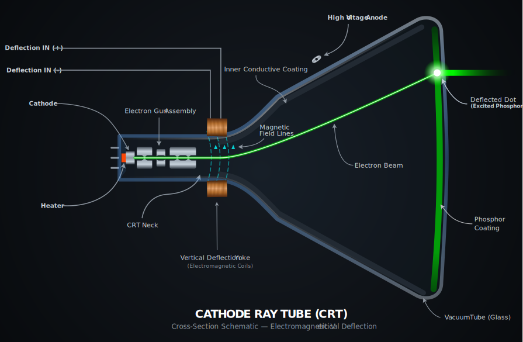
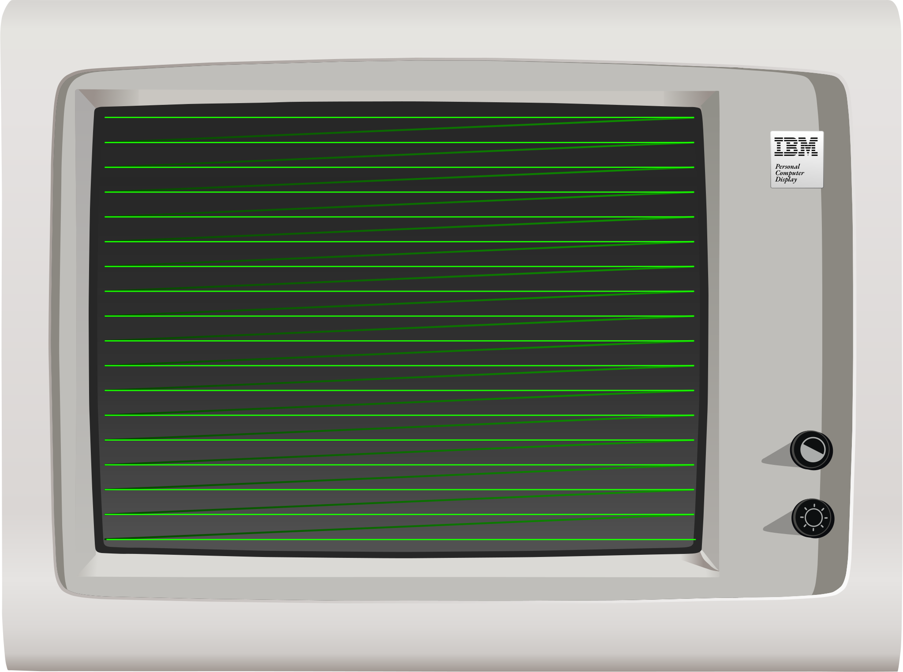
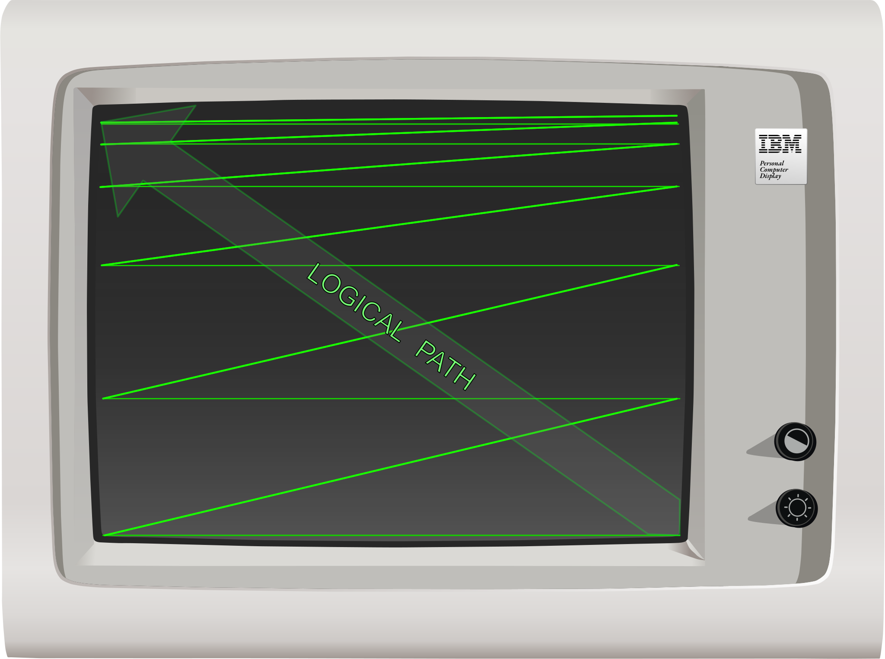

# Display Concepts

This section describes general display concepts for raster-scan displays. If you are already familiar with how CRTs work, you may skip this section. Most of the information here is not required for emulation, but serves as reference material.

## The Cathode Ray Tube

The main displays for the IBM PC were [cathode-ray tube (CRT)](https://en.wikipedia.org/wiki/Cathode_ray_tube) monitors and [television sets](https://en.wikipedia.org/wiki/Television_set). 

A [cathode](https://en.wikipedia.org/wiki/Cathode) is a negatively-charged electrode. The cathode in a CRT is specifically part of an [electron gun](https://en.wikipedia.org/wiki/Electron_gun) which fires a narrow, collimated beam of electrons toward a [phosphor](https://en.wikipedia.org/wiki/Phosphor) coating on the inside of a vacuum-sealed glass tube. The phosphor glows when struck by the electron beam, emitting light visible from the outer side of the glass, which faces the user.

The electron beam can be **deflected** (moved around) by magnets, since electrons have a charge and will react to a magnetic field. Electromagnets called **deflection coils** are used to precisely deflect the electron beam. A set of deflection coils is packaged together inside a [deflection yoke](https://en.wikipedia.org/wiki/Deflection_yoke), which is mounted to the back side or **neck** of the CRT.

  
  
<em>CRT vertical deflection (Click to zoom)</em>

<!-- Modal for image zoom -->

  
  
&times;

## Vector Displays

Some CRTs could use a deflection yoke to move the beam around in arbitrary directions to draw figures on the screen precisely - these were called [vector displays](https://en.wikipedia.org/wiki/Vector_monitor). You may be familiar with the more famous examples used in early arcade games like [Asteroids](https://en.wikipedia.org/wiki/Asteroids_(video_game)) or the [Vectrex](https://en.wikipedia.org/wiki/Vectrex) video game console.

## Raster Displays

Most, if not all home computer displays were [raster displays](https://en.wikipedia.org/wiki/Raster_graphics). In a raster display, the electron beam is deflected on two axes at different rates. The beam moves very quickly in the horizontal direction across the screen in a succession of lines called **scanlines**, usually starting in the upper-left corner. At the same time, the beam is deflected downwards more slowly from the top to the bottom of the screen.

As each scanline is drawn out, the video signal is modulated - in the simplest scenario, it is simply turned off and on. This divides each scanline into individual pixel elements or **pixels**.

When the electron beam reaches the right side of the screen, **horizontal flyback** occurs, during which the electron beam is rapidly returned to the left side of the screen. The continuing vertical deflection ensures that the beam arrives at the left side slightly lower down on the screen than the previous scanline. In this manner the entire screen can be drawn, line by line, until the bottom of the screen is reached.

  
  
<em>CRT horizontal scanout (Click to zoom)</em>

If unaccounted for, the continuous vertical deflection would cause the image to be rotated slightly, with each scanline ending slightly lower down on the screen from where it started. To counteract this, the entire deflection yoke is mounted with a slight counter-rotation to ensure scanlines remain level.

When the beam has reached the bottom of the screen, **vertical retrace** occurs, as the electron beam returns to the top of the screen again, and the process repeats. This frequency at which this process occurs is called the **vertical refresh** frequency, and may be anywhere from 50Hz to 70Hz or more, depending on the adapter and monitor. Horizontal deflection continues throughout vertical flyback - if the beam were left on, it would be seen to ping-pong off the sides of the screen as it returned to the top. Simplified diagrams will often only show the beam moving in a direct diagonal path from one corner to the other.

  
  
<em>CRT vertical flyback (Click to zoom)</em>

## Phosphor Decay

The phosphors on the screen are only fully lit during the period in which the electron beam is directly illuminating them, after which they immediately begin to fade. Different phosphors fade more slowly than others — the phosphors used in older monochrome monitors were **long persistence** phosphors, meaning they faded slowly enough that scrolling text could leave a smeary after-image or trail on the screen. The long persistence phosphors on monochrome displays made up for the slower refresh rates. On color displays, fast=responding phosphors were preferred. 

To a high speed camera, a CRT will look like a bright line trailed by a fading image, however a quirk of human perception called [persistence of vision](https://en.wikipedia.org/wiki/Persistence_of_vision) means that we perceive the display as having a fixed, steady image. That said, many people experience eye strain using monitors with lower refresh rates.

## Color

The previous descriptions and diagrams have shown a monochrome CRT. A color CRT operates in a similar way, but with three electron beams and three sets of phosphors, one for each of the additive primary colors red, green, and blue. The individual beams are guided to their corresponding phosphors through one of several possible mechanisms, most commonly either an [shadow mask](https://en.wikipedia.org/wiki/Shadow_mask) or [aperture grille](https://en.wikipedia.org/wiki/Aperture_grille). 

## Video Synchronization

A video card emits two synchronization signals, which are represented as pulses of either positive or negative polarity, depending on the current display adapter and mode. These pulses signal to the monitor the video card's intent that a horizontal or vertical flyback be performed. These are called **HSYNC** and **VSYNC**, respectively. Most monitors, in order to protect themselves from honoring invalid or harmful synchronization frequencies, maintain one or more [Phase Locked Loops](https://en.wikipedia.org/wiki/Phase-locked_loop) (PLLs), usually implemented via some sort of sync controller IC. This allows the monitor to adapt — or **sync** — to a range of horizontal and vertical refresh frequencies that it can safely support, while ignoring sync signals that fall outside that range. The monitor's PLL will cause horizontal or vertical flyback to occur when necessary, regardless of synchronization. That said, some models of monitor lack at least one PLL — such as the IBM 5151 — and can be damaged in the event that the video card sends invalid horizontal synchronization signals.

In general, the monitor's electron beam cannot be frozen or held in place by the host computer failing to send synchronization pulses. It is constantly moving - if it is not, something has gone very wrong. For most monitors, if the card does not send synchronization signals, the monitor will trigger flyback on its own.

When a monitor fails to achieve vertical synchronization, the picture is typically seen to scroll vertically (and often rapidly) across the screen, a phenomenon called **rolling**. This is caused by the monitor's PLL-driven vertical flyback being out of phase with the video signal's VSYNC pulses. Physical knobs, like the `vhold` knob, are sometimes provided to assist in adjustment in this case. 

When a monitor loses horizontal synchronization, the effect on the picture is much more dramatic, with the image completely scrambled instead of scrolling.

## Digital vs. Analog

Video signals can often be described as digital or analog. The digital video signals of the 1980's were not like those of today. When we talk about a digital video signal in the context of the orginal PC, it simply refers to TTL-level output on dedicated color and intensity pins. Video cards could sometimes emit both digital and analog signals. The DE-9 connector on MDA, CGA, and EGA cards carries a digital video signal - on the CGA, this signal is converted to an analog composite signal on the card's composite output jack. 

The VGA card introduced analog video to the PC. The VGA's analog signal allowed a wider range of colors to be displayed without a drastic increase in pin count, by modulating voltage on each pin dedicated to the primary colors instead of relying on discrete intensity pins like with CGA and EGA.

## Emulation Considerations

It's not necessary to emulate the way a monitor scans out the screen to emulate the PC, although monitor emulation (emulating the PLLs and synchronization performed by a real monitor) can produce satisfying effects like screen bounce on mode changes. Knowledge of how horizontal and vertical sync pulses work, as well as horizontal and vertical refresh timings, are important for emulating cards such as the EGA and VGA which contain self-tests in their corresponding BIOS ROMs that test for proper operation of these signals. 

## Terminology

 - **pixel:** - (Picture Element) This is usually the smallest addressable element of a raster display, determined by the capabilities of the display and display adapter.
 - **hdot:** - (Horizontal dot) This is essentially the time-based unit equivalent to a pixel, but a pixel need not be drawn during every hdot.
 - **dot clock:** - The frequency at which the video card produces pixels. By slowing down the dot clock, the effective horizontal resolution of a card can be decreased, making each pixel wider. The display timings of the card must be reconfigured to account for this.
 - **horizontal blanking period:** - The period in which the electron beam is turned off at the left and right edges of the screen or beyond.
 - **vertical blanking period:** - The period in which the display is turned off at the top and bottom edges of the screen or beyond.
 - **horizontal retrace:** - The period in which the electron beam is being moved from the right side of the screen to the left side. Occurs during the horizontal blanking period. Also called a **horizontal flyback**.
 - **vertical retrace:** - The period in which the electron beam is being moved from the bottom-right of the screen to the top-left side. Occurs during the vertical blanking period. Also called a **vertical flyback**.
 - **horizontal front porch:** - The period of the horizontal blanking period immediately before the horizontal retrace period.
 - **horizontal back porch:** - The period of the horizontal blanking period immediately after the horizontal retrace period.
 - **vertical front porch:** - The period of the vertical blanking period immediately before the vertical retrace period.
 - **vertical back porch:** - The period of the vertical blanking period immediately after the vertical retrace period.
 - **HSYNC:** - A signal the display adapter sends to the monitor to initiate the horizontal retrace period.
 - **VSYNC:** - A signal the display adapter sends to the monitor to initiate the vertical retrace period.
 - **horizontal refresh rate:** - The frequency at which the monitor displays an entire scanline, ending in an hsync. Expressed in kHz.
 - **vertical refresh rate:** - The frequency at which the monitor displays an entire frame, ending in a vsync. Expressed in Hz.
 - **overscan:**
    - On analog television sets, the [overscan](https://en.wikipedia.org/wiki/Overscan) is part of the video signal that may be hidden by the display's bezels. 
    - On digital computer monitors, 'overscan' typically refers to the part of the video signal which lies outside of the region where addressable pixels are displayed, which may lie partially within the borders of the monitor's bezels, and partially outside it. The overscan can often be set to a particular color, depending on the adapter.

## Primary Emulation Resources:

 - (cosmodoc.org) [People Don’t Like Electrons Shooting At Their Face](https://cosmodoc.org/topics/ega-functions/#people-dont-like-electrons-shooting-at-their-face)
