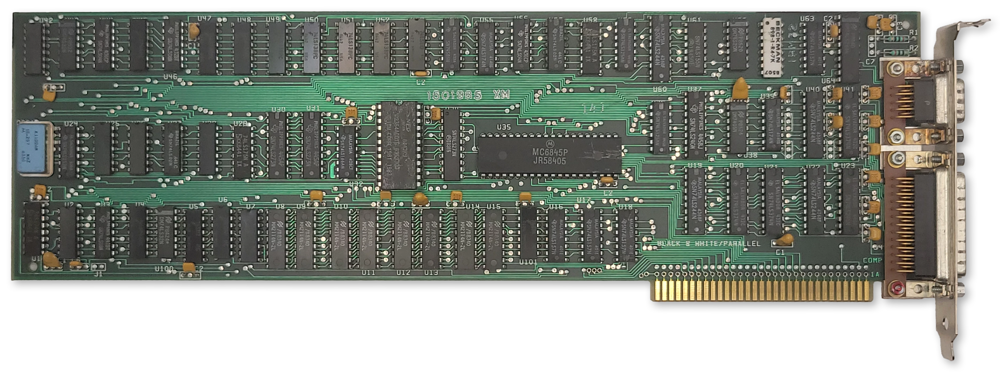
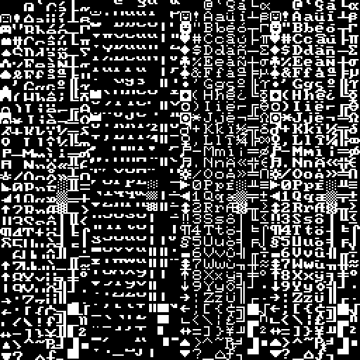
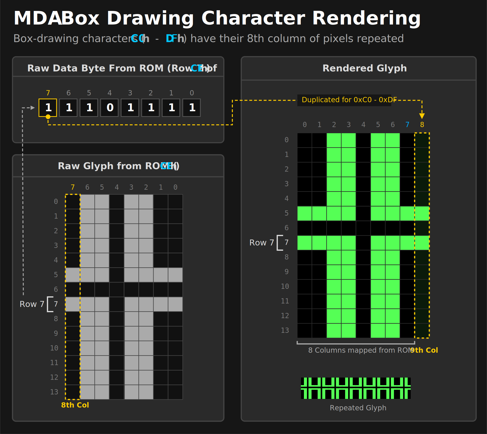

# Monochrome Display Adapter (MDA)

  
  
<em>The IBM MDA card</em>

The IBM Monochrome Display Adapter (MDA) was one of the first video adapters available for the IBM PC, along with the IBM Color Graphics Adapter and the third-party Hercules video adapter.

> [!IMPORTANT] 
> The MDA is built around the [Motorola MC6845 CRTC](6845.md). Read that chapter first for a basic understanding of how the CRTC is used to define frame geometry and draw the screen.

## At a Glance

| Item                    | Description                                      |
| ----------------------- | ------------------------------------------------ |
| Video memory            | **4KiB** at `B000:0`, mirrored 8x through `B700:0`|
| Expansion ROM           | None                                             |
| Font ROM                | **8KiB** Character generator ROM, 8x14 glyphs    |
| Main display outputs    | TTL monochrome video on DE-9,                    |
| Typical text modes      | **80x25**, 4 shades, **9x14** character cell     |
| Standard Resolution     | **720x350** @ 50Hz                               |
| Standard graphics modes | None                                             |
| I/O address range       | `3B0h`-`3BFh`                                    |
| CRTC address port       | `3B4h` standard, `3B0h`, `3B2h`, `3B6h` alternate*|
| CRTC data port          | `3B5h` standard, `3B1h`, `3B3h`, `3B7h` alternate*|
| MDA control ports       | `3B8h` mode control                              |
| MDA status port         | `3BAh`                                           |
| Parallel port           | `3BCh`-`3BEh`                                    |
| Interrupts              | No display interrupt; printer interface uses `IRQ7` |
| DMA                     | None                                             |

The MDA was intended for use with the **IBM 5151 Personal Computer Display**. This monitor plugged into the back of the PC's power supply and turned on and off with the system. The MDA card itself was only capable of displaying **text mode**, but the monitor itself could display graphics, which cards like the **Hercules Graphics Adapter** took advantage of to provide a tempting upgrade for 5151 owners.

The MDA has 4KiB of DRAM dedicated to video memory — enough to hold a single 80x25 screen's worth of text. It also has an 8KiB font ROM that holds bit patterns for drawing text glyphs.

The MDA's 4KiB of DRAM at segment `B000:0` is incompletely decoded, causing eight mirrors of video memory from `B000:0` through `B700:FFFF`. This ends at the CGA's memory address of `B8000`. Along with the different base IO address, this allowed one to install both an MDA card and a CGA card in the same system for an early dual-monitor setup.

The MDA has no on-board **video BIOS** or expansion ROM. All PC-compatible BIOS implementations must therefore know how to identify, initialize and operate an MDA card in order to provide standard [int 10h](https://en.wikipedia.org/wiki/INT_10H) services.

In text mode, the MDA card was capable of outputting 3 grayscale shades and black, using two output pins of its DE-9 video connector. Some early MDA cards could be coerced into showing 16 colors.[^1]

The MDA contains a 16.257MHz crystal. The refresh rate is approximately 50Hz.

The IBM MDA card included a [parallel printer port](../io-devices/parallel.md). See that section for more details.

> [!NOTE]
> **\*** Incomplete decoding of the CRTC registers means the two CRTC ports are repeated four times. Some software titles may rely on these alternate port numbers.

### MDA Character Glyphs (Standard Font)

The standard MDA character glyphs are shown below.

<!-- cSpell:disable -->

	<table class="mda-ascii-table">
		<tr>
			<th class="corner" aria-hidden="true"></th>
			<th scope="col">0</th>
			<th scope="col">1</th>
			<th scope="col">2</th>
			<th scope="col">3</th>
			<th scope="col">4</th>
			<th scope="col">5</th>
			<th scope="col">6</th>
			<th scope="col">7</th>
			<th scope="col">8</th>
			<th scope="col">9</th>
			<th scope="col">A</th>
			<th scope="col">B</th>
			<th scope="col">C</th>
			<th scope="col">D</th>
			<th scope="col">E</th>
			<th scope="col">F</th>
		</tr>
		<tr>
			<th scope="row">0</th>
			<td class="glyph-cell">
				
			</td>
			<td class="glyph-cell">
				
			</td>
			<td class="glyph-cell">
				
			</td>
			<td class="glyph-cell">
				
			</td>
			<td class="glyph-cell">
				
			</td>
			<td class="glyph-cell">
				
			</td>
			<td class="glyph-cell">
				
			</td>
			<td class="glyph-cell">
				
			</td>
			<td class="glyph-cell">
				
			</td>
			<td class="glyph-cell">
				
			</td>
			<td class="glyph-cell">
				
			</td>
			<td class="glyph-cell">
				
			</td>
			<td class="glyph-cell">
				
			</td>
			<td class="glyph-cell">
				
			</td>
			<td class="glyph-cell">
				
			</td>
			<td class="glyph-cell">
				
			</td>
		</tr>
		<tr>
			<th scope="row">1</th>
			<td class="glyph-cell">
				
			</td>
			<td class="glyph-cell">
				
			</td>
			<td class="glyph-cell">
				
			</td>
			<td class="glyph-cell">
				
			</td>
			<td class="glyph-cell">
				
			</td>
			<td class="glyph-cell">
				
			</td>
			<td class="glyph-cell">
				
			</td>
			<td class="glyph-cell">
				
			</td>
			<td class="glyph-cell">
				
			</td>
			<td class="glyph-cell">
				
			</td>
			<td class="glyph-cell">
				
			</td>
			<td class="glyph-cell">
				
			</td>
			<td class="glyph-cell">
				
			</td>
			<td class="glyph-cell">
				
			</td>
			<td class="glyph-cell">
				
			</td>
			<td class="glyph-cell">
				
			</td>
		</tr>
		<tr>
			<th scope="row">2</th>
			<td class="glyph-cell">
				
			</td>
			<td class="glyph-cell">
				
			</td>
			<td class="glyph-cell">
				
			</td>
			<td class="glyph-cell">
				
			</td>
			<td class="glyph-cell">
				
			</td>
			<td class="glyph-cell">
				
			</td>
			<td class="glyph-cell">
				
			</td>
			<td class="glyph-cell">
				
			</td>
			<td class="glyph-cell">
				
			</td>
			<td class="glyph-cell">
				
			</td>
			<td class="glyph-cell">
				
			</td>
			<td class="glyph-cell">
				
			</td>
			<td class="glyph-cell">
				
			</td>
			<td class="glyph-cell">
				
			</td>
			<td class="glyph-cell">
				
			</td>
			<td class="glyph-cell">
				
			</td>
		</tr>
		<tr>
			<th scope="row">3</th>
			<td class="glyph-cell">
				
			</td>
			<td class="glyph-cell">
				
			</td>
			<td class="glyph-cell">
				
			</td>
			<td class="glyph-cell">
				
			</td>
			<td class="glyph-cell">
				
			</td>
			<td class="glyph-cell">
				
			</td>
			<td class="glyph-cell">
				
			</td>
			<td class="glyph-cell">
				
			</td>
			<td class="glyph-cell">
				
			</td>
			<td class="glyph-cell">
				
			</td>
			<td class="glyph-cell">
				
			</td>
			<td class="glyph-cell">
				
			</td>
			<td class="glyph-cell">
				
			</td>
			<td class="glyph-cell">
				
			</td>
			<td class="glyph-cell">
				
			</td>
			<td class="glyph-cell">
				
			</td>
		</tr>
		<tr>
			<th scope="row">4</th>
			<td class="glyph-cell">
				
			</td>
			<td class="glyph-cell">
				
			</td>
			<td class="glyph-cell">
				
			</td>
			<td class="glyph-cell">
				
			</td>
			<td class="glyph-cell">
				
			</td>
			<td class="glyph-cell">
				
			</td>
			<td class="glyph-cell">
				
			</td>
			<td class="glyph-cell">
				
			</td>
			<td class="glyph-cell">
				
			</td>
			<td class="glyph-cell">
				
			</td>
			<td class="glyph-cell">
				
			</td>
			<td class="glyph-cell">
				
			</td>
			<td class="glyph-cell">
				
			</td>
			<td class="glyph-cell">
				
			</td>
			<td class="glyph-cell">
				
			</td>
			<td class="glyph-cell">
				
			</td>
		</tr>
		<tr>
			<th scope="row">5</th>
			<td class="glyph-cell">
				
			</td>
			<td class="glyph-cell">
				
			</td>
			<td class="glyph-cell">
				
			</td>
			<td class="glyph-cell">
				
			</td>
			<td class="glyph-cell">
				
			</td>
			<td class="glyph-cell">
				
			</td>
			<td class="glyph-cell">
				
			</td>
			<td class="glyph-cell">
				
			</td>
			<td class="glyph-cell">
				
			</td>
			<td class="glyph-cell">
				
			</td>
			<td class="glyph-cell">
				
			</td>
			<td class="glyph-cell">
				
			</td>
			<td class="glyph-cell">
				
			</td>
			<td class="glyph-cell">
				
			</td>
			<td class="glyph-cell">
				
			</td>
			<td class="glyph-cell">
				
			</td>
		</tr>
		<tr>
			<th scope="row">6</th>
			<td class="glyph-cell">
				
			</td>
			<td class="glyph-cell">
				
			</td>
			<td class="glyph-cell">
				
			</td>
			<td class="glyph-cell">
				
			</td>
			<td class="glyph-cell">
				
			</td>
			<td class="glyph-cell">
				
			</td>
			<td class="glyph-cell">
				
			</td>
			<td class="glyph-cell">
				
			</td>
			<td class="glyph-cell">
				
			</td>
			<td class="glyph-cell">
				
			</td>
			<td class="glyph-cell">
				
			</td>
			<td class="glyph-cell">
				
			</td>
			<td class="glyph-cell">
				
			</td>
			<td class="glyph-cell">
				
			</td>
			<td class="glyph-cell">
				
			</td>
			<td class="glyph-cell">
				
			</td>
		</tr>
		<tr>
			<th scope="row">7</th>
			<td class="glyph-cell">
				
			</td>
			<td class="glyph-cell">
				
			</td>
			<td class="glyph-cell">
				
			</td>
			<td class="glyph-cell">
				
			</td>
			<td class="glyph-cell">
				
			</td>
			<td class="glyph-cell">
				
			</td>
			<td class="glyph-cell">
				
			</td>
			<td class="glyph-cell">
				
			</td>
			<td class="glyph-cell">
				
			</td>
			<td class="glyph-cell">
				
			</td>
			<td class="glyph-cell">
				
			</td>
			<td class="glyph-cell">
				
			</td>
			<td class="glyph-cell">
				
			</td>
			<td class="glyph-cell">
				
			</td>
			<td class="glyph-cell">
				
			</td>
			<td class="glyph-cell">
				
			</td>
		</tr>
		<tr>
			<th scope="row">8</th>
			<td class="glyph-cell">
				
			</td>
			<td class="glyph-cell">
				
			</td>
			<td class="glyph-cell">
				
			</td>
			<td class="glyph-cell">
				
			</td>
			<td class="glyph-cell">
				
			</td>
			<td class="glyph-cell">
				
			</td>
			<td class="glyph-cell">
				
			</td>
			<td class="glyph-cell">
				
			</td>
			<td class="glyph-cell">
				
			</td>
			<td class="glyph-cell">
				
			</td>
			<td class="glyph-cell">
				
			</td>
			<td class="glyph-cell">
				
			</td>
			<td class="glyph-cell">
				
			</td>
			<td class="glyph-cell">
				
			</td>
			<td class="glyph-cell">
				
			</td>
			<td class="glyph-cell">
				
			</td>
		</tr>
		<tr>
			<th scope="row">9</th>
			<td class="glyph-cell">
				
			</td>
			<td class="glyph-cell">
				
			</td>
			<td class="glyph-cell">
				
			</td>
			<td class="glyph-cell">
				
			</td>
			<td class="glyph-cell">
				
			</td>
			<td class="glyph-cell">
				
			</td>
			<td class="glyph-cell">
				
			</td>
			<td class="glyph-cell">
				
			</td>
			<td class="glyph-cell">
				
			</td>
			<td class="glyph-cell">
				
			</td>
			<td class="glyph-cell">
				
			</td>
			<td class="glyph-cell">
				
			</td>
			<td class="glyph-cell">
				
			</td>
			<td class="glyph-cell">
				
			</td>
			<td class="glyph-cell">
				
			</td>
			<td class="glyph-cell">
				
			</td>
		</tr>
		<tr>
			<th scope="row">A</th>
			<td class="glyph-cell">
				
			</td>
			<td class="glyph-cell">
				
			</td>
			<td class="glyph-cell">
				
			</td>
			<td class="glyph-cell">
				
			</td>
			<td class="glyph-cell">
				
			</td>
			<td class="glyph-cell">
				
			</td>
			<td class="glyph-cell">
				
			</td>
			<td class="glyph-cell">
				
			</td>
			<td class="glyph-cell">
				
			</td>
			<td class="glyph-cell">
				
			</td>
			<td class="glyph-cell">
				
			</td>
			<td class="glyph-cell">
				
			</td>
			<td class="glyph-cell">
				
			</td>
			<td class="glyph-cell">
				
			</td>
			<td class="glyph-cell">
				
			</td>
			<td class="glyph-cell">
				
			</td>
		</tr>
		<tr>
			<th scope="row">B</th>
			<td class="glyph-cell">
				
			</td>
			<td class="glyph-cell">
				
			</td>
			<td class="glyph-cell">
				
			</td>
			<td class="glyph-cell">
				
			</td>
			<td class="glyph-cell">
				
			</td>
			<td class="glyph-cell">
				
			</td>
			<td class="glyph-cell">
				
			</td>
			<td class="glyph-cell">
				
			</td>
			<td class="glyph-cell">
				
			</td>
			<td class="glyph-cell">
				
			</td>
			<td class="glyph-cell">
				
			</td>
			<td class="glyph-cell">
				
			</td>
			<td class="glyph-cell">
				
			</td>
			<td class="glyph-cell">
				
			</td>
			<td class="glyph-cell">
				
			</td>
			<td class="glyph-cell">
				
			</td>
		</tr>
		<tr>
			<th scope="row">C</th>
			<td class="glyph-cell">
				
			</td>
			<td class="glyph-cell">
				
			</td>
			<td class="glyph-cell">
				
			</td>
			<td class="glyph-cell">
				
			</td>
			<td class="glyph-cell">
				
			</td>
			<td class="glyph-cell">
				
			</td>
			<td class="glyph-cell">
				
			</td>
			<td class="glyph-cell">
				
			</td>
			<td class="glyph-cell">
				
			</td>
			<td class="glyph-cell">
				
			</td>
			<td class="glyph-cell">
				
			</td>
			<td class="glyph-cell">
				
			</td>
			<td class="glyph-cell">
				
			</td>
			<td class="glyph-cell">
				
			</td>
			<td class="glyph-cell">
				
			</td>
			<td class="glyph-cell">
				
			</td>
		</tr>
		<tr>
			<th scope="row">D</th>
			<td class="glyph-cell">
				
			</td>
			<td class="glyph-cell">
				
			</td>
			<td class="glyph-cell">
				
			</td>
			<td class="glyph-cell">
				
			</td>
			<td class="glyph-cell">
				
			</td>
			<td class="glyph-cell">
				
			</td>
			<td class="glyph-cell">
				
			</td>
			<td class="glyph-cell">
				
			</td>
			<td class="glyph-cell">
				
			</td>
			<td class="glyph-cell">
				
			</td>
			<td class="glyph-cell">
				
			</td>
			<td class="glyph-cell">
				
			</td>
			<td class="glyph-cell">
				
			</td>
			<td class="glyph-cell">
				
			</td>
			<td class="glyph-cell">
				
			</td>
			<td class="glyph-cell">
				
			</td>
		</tr>
		<tr>
			<th scope="row">E</th>
			<td class="glyph-cell">
				
			</td>
			<td class="glyph-cell">
				
			</td>
			<td class="glyph-cell">
				
			</td>
			<td class="glyph-cell">
				
			</td>
			<td class="glyph-cell">
				
			</td>
			<td class="glyph-cell">
				
			</td>
			<td class="glyph-cell">
				
			</td>
			<td class="glyph-cell">
				
			</td>
			<td class="glyph-cell">
				
			</td>
			<td class="glyph-cell">
				
			</td>
			<td class="glyph-cell">
				
			</td>
			<td class="glyph-cell">
				
			</td>
			<td class="glyph-cell">
				
			</td>
			<td class="glyph-cell">
				
			</td>
			<td class="glyph-cell">
				
			</td>
			<td class="glyph-cell">
				
			</td>
		</tr>
		<tr>
			<th scope="row">F</th>
			<td class="glyph-cell">
				
			</td>
			<td class="glyph-cell">
				
			</td>
			<td class="glyph-cell">
				
			</td>
			<td class="glyph-cell">
				
			</td>
			<td class="glyph-cell">
				
			</td>
			<td class="glyph-cell">
				
			</td>
			<td class="glyph-cell">
				
			</td>
			<td class="glyph-cell">
				
			</td>
			<td class="glyph-cell">
				
			</td>
			<td class="glyph-cell">
				
			</td>
			<td class="glyph-cell">
				
			</td>
			<td class="glyph-cell">
				
			</td>
			<td class="glyph-cell">
				
			</td>
			<td class="glyph-cell">
				
			</td>
			<td class="glyph-cell">
				
			</td>
			<td class="glyph-cell">
				
			</td>
		</tr>
	</table>

<!-- cSpell:enable -->

A visualization of the character font ROM is shown below, with bytes reversed and wrapping vertically to fit into a square image. The first half of the ROM is dedicated to the MDA's 8x14 font, which is encoded into 8x16 cells for alignment. Each cell is split into two 8x8 parts within the ROM due to addressing logic.

The same character ROM image is used for both MDA and CGA, so the CGA fonts follow the MDA font in the latter half of the ROM.

  
  
<em>The MDA/CGA character font ROM (byte-reversed)</em>

The character font ROM is not accessible from the host PC. It can only be read by the MDA itself.

## Box Drawing Characters

Character codes `C0h—DFh` receive special treatment. When one of these characters is being rasterized, the eighth column is repeated to form the ninth column on the display. This allows the box drawing characters to connect seamlessly together across a 9-pixel character cell. 

  
  
<em>MDA box drawing character rendering</em>

Note that `B0h—B2h` do not receive this treatment, so areas shaded with these characters will still have one pixel gaps between each character glyph.

## The MDA Registers

{{#bitfield h3 mda_registers.toml#mode-control-register}}

> [!CAUTION]
> IBM warns that the first thing that must be done to initialize the MDA is to set bit 0 of the mode control register to 1. 

Bit `0` of the mode control register selects the MDA's **dot clock**. When set to `1`, the onboard 16.257MHz crystal is used. If set to `0`, the clock is taken from an unpopulated pad. If the MDA's video memory is accessed while this bit is `0`, the MDA card will fail to drive the `IO_CH_READY` pin on the ISA bus high, and the CPU will hang. It is unclear what IBM's original intent for implementing this was, but perhaps they were simply keeping their options open for a future variant that supported additional resolutions and would have subsequently required a second clock source.

{{#bitfield h3 mda_registers.toml#status-register}}

The MDA's status register is very different from the CGA. The first bit reflects the HS pin from the 6845, delayed by one character clock. This differs from the CGA, which reports the inverted DE pin from the 6845. 

The MDA also lacks the vertical sync status bit. Instead, it has a type of *video mux* bit, **LVIDEO**. Querying bit 3 can test if an active pixel of any "color" other than black is being output. The IBM BIOS primarily uses this as a test during POST to ensure that the card is functioning. 

> [!TIP]
> When writing MDA emulation, implementing the **LVIDEO** bit may seem daunting. It is generally sufficient to set the latch if any pixel was output in the previous character clock (or even scanline) instead of requiring pixel-perfect accuracy. The IBM BIOS draws a row of solid block characters and tests that the bit is set immediately at the start of the frame. It is unknown if any software besides the BIOS POST relies on this bit for proper functionality.

## Light Pen

The very earliest models of the MDA card include a header to attach a light pen, similar to the CGA. This was removed on all subsequent versions of the card — the entire footprint was removed, not just left unpopulated, and in addition, the strobe signal to the 6845 and the two status bits for light pen operation were also disconnected and will always return `0`.

The P39 phosphors used in most monochrome displays were incompatible with early light pens for the PC, which may have influenced IBM's decision to remove light pen support from the MDA.

## Display Timings

The MDA has a 16.257MHz crystal. 

We can calculate the typical display field of the MDA from its normal CRTC parameters:

$$H_{\text{total}} = (R0 + 1) \times 9 = (97 + 1) \times 9 = 882$$

$$V_{\text{total}} = (R4 + 1) \times (R9 + 1) + R5 = (25 + 1) \times 14 + 6 = 370$$

$$\text{display field} = 882 \times 370$$

The horizontal and vertical refresh rates can then be derived:

$$f_{hsync} = \frac{16{,}257{,}000}{882} = 18.43 \text{ kHz}$$

$$f_{refresh} = \frac{16{,}257{,}000}{882 \times 370} = 49.82 \text{ Hz}$$

## BIOS Video Mode

The MDA typically uses standard `int10h` video mode `7`.

## CRTC Parameters

For the MDA's standard text mode, the MC6845 CRTC needs to be configured with the correct parameters for registers **R0-R11**. The standard CRTC parameters are given below.

<table class="crtc-params-table">
  <thead>
    <tr>
      <th rowspan="2">Register</th>
      <th rowspan="2">Name</th>
      <th class="header-group" colspan="1">Text Mode</th>
    </tr>
    <tr>
      <th class="header-group-member header-group-first header-group-last">80 Column</th>
    </tr>
  </thead>
  <tbody>
    <tr>
      <th>R0</th>
      <td>HorizontalTotal</td>
      <td>97</td>
    </tr>
    <tr>
      <th>R1</th>
      <td>HorizontalDisplayed</td>
      <td>80</td>
    </tr>
    <tr>
      <th>R2</th>
      <td>HorizontalSyncPosition</td>
      <td>82</td>
    </tr>
    <tr>
      <th>R3</th>
      <td>SyncWidth</td>
      <td>15</td>
    </tr>
    <tr>
      <th>R4</th>
      <td>VerticalTotal</td>
      <td>25</td>
    </tr>
    <tr>
      <th>R5</th>
      <td>VerticalTotalAdjust</td>
      <td>6</td>
    </tr>
    <tr>
      <th>R6</th>
      <td>VerticalDisplayed</td>
      <td>25</td>
    </tr>
    <tr>
      <th>R7</th>
      <td>VerticalSync</td>
      <td>25</td>
    </tr>
    <tr>
      <th>R8</th>
      <td>InterlaceMode</td>
      <td>2</td>
    </tr>
    <tr>
      <th>R9</th>
      <td>MaximumScanLineAddress</td>
      <td>13</td>
    </tr>
    <tr>
      <th>R10</th>
      <td>CursorStart</td>
      <td>11</td>
    </tr>
    <tr>
      <th>R11</th>
      <td>CursorEnd</td>
      <td>12</td>
    </tr>
  </tbody>
</table>

## Primary References

 - (seasip.org) [Monochrome Display Adapter: Notes](https://www.seasip.info/VintagePC/mda.html)
 - (minuszerodegress.net) [IBM Monochrome Display and Printer Adapter (MDA)](https://www.minuszerodegrees.net/5150_5160/cards/5150_5160_cards.htm#mda)

[^1]: VCFed forum thread, [Why did IBM create color MDA and just abandoned it?](https://forum.vcfed.org/index.php?threads/why-did-ibm-create-color-mda-and-just-abandoned-it.1252459/), April 2025.
