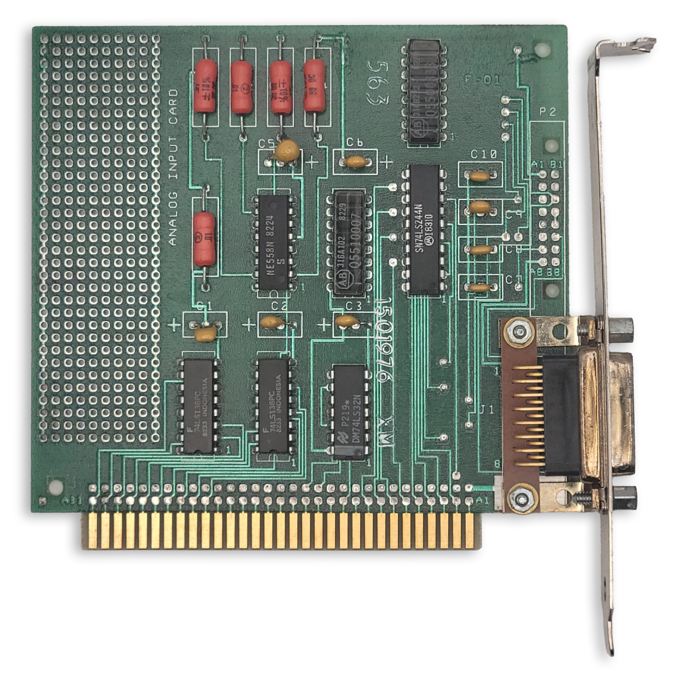
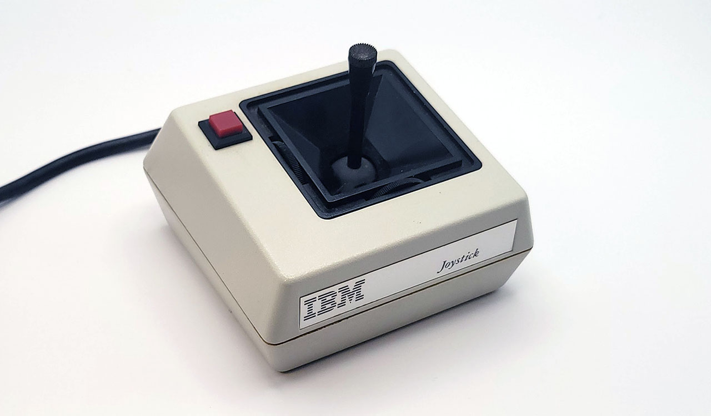
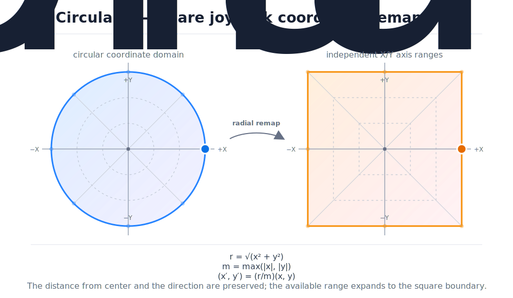

# The Game Port

<div style="text-align: center; margin: 1.5em 0;">
  
  <p style="font-style: italic; margin-top: 0.5em; opacity: 0.8;"><em>The IBM Game Control Adapter</em></p>
</div>

The **IBM Game Control Adapter** implements a *game port*, supporting up to four buttons and four analog axes. In the early days of the PC, joysticks typically had two axes (one stick) and one to two buttons.

## At a Glance

| Item                    | Description                                      |
| ----------------------- | ------------------------------------------------ |
| I/O address             | `201h`                                           |
| Interrupts              | None                                             |
| DMA                     | None                                             |

## Game Port Operation

The game port is implemented via four one-shot timers, provided by an *NE558N* quad timer chip. The pinout of the game port itself presents a challenge: the position of each axis must somehow be read with a single wire.

To do so, each axis of a joystick is connected to a [potentiometer](https://en.wikipedia.org/wiki/Potentiometer). A capacitor on the game port card and the potentiometer within the joystick form an *RC timing network* connected to one of the NE558N's monostable timers. This creates a one-shot timing pulse of a duration given by the following formula:

$$
T(\mu\mathrm{s}) = 24.2\mu\mathrm{s} + 0.011r\ \mu\mathrm{s}
$$

The potentiometers in the joystick typically have a range of 0 to 100kΩ. To read the axis positions, first port `201h` must be written to in order to trigger the four timers. This will cause bits **0-3** of `201h` to read high. Port `201h` must then be polled repeatedly until one axis bit changes from `1` to `0`. At this point, the elapsed time **T** (in microseconds) can provide the resistance value for that axis:

$$
r(\Omega) = \frac{T(\mu\mathrm{s}) - 24.2}{0.011}
$$

The measured resistance value can be normalized to the range [0.0-1.0] by dividing by the maximum resistance. An emulator can simulate an 'ideal' joystick with a perfect, linear 0-100kΩ response. Real joysticks were imperfect, and so many applications that used a joystick had a *calibration routine* where the user was asked to move the stick to the maximum extent of each axis before pressing a button. In this way the effective range of the potentiometer could be determined.

The immediate state of the four buttons can be read out at any time, as active-low inputs.


```bitfield
name = "Game Port"
bits = 8
description = "Joystick position and button status read from I/O port 201h."

[[register]]
name = "Game Port"
address = "201h"
width = 8

[[fields]]
name = "B2"
lsb = 7
width = 1
description = "**Joystick B button 2.**<br>**0**: Pressed<br>**1**: Open / not pressed"

[[fields]]
name = "B1"
lsb = 6
width = 1
description = "**Joystick B button 1.**<br>**0**: Pressed<br>**1**: Open / not pressed"

[[fields]]
name = "A2"
lsb = 5
width = 1
description = "**Joystick A button 2.**<br>**0**: Pressed<br>**1**: Open / not pressed"

[[fields]]
name = "A1"
lsb = 4
width = 1
description = "**Joystick A button 1.**<br>**0**: Pressed<br>**1**: Open / not pressed"

[[fields]]
name = "B-Y"
lsb = 3
width = 1
description = "**Joystick B Y-coordinate one-shot output.**<br>**0**: Timing pulse ended<br>**1**: One-shot fired / timing pulse active"

[[fields]]
name = "B-X"
lsb = 2
width = 1
description = "**Joystick B X-coordinate one-shot output.**<br>**0**: Timing pulse ended<br>**1**: One-shot fired / timing pulse active"

[[fields]]
name = "A-Y"
lsb = 1
width = 1
description = "**Joystick A Y-coordinate one-shot output.**<br>**0**: Timing pulse ended<br>**1**: One-shot fired / timing pulse active"

[[fields]]
name = "A-X"
lsb = 0
width = 1
description = "**Joystick A X-coordinate one-shot output.**<br>**0**: Timing pulse ended<br>**1**: One-shot fired / timing pulse active"
```

## Typical Joystick

A typical joystick of the original PC era would have a single stick, and one or two buttons. Pictured below is an IBM PCjr joystick, but it was a rebadged *Kraft* joystick that could also be purchased for a standard PC game port. This joystick, like many others, can be converted per-axis from auto-centering to free movement, something probably only useful for flight-simulator games.

<div style="text-align: center; margin: 1.5em 0;">
  
  <p style="font-style: italic; margin-top: 0.5em; opacity: 0.8;"><em>The IBM Joystick</em></p>
</div>


## Radial Remapping

Modern analog sticks are typically circular, producing coordinate pairs in the unit circle:

$$
x^2 + y^2 \leq 1
$$

Traditional joysticks typically allowed the full range of each axis independently. This can cause problems when calibrating a joystick via diagonal inputs with a modern gamepad. It may be useful to translate radial coordinates to square ones:

$$
r = \sqrt{x^2 + y^2}, \qquad
m = \max\left(|x|, |y|\right), \qquad
(x', y') = \frac{r}{m}(x, y)
$$

This produces the following remapping:

<div style="text-align: center; margin: 1.5em 0;">
  
</div>

## Game Port Evolution

The game port didn't exist for long as a standalone card, although several companies produced their own versions, sometimes with a trim adjustment knob for better calibration. Game ports instead started to appear on many *multifunction cards* like the *AST SixPakPlus*. Eventually, the game port would migrate almost entirely to PC sound cards such as the *SoundBlaster*, where they also served a secondary role as a MIDI port.

## Utilities

 - (www.oldskool.org) [JOYCALIB](http://www.oldskool.org/pc/joycalib) is an excellent joystick calibration utility made by [Trixter](https://www.oldskool.org/). It can be very useful for testing your game port and joystick emulation.

## Datasheet

 - (archive.org) [The IBM Game Control Adapter](https://archive.org/details/ibm_pc_datasheets/Expansion%20Cards/IBM%20Game%20Control%20Adapter/)