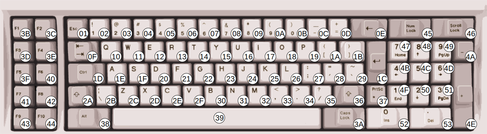

# Keyboard 

The IBM 5150 and 5160 originally used an 83-key IBM "Model-F" keyboard[^wikipedia], IBM Part #1501100 (Part #1501105 in the UK[^seasip]).

Later revisions of the BIOS ROM for the IBM 5160 contained support for the 101-key Enhanced Keyboard[^mzd]. This keyboard introduced multi-byte scancodes, which required large changes in the keyboard handling code of the BIOS to accommodate.

IBM changed the keyboard protocol with the IBM 5170 AT, making everyone buy new keyboards. Therefore, keyboards of this era are often described as speaking either the "XT" or "AT" protocol. Some keyboards were made that could switch between both, and adapters were (and are) available.

The 83-key keyboard layout is missing many of the keys that we take for granted on modern keyboard layouts. Unlike modern keyboards, the function keys are arranged in a block on the left side. 

  
  
<em>Figure 1.1: IBM PC 83-key Model F Keyboard Layout with scancodes (Click to zoom)</em>

<!-- Modal for image zoom -->

  
  
&times;

## Keyboard Operation

The keyboard communicates with the PC by sending one-byte **scancodes** when a key is pressed or released. On the original 83-keyboard, each key produces a single-byte scancode.  When pressed, the unmodified scancode value is sent. When released, the scancode is sent again, with the MSB set to `1`.  Since keyboard operation is event-driven, if we were ever to miss processing a 'key-up' scancode, this would cause the phenomenon of a "stuck key," something most PC users have experienced at one point.

The keyboard is a serial device, and the keyboard port a specialized serial port. The electrical details of the keyboard port are not really salient to emulating the keyboard, except for the operation of the clock pin.

Bit 6 of the 8255 PPI's Port B register, when written with a 0, will pull the keyboard clock line low. When held in this state for approximately 20ms, the keyboard will perform a self-test. When the clock line is released by writing `1` to PPI Port B bit 6, the keyboard will send the special scancode `0xAA`. If the keyboard internally detects a physically stuck key, it will send the scancode of that key 10ms after sending `0xAA`.[^mzd-kb]. There's probably no reason to emulate stuck keys, though.

If you fail to emulate sending the reset scancode `0xAA` at the appropriate time, the BIOS will emit a `POST error code 301`.

If you happen to be using SDL for your emulator, here's a table of SDL keycode definitions to IBM scancodes:

| SDL Key           | Scancode (hex) |
| ----------------- | -------------- |
| SDLK_A            | 1E             |
| SDLK_B            | 30             |
| SDLK_C            | 2E             |
| SDLK_D            | 20             |
| SDLK_E            | 12             |
| SDLK_F            | 21             |
| SDLK_G            | 22             |
| SDLK_H            | 23             |
| SDLK_I            | 17             |
| SDLK_J            | 24             |
| SDLK_K            | 25             |
| SDLK_L            | 26             |
| SDLK_M            | 32             |
| SDLK_N            | 31             |
| SDLK_O            | 18             |
| SDLK_P            | 19             |
| SDLK_Q            | 10             |
| SDLK_R            | 13             |
| SDLK_S            | 1F             |
| SDLK_T            | 14             |
| SDLK_U            | 16             |
| SDLK_V            | 2F             |
| SDLK_W            | 11             |
| SDLK_X            | 2D             |
| SDLK_Y            | 15             |
| SDLK_Z            | 2C             |
| SDLK_1            | 02             |
| SDLK_2            | 03             |
| SDLK_3            | 04             |
| SDLK_4            | 05             |
| SDLK_5            | 06             |
| SDLK_6            | 07             |
| SDLK_7            | 08             |
| SDLK_8            | 09             |
| SDLK_9            | 0A             |
| SDLK_0            | 0B             |
| SDLK_RETURN       | 1C             |
| SDLK_ESCAPE       | 01             |
| SDLK_BACKSPACE    | 0E             |
| SDLK_TAB          | 0F             |
| SDLK_SPACE        | 39             |
| SDLK_MINUS        | 0C             |
| SDLK_EQUALS       | 0D             |
| SDLK_LEFTBRACKET  | 1A             |
| SDLK_RIGHTBRACKET | 1B             |
| SDLK_BACKSLASH    | 2B             |
| SDLK_SEMICOLON    | 27             |
| SDLK_APOSTROPHE   | 28             |
| SDLK_COMMA        | 33             |
| SDLK_PERIOD       | 34             |
| SDLK_SLASH        | 35             |
| SDLK_GRAVE        | 29             |
| SDLK_LSHIFT       | 2A             |
| SDLK_RSHIFT       | 36             |
| SDLK_LCTRL        | 1D             |
| SDLK_RCTRL        | 1D             |
| SDLK_LALT         | 38             |
| SDLK_RALT         | 38             |
| SDLK_CAPSLOCK     | 3A             |
| SDLK_F1           | 3B             |
| SDLK_F2           | 3C             |
| SDLK_F3           | 3D             |
| SDLK_F4           | 3E             |
| SDLK_F5           | 3F             |
| SDLK_F6           | 40             |
| SDLK_F7           | 41             |
| SDLK_F8           | 42             |
| SDLK_F9           | 43             |
| SDLK_F10          | 44             |
| SDLK_F11          | 57             |
| SDLK_F12          | 58             |
| SDLK_UP           | 48             |
| SDLK_DOWN         | 50             |
| SDLK_LEFT         | 4B             |
| SDLK_RIGHT        | 4D             |
| SDLK_INSERT       | 52             |
| SDLK_DELETE       | 53             |
| SDLK_HOME         | 47             |
| SDLK_END          | 4F             |
| SDLK_PAGEUP       | 49             |
| SDLK_PAGEDOWN     | 51             |
| SDLK_KP_1         | 4F             |
| SDLK_KP_2         | 50             |
| SDLK_KP_3         | 51             |
| SDLK_KP_4         | 4B             |
| SDLK_KP_5         | 4C             |
| SDLK_KP_6         | 4D             |
| SDLK_KP_7         | 47             |
| SDLK_KP_8         | 48             |
| SDLK_KP_9         | 49             |
| SDLK_KP_0         | 52             |
| SDLK_KP_PLUS      | 4E             |
| SDLK_KP_MINUS     | 4A             |
| SDLK_KP_PERIOD    | 53             |
| SDLK_KP_ENTER     | 1C             |
| SDLK_KP_DIVIDE    | 35             |
| SDLK_KP_MULTIPLY  | 37             |
| SDLK_KP_EQUALS    | 0D             |

# References
[^mzd]: minuszerodegrees.net [IBM 5160 - Keyboards](https://minuszerodegrees.net/5160/keyboard/5160_keyboard_support.htm)
[^mzd-kb]: minuszerodegrees.net [5160 Keyboard Startup](https://minuszerodegrees.net/5160/keyboard/5160_keyboard_startup.jpg)
[^seasip]: seasip.info [The IBM 1501105 Keyboard](https://www.seasip.info/VintagePC/ibm_1501105.html)
[^wikipedia]: wikipedia.org [*Model F keyboard*](https://en.wikipedia.org/wiki/Model_F_keyboard).