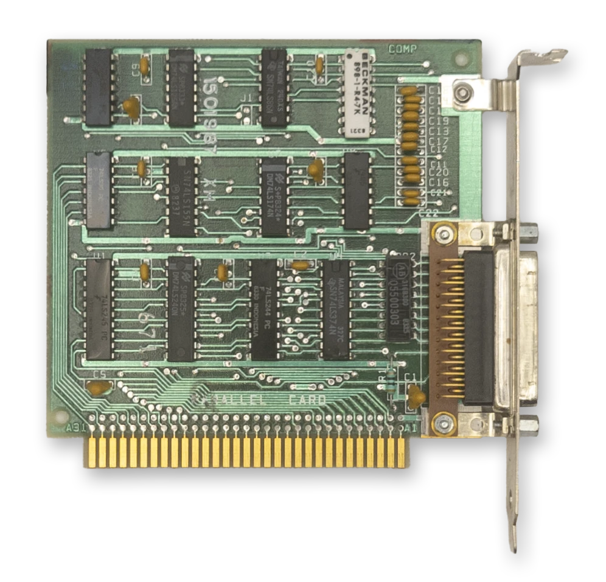

# The Parallel Port

<div style="text-align: center; margin: 1.5em 0;">
  
  <p style="font-style: italic; margin-top: 0.5em; opacity: 0.8;"><em>The IBM Printer Adapter</em></p>
</div>

The term **parallel** is in contrast to **serial**. The parallel port provides an 8-bit bidirectional data path, whereas a bidirectional serial connection typically uses a pair of wires, transferring one bit at a time.

The PC parallel port was typically used to interface with a printer, but over the years a number of other devices utilized the parallel port, from storage devices to sound generators. Hobbyists could use the parallel port to connect to breadboards and control various projects.

When connecting to a printer, a *printer cable* was typically used with a male DB-25 connector on one end and a [Centronics connector](https://en.wikipedia.org/wiki/IEEE_1284) on the other, named after the [Centronics Data Computer Corporation](https://en.wikipedia.org/wiki/Centronics).

The parallel port can be implemented entirely with off-the-shelf 74-series logic chips and a few discrete components. IBM sold a dedicated ISA card called the *IBM Printer Adapter* that provided a single parallel port. A parallel port was often included as a 'bonus accessory' on other cards, such as the [Monochrome Display Adapter](../display-graphics/mda.md), various *multifunction adapters*, and several other third-party video cards. 

## At a Glance

| Item                     | Description                                      |
| ------------------------ | ------------------------------------------------ |
| Typical LPT1 base address | `378h` (or `3BCh` on the MDA*)                  |
| Typical LPT2 base address | `278h`                                          |
| Data register            | Base address + `0`                               |
| Status register          | Base address + `1`                               |
| Control register         | Base address + `2`                               |
| Interrupts               | Usually `IRQ7` for LPT1, `IRQ5` for LPT2         |
| DMA                      | None                                             |

> [!NOTE]
> *There is no fixed address for LPT1, 2 and 3. Device names are assigned to ports discovered in the order `3BCh`, `378h`, `278h`. 

## Registers 

### The Parallel Data Register

```bitfield
name = "Data Register"
bits = 8
description = "Data input and output register."
address = "Base + 0"

[[fields]]
name = "DATA"
lsb = 0
width = 8
description = "Data byte"
```

### The Parallel Status Register

```bitfield
name = "Status Register"
bits = 8
description = "Buffered status pins from the printer."

[[register]]
name = "Status"
address = "Base + 1"
width = 8

[[fields]]
name = "/BUSY"
lsb = 7
width = 1
description = "0: The printer is busy and cannot accept data.<br>1: The printer is not busy and can receive data."

[[fields]]
name = "/ACK"
lsb = 6
width = 1
description = "0: The printer has acknowledged the last character and is ready to receive another.<br>1: The printer is processing (busy)."

[[fields]]
name = "PE"
lsb = 5
width = 1
description = "0: The printer reports it has paper.<br>1: The printer reports it is out of paper."

[[fields]]
name = "SLCT"
lsb = 4
width = 1
description = "0: The printer has not been selected (Printer offline)<br>1: The printer has been selected (Select/Online button pressed)"

[[fields]]
name = "/ERROR"
lsb = 3
width = 1
description = "0: The printer has encountered an error condition.<br>1: The printer reports no current error condition."

[[fields]]
name = "Unused"
lsb = 0
width = 3
description = "Unused"
```

### The Parallel Control Register

```bitfield
name = "Control Register"
bits = 8
description = "Set control signals from the CPU to the printer."

[[register]]
name = "Control"
address = "Base + 2"
width = 8

[[fields]]
name = "Unused"
lsb = 5
width = 3
description = "Unused"

[[fields]]
name = "IRQEN"
lsb = 4
width = 1
description = "0: Disable interrupts.<br>1: Enable interrupts triggered by a rising edge of the /ACK pin."

[[fields]]
name = "SLCT_IN"
lsb = 3
width = 1
description = "0: Leave printer unselected.<br>1: Select the printer."

[[fields]]
name = "/INIT"
lsb = 2
width = 1
description = "0: Initialize the printer.<br>1: Do nothing."

[[fields]]
name = "ALF"
lsb = 1
width = 1
description = "0: Do not line-feed automatically.<br>1: Line-feed automatically."

[[fields]]
name = "STR"
lsb = 0
width = 1
description = "Data clock strobe to feed data into the printer."
```

## Datasheet

 - (archive.org) [IBM Printer Adapter](https://archive.org/details/ibm_pc_datasheets/IBM%20Printer%20Adapter/)
 - (archive.org) [IBM Serial/Parallel Adapter](https://archive.org/details/ibm_pc_datasheets/Expansion%20Cards/IBM%20PC%20AT%20Serial%20Parallel%20Adapter/page/n1/mode/2up)