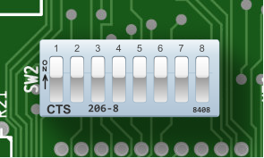

# DIP switches
 

  
  
<em>DIP Switch #2 on the IBM 5150</em>

Dual In-line Package (DIP) switches are small electrical components designed to enable a user to configure the operation of a device. DIP switches have an indicated ON position printed on the switch package. In this manner some switches can be turned ON and others turned OFF. DIP switches are not often marked with their effects - typically you would need to consult a manual to determine how they should be set.

Although convenient for device designers to implement, they are somewhat inconvenient for users in that they require a small tool to physically set. On the PC, accessing the DIP switches requires removing the case cover and navigating through any cabling and expansion cards that may be in the way.

The IBM 5150 has two configuration DIP switches. The first one, SW1, is concerned with configuring the amount of memory installed in the system.  The second set of DIP switches, SW2, is used to indicate what hardware is installed in the system.

The IBM 5160 XT BIOS added auto-discovery of the amount of memory installed in the system, and so SW1 was removed. The operation of SW2 on the XT is otherwise similar.

Some expansion cards have DIP switches, which are sometimes accessible from the outside of the case through a cut-out in the IO bracket. The IBM EGA card is one such example.

# Reading DIP Switches

One gotcha when reading the DIP switches on the PC is that they will read **logically inverted** from what you may intuit from their physical state. If a DIP switch is set to **ON**, it will read as a logical `0`. If a switch is set to **OFF**, it will read as a logical `1`.

A small schematic will help explain why:

When a switch is **OFF**, it is electrically **open**. Pull-up resistors connected to the output side of the switches make them read as logically `1`. When a switch is **ON**, it is electrically **closed**. The other ends of the switches are connected to ground, and so current flows through the switch and the output side of the switch reads as logically `0`.

This was a common way to implement a DIP switch as a connection to ground is a lot easier to find on a PCB than a connection to VCC. 