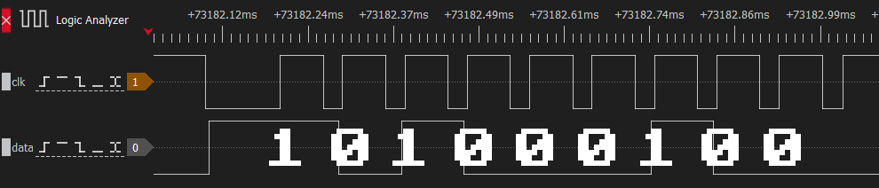
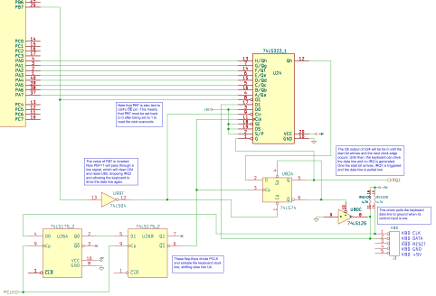

# The IBM PC/XT Keyboard Interface

The XT keyboard interface, as it will be referred to from now on, is one of the most frequently misunderstood systems on the IBM PC, confusing both emulator authors and retro-programmers alike. It is easy to write a program that uses the keyboard in a way that works fine on an AT (or in DosBox), but fails on a more accurate XT emulator or real XT system. This is due to some peculiarities of the XT interface, which will be explained here.

## The Host Keyboard Interface

The low-level, host-facing interface to the keyboard is implemented via the [8255 PPI](../support-chips/ppi-8255.md). The keyboard is controlled via two bits on `Port B`, `61h`, and the scancodes themselves are read out of `Port A`, `60h`. These particular ports became somewhat standard, and so are often implemented on systems which do not even have an 8255 at all.

```bitfield
name = "PPI Port B Keyboard Control Bits"
bits = 8
description = "Keyboard interface control signals on PPI Port B."

[[register]]
address = "61h"

[[fields]]
name = "PB7"
lsb = 7
width = 1
description = "0: Normal operation<br>1: Clear KSR + Clear IRQ1<br>[5150 only: Present SW1 settings to port A]"

[[fields]]
name = "PB6"
lsb = 6
width = 1
description = "0: Pull keyboard clock line LOW<br>1: Allow keyboard to drive clock"

[[fields]]
name = "Other functions"
lsb = 0
width = 6
description = "Other functions - see PPI section"
color = "CCCCCC"
```

## The Hardware Keyboard Interface

**PB6** is typically used to reset the keyboard. It is wired up to a driver that will connect the keyboard clock line to ground. The control pin of the driver is active-low, which is why setting **PB6** to `0` will perform this function, and setting **PB6** to `1` allows the keyboard to operate normally.

Here is a simplified schematic:


<!-- Modal for image zoom -->
<div id="imageModal" style="display: none; position: fixed; z-index: 1000; left: 0; top: 0; width: 100%; height: 100%; background-color: rgba(0,0,0,0.8);" onclick="closeModal()">
  
  <div style="position: absolute; top: 15px; right: 35px; color: white; font-size: 40px; font-weight: bold; cursor: pointer;" onclick="closeModal()">&times;</div>
</div>

<script>
function openModal(img) {
    document.getElementById('imageModal').style.display = 'block';
    document.getElementById('modalImg').src = img.src;
}

function closeModal() {
    document.getElementById('imageModal').style.display = 'none';
}

// Close modal with Escape key
document.addEventListener('keydown', function(event) {
    if (event.key === 'Escape') {
        closeModal();
    }
});
</script>

See the [Model F](../io-devices/keyboard.md) section for more specific details, but if the keyboard clock line is held low for 20ms the keyboard will perform a reset/self-test. The BIOS sometimes does this, but applications usually do not.

The keyboard interface is a typical two-wire serial connection with a clock and a data line.  Both of these are pulled high, with either the PC or the keyboard able to drive the lines low. The PC drives the lines low with dedicated drivers; the keyboard takes advantage of the open-collector outputs of its 8048 microcontroller.

This scheme allows simple hardware flow control - when the PC has the clock or data line pulled low, the keyboard cannot send data. The keyboard's microcontroller can detect when the PC has either line held low, and knows to wait as the PC must either be busy, or requesting a reset. Keys pressed while the data line is held low by the PC will be stored in the keyboard's internal FIFO until they can be sent. If this FIFO is full, then any additional keystrokes will be lost.

Each scancode is sent as a series of 9 bits. A rising edge of the keyboard clock line triggers the PC to sample the data line, shifting the resulting bit into a 74LS322 shift register, `U24`. The first bit, called a **start bit**, is always 1. This is put to good effect - when the `Qh` output of U24 goes high, this triggers various circuitry that clamps down on the keyboard data line, pulling it low after an additional clock. At this point, the shift register contains the entire 8-bit scancode, which can then be read out of PPI Port A.

Bits are sent over the wire from least-significant (bit 0 of scancode) to most-significant. Here is a logic analyzer capture of the 'G' key being pressed (scancode 0x22):

<div style="text-align: center; margin: 1.5em 0;">
  
  <p style="font-style: italic; margin-top: 0.5em; opacity: 0.8;"><em>Keyboard scancode 0x22 timing trace (Click to zoom)</em></p>
</div>

Here is a simplified schematic:



Note that a complete scancode being received directly triggers **IRQ1**, and only writing `1` to **PB7** will lower **IRQ1** again.

Setting **PB7** to `1` does several things:
 - It clears the contents of the keyboard shift register **U24**, making its `Qh` output low for at least the next 8 clocks.
 - It disables the parallel outputs of the keyboard shift register **U24**, making it impossible to read a scancode.
 - It resets the flip-flop controlling IRQ1 and the keyboard data line. This forces IRQ1 low, and allows the keyboard to drive the data line.

Therefore, to read the keyboard, software must set **PB7** to `1` and then reset it back to `0` after each scancode is read.
