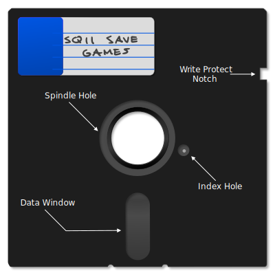
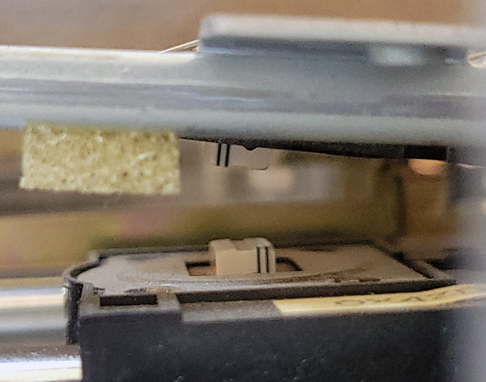
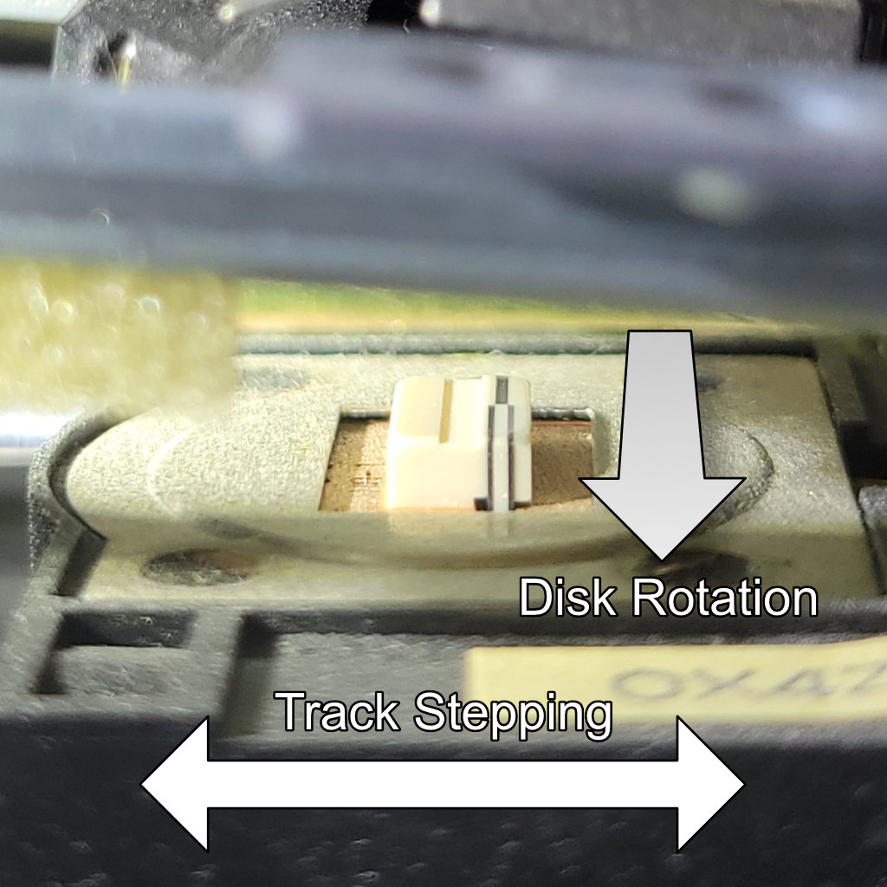
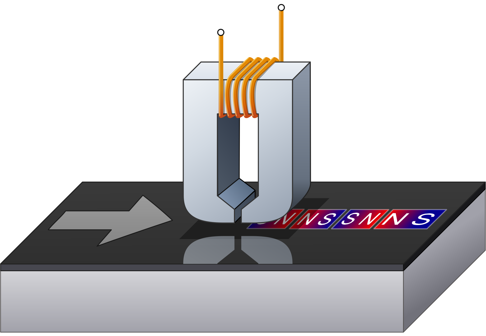
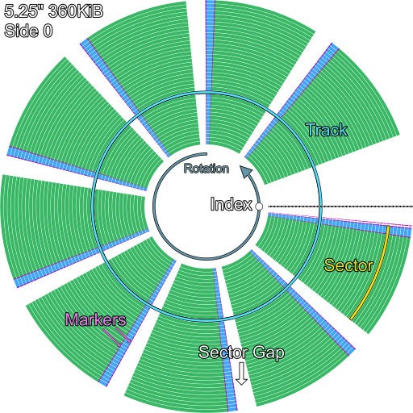

# Floppy Disk Concepts

If you are already familiar with floppy disks, their operation and organization, skip ahead to the [floppy data encoding](./floppy-data-encoding.md) section.

The [floppy disk](https://en.wikipedia.org/wiki/Floppy_disk) was the most common form of removable, rewritable storage on the IBM PC. Even when physical distribution of commercial software had moved to the [CD-ROM](https://en.wikipedia.org/wiki/CD-ROM), users still found the floppy disk useful day-to-day for moving files between systems. The main advantage of the floppy disk was its sheer ubiquity — nearly every PC had a floppy drive. 

The floppy disk gets its name from its flexibility. If held only by one corner, the disk would easily flex or 'flop' when moved. 

The floppy disk was originally invented by IBM, which coined the term *diskette* to refer to their 8" floppy disks, sometime around the time the [IBM 3740](https://en.wikipedia.org/wiki/IBM_3740) was introduced; however, floppy disks had already been in use for several years by then. The name *diskette* was frequently seen on floppy disk retail packaging, but colloquially, most people just called them *floppies*.

A floppy drive was technically an optional add-on for the original PC, but the near total absence of software titles available for the PC on cassette made at least one floppy drive a mandatory purchase.

Floppy disks have existed in numerous forms over the entire history of computing, but the original format used on the PC was the 5.25" diskette.

| Size | Approx. era | Formatted capacities | Notes |
| --- | --- | --- | --- |
| **8"** | 1970s | about 80KiB to 1200KiB | The original commercial floppy format. Used by IBM and early CP/M systems. |
| **5.25"** | late 1970s-1980s | about 90KiB to 1200KiB | The dominant early microcomputer format and the original IBM PC diskette size. |
| **3.5"** | mid-1980s-1990s | 720KiB, 1440KiB, and 2880KiB | A smaller rigid-shell format that gradually replaced 5.25-inch media on PCs. |
| **3"** | mid-1980s | about 180KiB per side to 720KiB | A less common format used mainly by Amstrad and a few other systems. |

## Basic Floppy Operation

A floppy disk is a ferromagnetic medium upon which data can be stored by magnetizing the medium in specific patterns. Data is read and written to the disk via *magnetic heads* located within a *floppy disk drive*. A floppy disk drive stores data on a floppy disk in a series of concentric rings called *tracks*. The magnetic heads travel on a linear carriage controlled by a *stepper motor* which positions the heads above a specific track to be read or written. 

## The 5.25" Diskette

A 5.25" floppy disk consists of a vinyl jacket covering a circular disc of *biaxially oriented polyethylene terephthalate*, more commonly known by its brand name, [Mylar](https://en.wikipedia.org/wiki/Mylar). A polymeric coating containing carefully milled [ferric oxide](https://en.wikipedia.org/wiki/Ferric) powder was applied to the surface of this disc, which could then be deliberately magnetized to store specially-encoded data. This inner disc is sometimes referred to as the *cookie* (or *biscuit*, if you are from the UK).

The vinyl jacket of a floppy disk has several cutouts. A central hole exposes the inner rim of the Mylar disc which is clamped against the floppy drive *spindle* when a disk is inserted into a drive and the *drive door* (sometimes just a lever) is closed. The drive's *spindle motor* could then rotate the cookie within the stationary jacket, typically around 300RPM.

A pill-shaped cutout called the *data window* exposes the usable region of the cookie on both sides, accommodating the full linear travel of the drives' *magnetic heads*. 

  
  
<em>A 5.25" Floppy Disk (Click to zoom)</em>

Near the central spindle, a circular cutout in the jacket allows a photosensor to detect light through a small hole in the Mylar disc called the *index hole*. The *index hole* is used to synchronize reading and writing to the floppy. When this photosensor — called the *index sensor* — detects light through the index hole, the drive generates an *index pulse*. The floppy controller uses the index pulse to know where to start reading or writing. Not all floppy disk systems utilized the index sensor, but the PC did.

The *write-protect notch* is a rectangular cutout on the right side of the floppy disk that permits data to be written to the floppy disk. A small sticker could be folded over the side of the floppy disk to cover this notch, which would then prevent the host computer from writing data to the disk. 

The inside of the jacket contains a dust-collecting liner which served the essential function of keeping the inner cookie clean. This part of the floppy may be considered consumable; over time only so much dust can be captured and larger, grittier particles trapped in the liner may even cause damage. Therefore, storing floppy disks in closed, dust-free containers was well-advised.

5.25" floppy disks were somewhat fragile. They were susceptible to damage from improper handling such as creasing or bending, or directly touching the magnetic coating visible through the data window. Exposure to magnets could damage or erase the data stored on the floppy. That said, if treated with care, the floppy disk was a fairly reliable storage medium.

Over time, floppy disks have faced new challenges. Heat and humidity in long-term storage can lead to the oxide coating flaking off, or mold growth on the cookie which can contaminate the inner lining. Even so, if stored carefully, many floppy disks can still be read a half-century later.

The original floppy diskette was 8". When the 5.25" disk was introduced, its smaller size required it to be distinguished from the standard 8" floppy, and so 5.25" diskettes were sometimes called *minifloppies*. Seeing the term minifloppy is a good sign you are reading an older reference.

### Single and Double Sided Floppies

The oldest floppy drives were *single-sided* — they possessed a single magnetic *head* to read and write data, which was done from the *bottom* side of the floppy if inserting it label-side up. Single-sided disks could sometimes be flipped over to use the other side, much as you might flip over a vinyl record. These so-called *flippy disks* could be easily identified by the presence of two index hole cutouts — and sometimes two write-protect notches.

A *double-sided* floppy drive has two magnetic heads, which clamp together to press against opposite sides of the cookie. You can see an image of a double-sided drive's magnetic heads below. Head 0, which accesses side 0, is located on the bottom, with side 1 accessed from the top. 

The top head is usually on some sort of actuator, where it can be lowered onto the disk surface to clamp the cookie between both heads. This clamping action is called *head loading*. In a single-sided drive, a foam pad typically provides the clamping force in the absence of an opposing head.

  
  
<em>A double-sided floppy drive's magnetic heads</em>

### 5.25" Floppy Capacities

5.25" floppy disks on the IBM PC were available in the following capacities:

| Formatted size | Sides | Tracks | Sectors per track | Notes                                                              |
| :------------- | :---- | :----- | :---------------- | :----------------------------------------------------------------- |
| 160KiB         | 1     | 40     | 8                 | Original IBM PC single-sided disk                                  |
| 180KiB         | 1     | 40     | 9                 | Single-sided format with one additional sector per track           |
| 320KiB         | 2     | 40     | 8                 | Double-sided version of the original PC layout                     |
| 360KiB         | 2     | 40     | 9                 | Standard double-sided double-density PC format                     |
| 720KiB         | 2     | 80     | 9                 | 80-track 'quad-density' format, less common on PC                  |
| 1200KiB        | 2     | 80     | 15                | High-density format introduced with the IBM PC AT                  |

### High Density 5.25" Drive Quirks

One way high-density 5.25" disk drives increased capacity was by doubling the number of tracks written to high-density 5.25" diskettes. To do so, the size of the magnetic head itself was made thinner. This can create issues when writing data to double-density diskettes that are then read in a double-density drive with a wider head.

Many high-density 5.25" drives increase the rotational rate of the cookie to 360RPM. This can cause inaccurate flux timing readings when flux-imaging double-density diskettes. This can be compensated for, but is not ideal. It is best to image double-density floppy disks in a double-density drive, or a high-density drive with a selectable 300RPM mode.

## The 3.5" Diskette

The 3.5" floppy disk was an improvement over the 5.25" floppy in capacity, durability, and convenience. The 3.5" floppy disk employed a rigid plastic shell and a metal, spring-loaded *shutter* to protect the cookie from dust and contact with fingers. A rectangular hole — which could be covered by an integrated plastic slider — controlled whether the disk could be written to or not, meaning awkward stickers were no longer required. When the hole was unobstructed by the slider, the disk was write-protected.

  
  
<em>A 3.5" Floppy Disk (Click to zoom)</em>

Later high-density variations of the 3.5" floppy could be identified by a second hole on the opposite side from the write-protect hole. This allowed the drive to recognize the disk as high density. In addition, a "HD" logo was usually printed on or molded into the plastic shell. 

3.5" diskettes are sometimes referred to as *microfloppies*.

> [!NOTE]
> In more recent years, a contentious debate can occasionally arise over whether the hard-shelled 3.5" disks were referred to as "floppy disks" — primarily due to their distinct lack of being floppy. The term "floppy disk" applied almost universally to 3.5" disks as well, and the evidence is overwhelming: from retail packaging to advertisements to magazine articles and contemporary books, we can easily see that 3.5" disks were widely and commonly referred to as floppies.

### 3.5" Floppy Capacities

3.5" floppy disks on the IBM PC were available in the following capacities:

| Formatted size | Sides | Tracks | Sectors per track | Notes                                                              |
| :------------- | :---- | :----- | :---------------- | :----------------------------------------------------------------- |
| 720KiB         | 2     | 80     | 9                 | Double-density                                                     |
| 1440KiB        | 2     | 80     | 18                | High-density: the most common 3.5" format, but not supported by the original PC |
| 2880KiB        | 2     | 80     | 36                | Extra-high density (not common)                                    |

## Magnetic Encoding

A floppy disk, like any digital medium, ultimately stores 0s and 1s. A floppy disk encodes binary bits by means of changing [magnetic flux](https://en.wikipedia.org/wiki/Magnetic_flux). 

The Mylar cookie of a floppy disk has a polymeric coating applied to it containing very fine, ferromagnetic particles. On a blank, unformatted disk, these particles are not magnetized in any specific direction. To write data to a floppy disk, the drive magnetizes these particles in specific patterns along concentric rings called tracks.

It might help to visualize the ferromagnetic coating as if it were a number of very small bar magnets with a north and south pole. Data is encoded by alternating the magnetic polarization along a single track as the disk rotates beneath the write head. This is called *longitudinal recording*. 

> [!NOTE]
> Later 2880KiB — or "Extra-high density" — floppy drives utilized *perpendicular recording*, which will not be discussed here. 

The ferromagnetic coating is magnetized by the drive's magnetic write head. A photograph of such a head can be seen below.

  
  
<em>The floppy disk write head in a TEAC FD-55BR disk drive</em>

  
  
<em>A floppy disk write head</em>

By periodically changing the magnetic orientation, small regions where the polarity flips are also created — these regions are called *flux reversals* or *flux transitions*. 

  
  
<em>A flux transition (representational, not to scale — click to zoom)</em>

When reading a floppy disk, it is these transitions that the drive detects, via [Faraday's Law of Induction](https://en.wikipedia.org/wiki/Faraday%27s_law_of_induction). The change in the magnetic field induces a voltage in the coil attached to the read head, creating an electrical signal that can be amplified and turned into a *read pulse*. These read pulses are sent to a *floppy controller*, which uses the time between each pulse to recreate the actual bits encoded on the disk.

## Data Encoding

The actual bits stored on a floppy disk represent an *encoded* form of the data written to the disk. Earlier 8" floppy disks typically used [*frequency modulation*](https://en.wikipedia.org/wiki/Frequency_modulation_encoding) (FM) encoding, whereas most floppy disks for the PC utilize [*modified frequency modulation*](https://en.wikipedia.org/wiki/Modified_frequency_modulation) (MFM) encoding.

Although FM mode was seldom used, the IBM PC floppy controller could be operated in both FM and MFM modes. The controller would need to be set to the correct mode to successfully read back data originally written with that mode. 

The purpose of both encoding schemes is to add *clock bits* that provide timing information, a technique known as [clock recovery](https://en.wikipedia.org/wiki/Clock_recovery). 

A requirement for successful clock recovery from the encoded bit stream is ensuring that `1` bits are regularly encoded. This in turn ensures that regular flux transitions are written to the disk. The absence of a flux transition over too long a period risks creating an unstable condition where data cannot be reliably read. As a general rule, no more than three consecutive `0` bits are allowed in the encoded bitstream written to a floppy disk track.

The next chapter, [Data Encoding](./floppy-data-encoding.md), covers this subject in more detail.

## Density

*Density* in terms of floppy disks refers to how tightly and efficiently data can be encoded onto a track. Initially this was a combination of both encoding methods and packing flux transitions more tightly together. 

All standard floppy disk formats used on an IBM PC use MFM encoding. As this was a space savings improvement over the original FM encoding, this led to the terminology of the *double-density diskette* often seen on retail packaging and diskette labels. If you were ever curious if there was a "single-density" diskette — these were actually referred to as *standard density*, but were never used on the PC.

PC floppy disk encoding never moved beyond MFM. Therefore, when *high-density* and *extra-high-density* disks emerged, this extra density was simply the result of packing flux transitions more tightly together. This usually necessitated more advanced formulations of ferromagnetic coatings, using more exotic or specially-doped oxides. 

## Rotation 

If viewed from the top, a floppy disk drive rotates the cookie in a *clockwise* direction, and therefore data is written to the cookie counter-clockwise. When viewed from beneath the drive (from the perspective of head 0), the cookie rotates in a *counter-clockwise* direction, and therefore data is written clockwise. This rotation is often reflected by disk visualization software.

Most floppy drives on the PC rotate the cookie at 300RPM except for 5.25" high-density disk drives, which often rotate the cookie at 360RPM. 

> [!NOTE] 
> Some 3.5" drives, mostly used on non-IBM-PC compatible systems, could rotate at 360RPM, or even at dynamic speeds depending on which track was being read. These will not be discussed further in this book.

## Floppy Disk Organization and Addressing

A floppy disk stores concentric rings of data called *tracks*. Tracks are identified by a 0-based index, starting at the outer extent of the drive head's travel (closest to the edge of the disk), counting upwards as the tracks proceed inwards toward the spindle hole. This index is called the *cylinder number*. A track can be uniquely identified by combining the cylinder number with a specific *head*, indicating which side of the floppy the track is on.

> [!TIP]
> The distinction between *tracks* and *cylinders* may be somewhat confusing. Think of it as a coordinate system where a track is a combination of cylinder and head — the cylinder specifies how far from the outer edge of the data the *drive head* should be positioned, and the head determines on which side of the disk the track is located. On a double-sided disk, a cylinder can therefore refer to two unique tracks, one on each side of the disk. On a single-sided disk, the concepts of *track* and *cylinder* are fundamentally equivalent.

A floppy drive selects a specific cylinder to operate on by physically moving the magnetic heads until they are over the cylinder. Since the carriage the magnetic heads are on is actuated by a stepper motor, the process of moving from one cylinder to the next is called *stepping*. 

Each track contains one or more *sectors*. Each sector is identified by a *sector ID* consisting of the cylinder number, head number, *sector number*, and a *sector size specifier*. Sector numbers typically begin with `1` on each track by convention, but nothing actually guarantees this.

The combination of cylinder, head, and sector number can uniquely identify a sector on a normal floppy disk. This is sometimes referred to as [*CHS addressing*](https://en.wikipedia.org/wiki/Cylinder-head-sector), which you may also see referenced in the context of early hard drives.

Sectors are aligned on each track by synchronizing to the *index pulse* created by a photodiode that detects light shining through the physical *index hole*. With each sector on each track aligned, a floppy disk resembles something like pie slices. Individual sectors are separated by small areas of padding called *sector gaps*.

Floppy disks are often visualized using diagrams with an exaggerated inner diameter with the *index position* at the right side, like the one below.

  
  
<em>A typical sector layout on a 5.25" 360KiB floppy disk, as seen from head 0 (not to scale)</em>

If one could see the actual track layout on a 5.25" disk, it would be condensed into the region visible through the data window and accessible along the full travel of the floppy drive's head carriage. The following diagram attempts to reproduce such an image:

  
  
<em>A typical sector layout on a 5.25" 360KiB floppy disk, as seen from head 1</em>

The specification of how data is organized on any given track of a floppy disk is called its *track format*.  

The track format of IBM floppy disks is sometimes referred to as *System 34 format*, in reference to the [IBM System/34](https://en.wikipedia.org/wiki/IBM_System/34), which utilized this format before the PC. 

### Sectors: Soft vs Hard

All floppy disks for the PC are *soft-sectored*. You may see this description as you read various references and wonder what it means. Some earlier 8" floppy disks were *hard-sectored* in that they had physical holes punched into the cookie that delineated sector boundaries on the disk. These holes were placed on a radial path aligned with the *index hole* and so could be read via the same photosensor.

Sectors may be placed anywhere on a PC-formatted floppy disk, thus we can say they are the opposite of hard-sectored: *soft-sectored*.

## Disk vs Disc

These two terms are essentially interchangeable, but the frequency of their usage varied in context. Some 40 years later, it still doesn't feel quite right to read "floppy disc." The most commonly agreed rule today seems to be that *disk* is used to refer to magnetic or flash-based storage devices and media, whereas *disc* is used to refer to optical media. Therefore, *floppy disk* and *compact disc*. 

This rule follows from a predominantly US-based perspective; other countries may have had different terminology. 

## Floppy Disk Specifications

<table class="floppy-spec-table">
  <thead>
    <tr>
      <th></th>
      <th class="floppy-format-group" colspan="5">5.25&quot;</th>
      <th class="floppy-format-group" colspan="3">3.5&quot;</th>
    </tr>
    <tr>
      <th>Standard Capacity</th>
      <th>160KiB</th>
      <th>180KiB</th>
      <th>320KiB</th>
      <th>360KiB</th>
      <th>1200KiB</th>
      <th>720KiB</th>
      <th>1440KiB</th>
      <th>2880KiB</th>
    </tr>
  </thead>
  <tbody>
    <tr>
      <th>Physical Dimensions</th>
      <td>5.25"</td>
      <td>5.25"</td>
      <td>5.25"</td>
      <td>5.25"</td>
      <td>5.25"</td>
      <td>3.5"</td>
      <td>3.5"</td>
      <td>3.5"</td>
    </tr>
    <tr>
      <th>Default Encoding</th>
      <td>MFM</td>
      <td>MFM</td>
      <td>MFM</td>
      <td>MFM</td>
      <td>MFM</td>
      <td>MFM</td>
      <td>MFM</td>
      <td>MFM</td>
    </tr>
    <tr>
      <th>Density</th>
      <td>DD</td>
      <td>DD</td>
      <td>DD</td>
      <td>DD</td>
      <td>HD</td>
      <td>DD</td>
      <td>HD</td>
      <td>ED</td>
    </tr>
    <tr>
      <th>Cylinders</th>
      <td>40</td>
      <td>40</td>
      <td>40</td>
      <td>40</td>
      <td>80</td>
      <td>80</td>
      <td>80</td>
      <td>80</td>
    </tr>
    <tr>
      <th>Heads</th>
      <td>1</td>
      <td>1</td>
      <td>2</td>
      <td>2</td>
      <td>2</td>
      <td>2</td>
      <td>2</td>
      <td>2</td>
    </tr>
    <tr>
      <th>Tracks</th>
      <td>40</td>
      <td>40</td>
      <td>80</td>
      <td>80</td>
      <td>160</td>
      <td>160</td>
      <td>160</td>
      <td>160</td>
    </tr>
    <tr>
      <th>Sector Offset</th>
      <td>1</td>
      <td>1</td>
      <td>1</td>
      <td>1</td>
      <td>1</td>
      <td>1</td>
      <td>1</td>
      <td>1</td>
    </tr>
    <tr>
      <th>Sectors Per Track</th>
      <td>8</td>
      <td>9</td>
      <td>8</td>
      <td>9</td>
      <td>15</td>
      <td>9</td>
      <td>18</td>
      <td>36</td>
    </tr>
    <tr>
      <th>Total Sectors</th>
      <td>320</td>
      <td>360</td>
      <td>640</td>
      <td>720</td>
      <td>2400</td>
      <td>1440</td>
      <td>2880</td>
      <td>5760</td>
    </tr>
    <tr>
      <th>RPM</th>
      <td>300</td>
      <td>300</td>
      <td>300</td>
      <td>300</td>
      <td>360</td>
      <td>300</td>
      <td>300</td>
      <td>300</td>
    </tr>
    <tr>
      <th>Revolution Time</th>
      <td>200ms</td>
      <td>200ms</td>
      <td>200ms</td>
      <td>200ms</td>
      <td>166ms</td>
      <td>200ms</td>
      <td>200ms</td>
      <td>200ms</td>
    </tr>
    <tr>
      <th>Raw bit rate (kbps)</th>
      <td>500</td>
      <td>500</td>
      <td>500</td>
      <td>500</td>
      <td>1000</td>
      <td>500</td>
      <td>1000</td>
      <td>2000</td>
    </tr>
    <tr>
      <th>MFM Data rate (kbps)</th>
      <td>250</td>
      <td>250</td>
      <td>250</td>
      <td>250</td>
      <td>500</td>
      <td>250</td>
      <td>500</td>
      <td>1000</td>
    </tr>
    <tr>
      <th>kb/track</th>
      <td>50</td>
      <td>50</td>
      <td>50</td>
      <td>50</td>
      <td>83.3</td>
      <td>50</td>
      <td>100</td>
      <td>200</td>
    </tr>
    <tr>
      <th>Bitcell/track</th>
      <td>100000</td>
      <td>100000</td>
      <td>100000</td>
      <td>100000</td>
      <td>166666</td>
      <td>100000</td>
      <td>200000</td>
      <td>400000</td>
    </tr>
    <tr>
      <th>TPI</th>
      <td>48</td>
      <td>48</td>
      <td>48</td>
      <td>48</td>
      <td>96</td>
      <td>135</td>
      <td>135</td>
      <td>135</td>
    </tr>
  </tbody>
</table>

