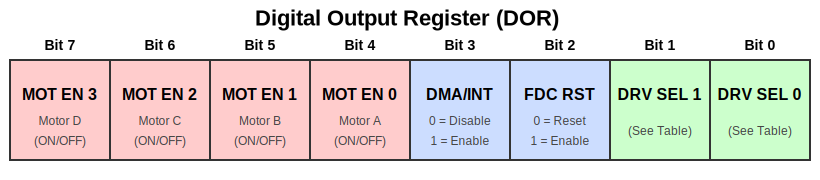

# Floppy Drive Controller

IBM PC/XT systems outfitted with a floppy drive had an "IBM 5.25" Diskette Drive Adapter" card installed in one of the available expansion slots. 

For a good look at the Diskette Drive Adapter, see [minuszerodegrees.net](https://www.minuszerodegrees.net/5150_5160/cards/5150_5160_cards.htm#floppy_adapter).

The IBM floppy drive controller, as we'll refer to it here, was a collection of 74-series logic chips and a 16.0Mhz clock crystal supporting the "brain" of the card, a NEC µPD765A (NEC 765) floppy drive controller chip. It could support up to four floppy disk drives, although configurations of more than two were uncommon. Drives 0-3 would be assigned the drive letters A-D. It would feel a bit wrong to have a floppy disk as drive C, but if you did indeed have three drives connected, that's what you'd end up with.

The NEC 765 takes an 8MHz clock, divided once from the card's 16Mhz crystal. 

The IBM controller card adds a main control register external to the 765, called the **Digital Output Register** or DOR. The DOR has several functions - it selects a specific drive as the target of operations, it can reset the 765, it can enable or disable interrupts and DMA, and it can turn on and off the attached floppy drive motors.

  
  
<em>Figure 1: The Digital Output Register (DOR)</em>

## Drive Selection Bits

The two least significant bits (Bits 0-1) of the DOR control which floppy drive is selected:

| Bit 1 | Bit 0 | Selected Drive |
|-------|-------|----------------|
| 0     | 0     | Drive A        |
| 0     | 1     | Drive B        |
| 1     | 0     | Drive C        |
| 1     | 1     | Drive D        |

If a drive's motor is not on, selecting it in the DOR will do nothing until the motor is turned on.

The DOR is implemented with an 74LS273 8-bit register chip. The DOR is write-only.

The FDC RESET bit 2 directly toggles the 765's RST pin, resetting the controller chip.

> **Note:** To avoid confusion, be aware that the DOR is the only drive selection method used by the IBM floppy drive controller. The NEC 765 command set includes fields that would, in theory, select which drive the operation is intended to target. Under IBM's controller design, these bits do nothing - the 765 is not in control of which drive is selected. You can verify this yourself by noting the 765's "unit select" pins, 28 and 29, are not connected.

On the IBM PC/XT, the floppy drive controller is operated by the BIOS in DMA mode exclusively. It is possible to operate the controller in polled-io mode in a manual fashion, but there are severe disadvantages to doing so - as was seen on the IBM PCjr which lacked a DMA controller. The lack of DMA prevented such operations as transferring data via the serial ports and floppy disk drive at the same time.

### I/O Ports

The IBM Diskette Drive Adapter decodes the following IO port addresses:

| PC Port | 765  Port | RW | Description             |
|---------|-----------|----|-------------------------|
| 0x3F2   | n/a       |  W | Digital Output Register |
| 0x3F4   | 0         | R  | µPD765A Status Register |
| 0x3F5   | 1         | RW | µPD765A Data Register   |

### DMA Channel

The IBM Diskette Drive Adapter uses **DMA Channel 2**.

### IRQs

The IBM Diskette Drive Adapter uses **IRQ 6**.

## Technical References

## References

<!-- [^technical-reference] [^8254-datasheet] -->

[^technical-reference]: (minuszerodegrees.net) [*IBM 5-1/4" Diskette Drive Adapter*](https://www.alldatasheet.com/datasheet-pdf/pdf/66098/INTEL/8253.html). IBM Corporation. Document Number: 6361505.

<!-- Invisible reference: -->
[^technical-reference]

