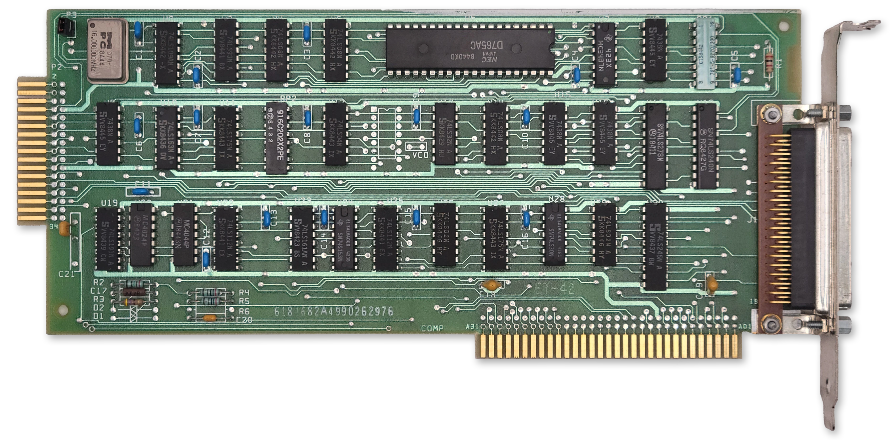

# The Floppy Disk Controller

  
  
<em>The IBM 5.25" Diskette Drive Adapter</em>

IBM PC/XT systems outfitted with a floppy disk drive had an **IBM 5.25" Diskette Drive Adapter** card installed in one of the available expansion slots. 

## At a Glance

| Item                 | Description                                    |
| -------------------- | ---------------------------------------------- |
| Controller IC        | NEC **µPD765A** or Intel **P8272A**            |
| Adapter clock        | **16.0MHz** crystal; **8MHz** controller clock |
| Supported drives     | Up to **4**                                    |
| DMA Channel          | **Channel 2**                                  |
| Interrupt            | **IRQ6**                                       |
| Primary I/O range    | `3F0h`-`3F7h`                                  |
| Secondary I/O range  | `370h`-`377h`                                  |
| DOR                  | `3F2h` primary, `372h` secondary               |
| Main status register | `3F4h` primary, `374h` secondary               |
| Data register        | `3F5h` primary, `375h` secondary               |
| Expansion ROM        | None                                           |

## Controller Overview

The IBM floppy drive controller, as we'll refer to it here, was a collection of 74-series logic chips and a 16.0MHz clock crystal supporting the "brain" of the card, a **NEC µPD765A** (NEC 765) floppy drive controller chip (or the more-or-less identical **Intel P8272A**). 

> [!NOTE]
> Microscope photography of the Intel P8272A has revealed the numbers '765' are present on the die, implying Intel licensed NEC's design and the controllers can be considered basically identical.

The IBM floppy controller could support up to four floppy disk drives, although configurations of more than two were uncommon. Drives 0-3 would be assigned the drive letters A-D up until MS-DOS 5.0, whereupon DOS started to reserve drive letter C for hard disks. It might feel a bit cursed to have a floppy disk as drive C, but if you did indeed have three drives connected and an earlier version of MS-DOS, that's what you'd end up with.

The NEC 765 takes an 8MHz clock, divided once from the card's 16MHz crystal. It has a maximum data rate of 250kbps, limiting it to support of *double-density* diskettes only.

The 765 doesn't perform every function needed by a floppy controller. Notably, the controller's *voltage-controlled oscillator* (VCO), a crucial part of the controller's *phase-locked-loop* (PLL) is external to the 765, although the 765 has pins for interacting with it. Also external to the 765 is the *data separator* circuitry. 

### Operation

On the IBM PC/XT, the floppy drive controller is operated by the BIOS in DMA mode exclusively. It is possible to operate the controller in *polled-io mode* (PIO) in a manual fashion, but there are severe disadvantages to doing so - as was seen on the IBM PCjr which lacked a DMA controller. The lack of DMA prevented such operations as transferring data via the serial ports and floppy disk drive at the same time.

The 765 operates as a state machine with three basic operational phases:

 - During the **command phase** the controller receives bytes from the host that instruct it to perform a specific operation.
 - During the **execution phase** the controller carries out the operation specified in the command phase.
 - During the **result phase** the controller provides status information to the host describing the result of the execution phase.

The 765 is capable of running some operations such as **Seek** and **Recalibrate** on multiple drives simultaneously. 

The 765 maintains an internal register holding the current cylinder, called the **Present Cylinder Number** (PCN), for each of the four supported disk drives.

### I/O Ports

The IBM Diskette Drive Adapter decodes the following I/O port addresses:

| Primary | Secondary | 765 Port | RW  | Description             |
| ------- | --------- | -------- | --- | ----------------------- |
| `3F0h`  | `370h`    | n/a      |     | Base Address            |
| `3F2h`  | `372h`    | n/a      | W   | Digital Output Register |
| `3F4h`  | `374h`    | 0        | R   | µPD765A Status Register |
| `3F5h`  | `375h`    | 1        | RW  | µPD765A Data Register   |

### Floppy Controller Cable Pinout

The IBM floppy controller has two connectors, an internal and external connector, each supporting two drives. The external connector will not be discussed here as it was rarely used.

The internal connector is of the edge connector type, and contains 34 contacts. Other floppy controllers may have a 34-pin, double-row male header.

All of the odd pins of the connector — one entire side — consist of ground connections. That leaves the other side with the following pinout:

| Pin |  I/O   |    Purpose     |
| :-: | :----: | :------------: |
|  2  |        |     Unused     |
|  4  |        |     Unused     |
|  6  |        |     Unused     |
|  8  | Input  |     /INDEX     |
| 10  | Output | Motor Enable A |
| 12  | Output | Drive Select B |
| 14  | Output | Drive Select A |
| 16  | Output | Motor Enable B |
| 18  | Output |   /DIRECTION   |
| 20  | Output |     /STEP      |
| 22  | Output |    /WR_DATA    |
| 24  | Output |    /WR_GATE    |
| 26  | Input  |    /TRACK0     |
| 28  | Input  |   /WPROTECT    |
| 30  | Input  |    /RD_DATA    |
| 32  | Output |    /HEAD1      |
| 34  |        |     Unused     |

IBM floppy drive cables famously have a twist that reverses conductors **10**—**16**. This allows every drive used in an IBM PC to be configured as drive **1** (DS1). This means that the drive desired to be the first floppy drive (A) should be at the end of the floppy cable.

### Floppy Drive Communication

The electrical interface to a floppy drive is rather simple in concept. The controller manipulates the drive select and motor lines to activate the desired floppy drive and spin its motor up to its operating RPM. While rotating, regular, active-low pulses of the **/INDEX** signal occur as the floppy drive's *index sensor* detects the *index hole*. As the drive detects *flux transitions*, active-low pulses of the **/RD_DATA** signal occur. If the controller wishes to write data, it will assert **/WR_GATE** and then provide the appropriate pulses on the **/WR_DATA**.

The controller specifies which head should be active via the **/HEAD1** output. If this signal is asserted, then head **1** is specified for all operations.

The controller can detect when the drive is positioned at the outermost track, *track 0*, via an active-low **/TRACK0** signal.

## The Digital Output Register

The IBM controller card adds a main control register external to the 765, called the **Digital Output Register** or DOR. The DOR has several functions — it selects a specific drive as the target of operations, it can reset the 765, it can enable or disable interrupts and DMA, and it can turn on and off the attached floppy drive motors.

The DOR is a **write-only** register implemented with a 74LS273 8-bit register chip. 

{{#bitfield floppy_controller.toml#digital-output-register}}

### Drive Selection Bits

The two least significant bits (Bits 0—1) of the DOR control which floppy drive is selected. 

> [!IMPORTANT]
> If a drive's motor is not on, selecting it in the DOR will do nothing until the motor is turned on.

To avoid confusion, be aware that the DOR is the only drive selection method used by the IBM floppy drive controller. The NEC 765 command set includes fields that select which drive the operation is intended to target. Under IBM's controller design, these bits do nothing externally — the 765 is not in control of which drive is selected. You can verify this yourself by noting the 765's **unit select** pins, 28 and 29, are not connected on the schematic.

> [!IMPORTANT]
> Even though the 765 does not control drive selection, a programmer should ensure that the drive selected in the DOR matches the drive number specified in commands. A mismatch in the drive selected in the DOR and command phase can cause incorrect operation of the **Seek** and **Recalibrate** commands.

### Reset Bit

The DOR's **/RESET** bit 2 drives the 765's active-high **RST** pin (1) via an inverter. When a `1` is written to bit 2, the 765's **RST** pin is pulled low, holding the controller in reset. 

> [!NOTE]
> The IBM floppy controller card ties the 765's **RDY** pin (35) high. This causes the 765 to generate an interrupt after coming out of the RESET state after "1-25ms", according to the datasheet. The controller is reset quite often during normal operation.

## The 765 Registers

The 765 contains **five** status registers in total. The first of these is the **main status register** (MSR). The MSR is the only status register that may be read at any time. The contents of the other status registers, **ST0—ST3**, are sent to host during the controller **result phase**. 

### The Main Status Register

{{#bitfield floppy_controller.toml#main-status-register}}

#### The BUSY bit

The **BUSY** bit is set when the controller is executing a command, and is only cleared when the last byte of the **result phase** has been read by the host CPU. It can be used as a general indication that a new command should not be sent to the CPU.

#### The DIO bit

The **DIO** bit controls the direction of transfer to or from the controller. The CPU should only send data to the controller when **DIO** is `0`. When **DIO** is `1`, the controller is not ready to receive data — it expects to have data to send to the CPU.

#### The MRQ bit

The **MRQ** bit can be usefully combined with the **DIO** bit to control data transfer to and from the controller.

| DIO | MRQ | Meaning                                                                                                       |
| --- | --- | ------------------------------------------------------------------------------------------------------------- |
| 0   | 0   | FDC is not ready to receive a byte from the CPU. (Busy, reset/disabled, or DMA operation in progress)         |
| 0   | 1   | FDC is ready and expecting to receive a command or data byte from the CPU via the data register.              |
| 1   | 0   | FDC has data pending, but not yet ready to read.                                                              |
| 1   | 1   | FDC has a byte ready for the CPU to read from the data register. Result bytes, sense bytes, or PIO read data. |

> [!NOTE]
> This bit may also be labelled as `RQM` in technical references. 

### Status Register 0 (ST0)

{{#bitfield floppy_controller.toml#status-register-0}}

> [!NOTE]
> The IBM floppy controller does not connect the typical floppy drive **/READY** indication line, pin **34**. Therefore the **NR** bit will typically not be set, even if the drive door is open and/or no disk is inserted into the drive. If you emulate this bit anyway, you may receive a "General Failure" error message in DOS when no disk is inserted instead of the expected "Not Ready Reading Drive" error.
>
> Correspondingly, since a drive cannot report not-ready during the *execution phase*, an **IC** code of `11b` will not be encountered.

> [!NOTE]
> The IBM floppy controller does not accommodate an external fault signal, nor do most PC floppy drives supply one. Therefore the **EC** field can only report failure of the Track 0 sensor during a **Seek** or **Recalibrate** operation.

### Status Register 1 (ST1)

{{#bitfield floppy_controller.toml#status-register-1}}

#### The No-Data Bit

The **No-Data** bit is set under the following conditions:

 - The FDC could not find the requested sector during execution of `READ DATA`, `WRITE DELETED DATA` or `SCAN`
 - The FDC could not read the ID field during execution of `READ ID`
 - The FDC could not find the starting sector during execution of `READ CYLINDER`.

### Status Register 2 (ST2)

{{#bitfield floppy_controller.toml#status-register-2}}

### Status Register 3 (ST3)

{{#bitfield floppy_controller.toml#status-register-3}}

> [!IMPORTANT]
> Remember that on the IBM floppy controller, the 765's unit select pins are not connected and do not drive selection of floppy drives. 

## Controller Commands

The 765 supports **15** different commands:
| Code  |                         Command Name                          |  MT  |  MF  |  SK  |
| :---: | :-----------------------------------------------------------: | :--: | :--: | :--: |
| `06h` |              [Read Data](#the-read-data-command)              | ✔️ | ✔️ | ✔️ |
| `0Ch` |      [Read Deleted Data](#the-read-deleted-data-command)      | ✔️ | ✔️ | ✔️ |
| `0Ah` |                [Read ID](#the-read-id-command)                |  0   | ✔️ |  0   |
| `02h` |             [Read Track](#the-read-track-command)             |  0   | ✔️ | ✔️ |
| `11h` |               [Scan Equal](#the-scan-commands)                | ✔️ | ✔️ | ✔️ |
| `19h` |            [Scan Low or Equal](#the-scan-commands)            | ✔️ | ✔️ | ✔️ |
| `1Dh` |           [Scan High or Equal](#the-scan-commands)            | ✔️ | ✔️ | ✔️ |
| `03h` |                [Specify](#the-specify-command)                |  0   |  0   |  0   |
| `05h` |             [Write Data](#the-write-data-command)             | ✔️ | ✔️ |  0   |
| `09h` |     [Write Deleted Data](#the-write-deleted-data-command)     | ✔️ | ✔️ |  0   |
| `0Fh` |                   [Seek](#the-seek-command)                   |  0   |  0   |  0   |
| `07h` |            [Recalibrate](#the-recalibrate-command)            |  0   |  0   |  0   |
| `0Dh` |           [Format Track](#the-format-track-command)           |  0   | ✔️ |  0   |
| `08h` | [Sense Interrupt Status](#the-sense-interrupt-status-command) |  0   |  0   |  0   |
| `04h` |     [Sense Drive Status](#the-sense-drive-status-command)     |  0   |  0   |  0   |

Commands consist of **2—9** command bytes, sent during the **command phase**. The command will then enter the **execution phase**. When complete (or on error) the command enters the **result phase** and various status register bytes will be made available to read out from the data register.

The first **command code byte 0** is common to all commands and contains the **command code** as given in the table above, along with operational flags. These flags are not always applicable to each command. The flags applicable to each command are noted in the table above.

### Command Code Byte 0

{{#bitfield floppy_controller.toml#command-code-0}}

### Command Code Byte 1

{{#bitfield floppy_controller.toml#command-byte-drive-head}}

### The Read Data Command

The **Read Data** command is opcode `06h`. 

The **Read Data** command searches for the sector ID matching the specified cylinder, head, sector and sector size. The matching sector must have a normal **data address mark** (DAM).

In **DMA mode**, it will read successive sectors that have a normal DAM until terminal count. In **PIO mode**, it will read successive sectors that have a normal DAM until `EOT` is reached. 

If the **MT** flag is set, once the last sector of **side 0** is transferred, the FDC proceeds to repeat the operation on **side 1**.

The **Read Data** command behaves as follows depending on the value of the **SK** flag:
| SK  | DAM Type | Sector Read | CM  | Result                  |
| :-- | :------- | :---------- | :-- | :---------------------- |
| 0   | Normal   | Y           | 0   | Normal Termination      |
| 0   | Deleted  | Y           | 1   | No Further Sectors Read |
| 1   | Normal   | Y           | 0   | Normal Termination      |
| 1   | Deleted  | N           | 1   | Sector Skipped          |

After the data is transferred, the command enters the **result phase**.

#### Status Flags Affected

| Flag | Register | Triggering Event |
|------|-------|-------|
| WC | [ST2](#status-register-2-st2) | Value of `C` mismatch in Sector ID  |
| BC | [ST2](#status-register-2-st2) | Value of `C` mismatch in Sector ID and `C` was `0xFF` |
| CM | [ST2](#status-register-2-st2) | A **deleted data address mark** (DDAM) was encountered |
| ND | [ST1](#status-register-1-st1) | No matching Sector ID was found |
| MA | [ST1](#status-register-1-st1) | No **sector ID address mark** (IDAM) was found within two index pulses |
| DE | [ST1](#status-register-1-st1) | A bad data field CRC was encountered |

#### Command Format

|  Phase  | Byte |                    Byte                     |
| :-----: |:----:| :-----------------------------------------: |
| Command |0| [Command Code Byte 0](#command-code-byte-0) |
| Command |1| [Command Code Byte 1](#command-code-byte-1) |
| Command |2|                  Cylinder                   |
| Command |3|                    Head                     |
| Command |4|                   Sector                    |
| Command |5|               Sector Size (N)               |
| Command |6|                End of Track                 |
| Command |7|                Gap 3 Length                 |
| Command |8|              Data Length (DTL)              |
| Result  |0|        [ST0](#status-register-0-st0)        |
| Result  |1|        [ST1](#status-register-1-st1)        |
| Result  |2|        [ST2](#status-register-2-st2)        |
| Result  |3|                  Cylinder                   |
| Result  |4|                    Head                     |
| Result  |5|                   Sector                    |
| Result  |6|               Sector Size (N)               |

### The Read Deleted Data Command

The **Read Deleted Data** command is opcode `0Ch`. 

The **Read Deleted Data** command searches for the sector ID matching the specified cylinder, head, sector and sector size. The matching sector must have a **deleted data address mark** (DDAM).

In **DMA mode**, it will read successive sectors that have a DDAM until terminal count. In **PIO mode**, it will read successive sectors that have a DDAM until `EOT` is reached. 

If the **MT** flag is set, once the last sector of **side 0** is transferred, the FDC proceeds to repeat the operation on **side 1**.

The **Read Deleted Data** command behaves as follows depending on the value of the **SK** flag:
| SK  | DAM Type | Sector Read | CM  | Result                  |
| :-- | :------- | :---------- | :-- | :---------------------- |
| 0   | Normal   | Y           | 1   | No Further Sectors Read      |
| 0   | Deleted  | Y           | 0   | Normal Termination |
| 1   | Normal   | N           | 1   | Sector Skipped      |
| 1   | Deleted  | Y           | 0   | Normal Termination          |

After the data is transferred, the command enters the **result phase**.

#### Status Flags Affected

| Flag | Register | Triggering Event |
|------|-------|-------|
| WC | [ST2](#status-register-2-st2) | Value of `C` mismatch in Sector ID  |
| BC | [ST2](#status-register-2-st2) | Value of `C` mismatch in Sector ID and `C` was `0xFF` |
| CM | [ST2](#status-register-2-st2) | A **normal data address mark** (DAM) was encountered |
| ND | [ST1](#status-register-1-st1) | No matching Sector ID was found |
| MA | [ST1](#status-register-1-st1) | No **sector ID address mark** (IDAM) was found within two index pulses |
| DE | [ST1](#status-register-1-st1) | A bad data field CRC was encountered |

#### Command Format

|  Phase  | Byte |                    Byte                     |
| :-----: | :--: | :-----------------------------------------: |
| Command |  0   | [Command Code Byte 0](#command-code-byte-0) |
| Command |  1   | [Command Code Byte 1](#command-code-byte-1) |
| Command |  2   |                  Cylinder                   |
| Command |  3   |                    Head                     |
| Command |  4   |                   Sector                    |
| Command |  5   |               Sector Size (N)               |
| Command |  6   |                End of Track                 |
| Command |  7   |                Gap 3 Length                 |
| Command |  8   |              Data Length (DTL)              |
| Result  |  0   |        [ST0](#status-register-0-st0)        |
| Result  |  1   |        [ST1](#status-register-1-st1)        |
| Result  |  2   |        [ST2](#status-register-2-st2)        |
| Result  |  3   |                  Cylinder                   |
| Result  |  4   |                    Head                     |
| Result  |  5   |                   Sector                    |
| Result  |  6   |               Sector Size (N)               |

### The Read ID Command

The **Read ID** command is opcode `0Ah`.

The FDC returns the fields of the next **Sector ID** encountered on the track.

The **MT** and **SK** flags are *not* valid for this command and should be `0`.

#### Status Flags Affected

| Flag | Register | Triggering Event |
|------|-------|-------|
| MA | [ST1](#status-register-1-st1) | No **sector ID address mark** (IDAM) was found within two index pulses |

#### Command Format

|  Phase  | Byte |                    Byte                     |
| :-----: |:----:| :-----------------------------------------: |
| Command |0| [Command Code Byte 0](#command-code-byte-0) |
| Command |1| [Command Code Byte 1](#command-code-byte-1) |
| Result  |0|        [ST0](#status-register-0-st0)        |
| Result  |1|        [ST1](#status-register-1-st1)        |
| Result  |2|        [ST2](#status-register-2-st2)        |
| Result  |3|                  Cylinder                   |
| Result  |4|                    Head                     |
| Result  |5|                   Sector                    |
| Result  |6|               Sector Size (N)               |

### The Read Track Command

The **Read Track** command is opcode `02h`.

Unlike what its name might suggest, **Read Track** does not actually read a raw track. Instead, it reads all sectors on a track, regardless of ID or CRC validation.

The **Read Track** command first waits for the index signal. It then returns the data for each sector encountered, in order. The **Sector ID** of the first sector is checked against the values given to the command for the purposes of setting the **ND** bit in [ST1](#status-register-1-st1), but a mismatch is not an error and does not stop command execution.

The **MT** and **SK** flags are *not* valid for this command and should be `0`.

#### Status Flags Affected

| Flag | Register                      | Triggering Event                                         |
| :--- | :---------------------------- | :------------------------------------------------------- |
| ND   | [ST1](#status-register-1-st1) | Sector ID comparison failed (command continues)          |
| DD   | [ST2](#status-register-2-st2) | A bad data field CRC was encountered (command continues) |
| DE   | [ST1](#status-register-1-st1) | A bad field CRC was encountered (command continues)      |

#### Command Format

|  Phase  | Byte |                    Byte                     |
| :-----: |:----:| :-----------------------------------------: |
| Command |0| [Command Code Byte 0](#command-code-byte-0) |
| Command |1| [Command Code Byte 1](#command-code-byte-1) |
| Result  |0|        [ST0](#status-register-0-st0)        |
| Result  |1|        [ST1](#status-register-1-st1)        |
| Result  |2|        [ST2](#status-register-2-st2)        |
| Result  |3|                  Cylinder                   |
| Result  |4|                    Head                     |
| Result  |5|                   Sector                    |
| Result  |6|               Sector Size (N)               |

### The Scan Commands

The three scan commands, **Scan Equal**, **Scan High or Equal**, and **Scan Low or Equal**, behave identically other than the mathematical expression they evaluate for each pair of bytes processed.

In each of the three commands, the FDC performs a comparison (the **scan condition**) between bytes read from the disk and bytes provided by the host. If this comparison is true for the entire sector, the scan condition is said to have been *satisfied* or that a *scan hit* has occurred, at which point the scan operation will enter the *result phase*.

The value of `FFh` is special, and is treated as a wildcard. If either the byte from the disk or the byte from the host is `FFh` then the comparison will be considered **true**. This allows use of `FFh` by the host to mask the comparison bytes provided to the FDC.

If a sector does not satisfy the scan condition, the FDC will continue with the next sector to scan based on the **STP** step parameter. If **STP** == `1`, this will be the next consecutive sector number. If **STP** == `2`, then the FDC will skip the next consecutive sector number. 

> [!IMPORTANT]
> Regardless of the **STP** parameter, the FDC must be able to read the last sector on the track as specified by EOT. Unexpectedly encountering the index pulse during the scan operation will result in abnormal termination.

If EOT is reached or terminal count occurs before a scan hit occurs, then the scan operation ends with a *scan not satisfied* condition. In the case of a terminal count, the operation ends after the current byte being compared. 

#### Scan Command Operations

| Code | Command | Effective Operation |
|--|---------|---------------------|
| `11h` | Scan Equal | (Byte from Disk) == (Byte from CPU)|
| `19h` | Scan Low or Equal | (Byte From Disk) ≤ (Byte from CPU)|
| `1Dh` | Scan High or Equal | (Byte From Disk) ≥ (Byte from CPU)|

#### Status Flags Affected

| Flag | Register                      | Triggering Event                                         |
| :--- | :---------------------------- | :------------------------------------------------------- |
| OR   | [ST1](#status-register-1-st1) | An overrun condition occurred during the scan operation  |
| SH   | [ST2](#status-register-2-st2) | The scan condition was satisfied (scan hit)              |
| SN   | [ST2](#status-register-2-st2) | The scan condition was not satisfied                     |
| CM   | [ST2](#status-register-2-st2) | A **deleted data address mark** (DDAM) was encountered   |

#### Command Format

|  Phase  | Byte |                    Byte                     |
| :-----: | :--: | :-----------------------------------------: |
| Command |  0   | [Command Code Byte 0](#command-code-byte-0) |
| Command |  1   | [Command Code Byte 1](#command-code-byte-1) |
| Command |  2   |                  Cylinder                   |
| Command |  3   |                    Head                     |
| Command |  4   |                   Sector                    |
| Command |  5   |               Sector Size (N)               |
| Command |  6   |                End of Track                 |
| Command |  7   |                Gap 3 Length                 |
| Command |  8   |           Sector Step Size (STP)            |
| Result  |  0   |        [ST0](#status-register-0-st0)        |
| Result  |  1   |        [ST1](#status-register-1-st1)        |
| Result  |  2   |        [ST2](#status-register-2-st2)        |
| Result  |  3   |                  Cylinder                   |
| Result  |  4   |                    Head                     |
| Result  |  5   |                   Sector                    |
| Result  |  6   |               Sector Size (N)               |

### The Specify Command

The **Specify** command sets three timing variables for the drive as well as setting the FDC operational mode to **DMA** or **PIO** modes. 

The **Specify** command has no result phase.

#### Command Format

|  Phase  | Byte |                    Byte                     |
| :-----: | :--: | :-----------------------------------------: |
| Command |  0   | [Command Code Byte 0](#command-code-byte-0) |
| Command |  1   | [Specify Timing 0](#command-byte-specify-timing-0) |
| Command |  2   | [Specify Timing 1](#command-byte-specify-timing-1) |

{{#bitfield h4 floppy_controller.toml#command-byte-specify-timing-0}}

{{#bitfield h4 floppy_controller.toml#command-byte-specify-timing-1}}

### The Write Data Command

The **Write Data** command is opcode `05h`. 

The **Write Data** command searches for the sector ID matching the specified cylinder, head, sector and sector size. Immediately after the matching IDAM, the controller will write a data field containing a normal *data address mark* (DAM).

In DMA mode, it will write data to consecutive sectors that have a normal DAM, starting at the initial matching sector ID, until *terminal count*. In PIO mode, it will write data to consecutive sectors that have a normal DAM up to and including the sector number specified by `EOT`.

If the **MT** flag is set, once the last sector of side 0 is transferred, the FDC proceeds to repeat the operation on side 1. A multi-track operation must begin on side 0 — the controller will not continue to side 0 from side 1.

The **SK** flag is not valid with **Write Data** and should be 0.

After the data is transferred, the command enters the *result phase*.

#### Status Flags Affected

| Flag | Register | Triggering Event |
|------|-------|-------|
| WC | [ST2](#status-register-2-st2) | Value of `C` mismatch in Sector ID  |
| BC | [ST2](#status-register-2-st2) | Value of `C` mismatch in Sector ID and `C` was `0xFF` |
| CM | [ST2](#status-register-2-st2) | A **deleted data address mark** (DDAM) was encountered |
| ND | [ST1](#status-register-1-st1) | No matching Sector ID was found |
| MA | [ST1](#status-register-1-st1) | No **sector ID address mark** (IDAM) was found within two index pulses |
| NW | [ST1](#status-register-1-st1) | The floppy drive reported the media was **write-protected** |

#### Command Format

|  Phase  | Byte |                    Byte                     |
| :-----: |:----:| :-----------------------------------------: |
| Command |0| [Command Code Byte 0](#command-code-byte-0) |
| Command |1| [Command Code Byte 1](#command-code-byte-1) |
| Command |2|                  Cylinder                   |
| Command |3|                    Head                     |
| Command |4|                   Sector                    |
| Command |5|               Sector Size (N)               |
| Command |6|                End of Track                 |
| Command |7|                Gap 3 Length                 |
| Command |8|              Data Length (DTL)              |
| Result  |0|        [ST0](#status-register-0-st0)        |
| Result  |1|        [ST1](#status-register-1-st1)        |
| Result  |2|        [ST2](#status-register-2-st2)        |
| Result  |3|                  Cylinder                   |
| Result  |4|                    Head                     |
| Result  |5|                   Sector                    |
| Result  |6|               Sector Size (N)               |

### The Write Deleted Data Command

The **Write Deleted Data** command is opcode `09h`. 

The **Write Deleted Data** command searches for the sector ID matching the specified cylinder, head, sector and sector size. Immediately after the matching IDAM, the controller will write a data field containing a *deleted data address mark* (DDAM).

In DMA mode, it will write data to consecutive sectors that have a DDAM, starting at the initial matching sector ID, until *terminal count*. In PIO mode, it will write data to consecutive sectors that have a DDAM up to and including the sector number specified by `EOT`.

If the **MT** flag is set, once the last sector of side 0 is transferred, the FDC proceeds to repeat the operation on side 1. A multi-track operation must begin on side 0 — the controller will not continue to side 0 from side 1.

The **Write Deleted Data** command behaves as follows depending on the value of the **SK** flag:
| SK  | DAM Type | Sector Written | CM  | Result                     |
| :-- | :------- | :---------- | :-- | :------------------------- |
| 0   | Normal   | Y           | 1   | No Further Sectors Written |
| 0   | Deleted  | Y           | 0   | Normal Termination         |
| 1   | Normal   | N           | 1   | Sector Skipped             |
| 1   | Deleted  | Y           | 0   | Normal Termination         |

After the data is transferred, the command enters the *result phase*.

#### Status Flags Affected

| Flag | Register | Triggering Event |
|------|-------|-------|
| WC | [ST2](#status-register-2-st2) | Value of `C` mismatch in Sector ID  |
| BC | [ST2](#status-register-2-st2) | Value of `C` mismatch in Sector ID and `C` was `0xFF` |
| CM | [ST2](#status-register-2-st2) | A normal **data address mark** (DAM) was encountered |
| ND | [ST1](#status-register-1-st1) | No matching Sector ID was found |
| MA | [ST1](#status-register-1-st1) | No **sector ID address mark** (IDAM) was found within two index pulses |
| NW | [ST1](#status-register-1-st1) | The floppy drive reported the media was **write-protected** |

#### Command Format

|  Phase  | Byte |                    Byte                     |
| :-----: |:----:| :-----------------------------------------: |
| Command |0| [Command Code Byte 0](#command-code-byte-0) |
| Command |1| [Command Code Byte 1](#command-code-byte-1) |
| Command |2|                  Cylinder                   |
| Command |3|                    Head                     |
| Command |4|                   Sector                    |
| Command |5|               Sector Size (N)               |
| Command |6|                End of Track                 |
| Command |7|                Gap 3 Length                 |
| Command |8|              Data Length (DTL)              |
| Result  |0|        [ST0](#status-register-0-st0)        |
| Result  |1|        [ST1](#status-register-1-st1)        |
| Result  |2|        [ST2](#status-register-2-st2)        |
| Result  |3|                  Cylinder                   |
| Result  |4|                    Head                     |
| Result  |5|                   Sector                    |
| Result  |6|               Sector Size (N)               |

### The Seek Command

The **Seek** command is opcode `0Fh`.

The **Seek** command instructs the controller to seek to the specified cylinder number provided in the *command phase*. The controller will issue the required number of step pulses to move the head to the requested cylinder. If the cylinder position is indeterminate, a **Recalibrate Command** should be issued first.

> [!IMPORTANT]
> The 765 maintains an internal register holding the current cylinder — called the **Present Cylinder Number** (PCN) — for each of the four supported disk drives. Although on the IBM PC the 765's *unit select* pins are nonfunctional, a mismatch in the drive selected in the DOR and command phase can cause incorrect Seek operation.

The rate at which the step pulses are issued is controlled by the **SRT** field of the first command byte provided to the **Specify** command. 

> [!NOTE] 
> If more than 150 microseconds elapse during the *command phase*, the period between the first and second step pulse issued by the controller may be shortened by up to 1ms compared to the value of **SRT**.

Multiple **Seek** commands can be issued at the same time. Once the first **Seek** command enters the execution phase, the controller becomes non-busy and can receive another **Seek** command. In this manner, all four supported drives can be executing a **Seek** command at the same time, but no other command is valid when any **Seek** operation is in progress.

The **Seek** command sets bits **D0B—D3B** in the [Main Status Register](#the-main-status-register) according to which drive was selected in the command phase. These bits are only cleared by a **Sense Interrupt Status** command.

If the drive is not ready at the end of the command phase, or if the drive becomes not ready during the execution phase before completion of the seek operation, the **NR** bit is set in [ST0](#status-register-0-st0) and the operation terminates with the *abnormal termination* interrupt code.

> [!NOTE] 
> The IBM floppy controller does not connect the READY line, so it has no way of detecting the not-ready condition.

The **Seek** has no result phase.

#### Status Flags Affected

| Flag | Register | Triggering Event |
|------|-------|-------|
| SE   | [ST0](#status-register-0-st0) | Seek completed |
| NR   | [ST0](#status-register-0-st0) | Drive not ready or became not ready |

#### Command Format

|  Phase  | Byte |                    Byte                     |
| :-----: |:----:| :-----------------------------------------: |
| Command |0| [Command Code Byte 0](#command-code-byte-0) |
| Command |1| [Command Code Byte 1](#command-code-byte-1) |
| Command |2|             New Cylinder Number             |

### The Recalibrate Command

The **Recalibrate** command is opcode `07h`.

The **Recalibrate** command issues *step* pulses to the drive until the *track 0* sensor indicates the drive has reached track 0.
Issuing the **Recalibrate** command immediately clears the *present cylinder number* (PCN) register for the specified drive.

Multiple **Recalibrate** commands can be issued at the same time. Once the first **Recalibrate** command enters the execution phase, the controller becomes non-busy and can receive another **Recalibrate** command. In this manner, all four supported drives can be executing a **Recalibrate** command at the same time, but no other command is valid when any **Recalibrate** operation is in progress.

The **Recalibrate** command sets bits **D0B—D3B** in the [Main Status Register](#the-main-status-register) according to which drive was selected in the command phase. These bits are only cleared by a **Sense Interrupt Status** command.

If the drive is not ready at the end of the command phase, or if the drive becomes not ready during the execution phase before completion of the recalibrate operation, the **NR** bit is set in [ST0](#status-register-0-st0) and the operation terminates with the *abnormal termination* interrupt code.

> [!NOTE] 
> The IBM floppy controller does not connect the READY line, so it has no way of detecting the not-ready condition.

The **Recalibrate** has no result phase.

#### Status Flags Affected

| Flag | Register | Triggering Event |
|------|-------|-------|
| EC   | [ST0](#status-register-0-st0) | The track 0 sensor did not assert after 77 step pulses |
| SE   | [ST0](#status-register-0-st0) | Always set |
| NR   | [ST0](#status-register-0-st0) | Drive not ready or became not ready |

#### Command Format

|   Phase   |      Byte      |                    Byte                     |
| :-------: | :------------: | :-----------------------------------------: |
|  Command  |       0        | [Command Code Byte 0](#command-code-byte-0) |
|  Command  |       1        | [Command Code Byte 1](#command-code-byte-1) |

### The Format Track Command

The **Format Track** command is opcode `0Dh`.

The **Format Track** command is used to write out the initial sector layout of a track, including *sector ID address marks* (IDAMs) and *data address marks* (DAMs). 

The controller first detects the *index pulse* before writing, to synchronize the newly-written track against the index position.

Unlike most other FDC commands, additional data must be provided to the controller during the *execution phase*. For each sector to be written (as specified by command byte 3, **SPT**), four bytes must be transferred to the controller providing the values **C**, **H**, **S** and **N** for each IDAM that must be written. These bytes are transferred via DMA when DMA mode is enabled.

Command byte 5, the **data pattern**, is used to fill the data field of the sector written.

The inter-sector gap, or *GAP 3*, is controlled by command byte **4**. 

#### Command Format

|   Phase   |      Byte      |                    Byte                     |
| :-------: | :------------: | :-----------------------------------------: |
|  Command  |       0        | [Command Code Byte 0](#command-code-byte-0) |
|  Command  |       1        | [Command Code Byte 1](#command-code-byte-1) |
|  Command  |       2        |               Sector Size (N)               |
|  Command  |       3        |           Sectors Per Track (SPT)           |
|  Command  |       4        |                Gap 3 Length                 |
|  Command  |       5        |                Data Pattern                 |
| Execution | 0 (per sector) |                  Track ID                   |
| Execution | 1 (per sector) |                   Head ID                   |
| Execution | 2 (per sector) |                  Sector ID                  |
| Execution | 3 (per sector) |               Sector Size (N)               |
|  Result   |       0        |        [ST0](#status-register-0-st0)        |
|  Result   |       1        |        [ST1](#status-register-1-st1)        |
|  Result   |       2        |        [ST2](#status-register-2-st2)        |
|  Result   |       3        |                  Cylinder                   |
|  Result   |       4        |                    Head                     |
|  Result   |       5        |                   Sector                    |
|  Result   |       6        |               Sector Size (N)               |

### The Sense Interrupt Status Command

The **Sense Interrupt Status** command is opcode `08h`.

The **Sense Interrupt Status** command is used to retrieve the controller status after certain interrupt signals have been issued. 

A controller interrupt is generated in the following conditions:

 1. Entering the *result phase* of the following commands:
    - **Read Data**
    - **Read Deleted Data**
    - **Read Track**
    - **Write Data**
    - **Write Deleted Data**
    - **Format Track**
    - any **Scan** command
 2. Upon termination of commands without a result phase:
    - **Seek**
    - **Recalibrate**
 3. A change in the READY line status for any drive*
 4. Regularly during the *execution phase* when in *PIO mode*.

Interrupts from source **1** are cleared by reading or writing to the controller, typically reading out the bytes from the *result phase*.
Interrupts from source **2** have no result phase, therefore a **Sense Interrupt Status** command must be issued to terminate the command and clear the interrupt.

Recall that for condition **2**, up to four simultaneous **Seek** or **Recalibrate** operations may be in progress, therefore, up to four **Sense Interrupt** commands may need to be issued, one for each operation.

> [!NOTE]    
> *The IBM floppy controller ties the 765's RDY pin high, and thus it cannot respond to changes in drive **/READY** status.

#### Command Format

|   Phase   |      Byte      |                    Byte                     |
| :-------: | :------------: | :-----------------------------------------: |
|  Command  |       0        | [Command Code Byte 0](#command-code-byte-0) |
|  Result   |       0        |        [ST0](#status-register-0-st0)        |
|  Result   |       1        |        Present Cylinder Number (PCN)        |

### The Sense Drive Status Command

The **Sense Drive Status** command is opcode `04h`.

The **Sense Drive Status** command retrieves the status of the drive indicated by the command byte **1**, returned in the form of [ST3](#status-register-3-st3).

#### Command Format

|   Phase   |      Byte      |                    Byte                     |
| :-------: | :------------: | :-----------------------------------------: |
|  Command  |       0        | [Command Code Byte 0](#command-code-byte-0) |
|  Command  |       1        | [Command Code Byte 1](#command-code-byte-1) |
|  Result   |       0        |        [ST3](#status-register-3-st3)        |

## Invalid Commands

Any unrecognized or unsupported command code will return a single [ST0](#status-register-0-st0) byte with a **IC** of `10b`, or *invalid command*. The value of the ST0 byte in hexadecimal will be `80h`. Some software looks for this code to be returned in response to specific commands in order to properly identify the type of controller present.

## Datasheets

 - (archive.org) [μPD765A Single/Double Density Floppy Disk Controller](https://archive.org/details/ibm_pc_datasheets/Controller%20Chips/NEC%20upd765%20Floppy%20Controller/upd765a/)
 - (archive.org) [IBM 5-1/4" Diskette Drive Adapter](https://archive.org/details/ibm_pc_datasheets/Expansion%20Cards/IBM%205_25%20Diskette%20Drive%20Adapter/)

## Primary References

 - (debs.future.easyspace.com @ web.archive.org) [Programming Floppy Disk Controllers](https://web.archive.org/web/20041010081013/http://debs.future.easyspace.com/Programming/Hardware/FDC/floppy.html)
