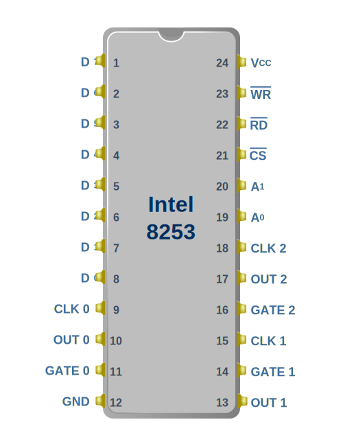
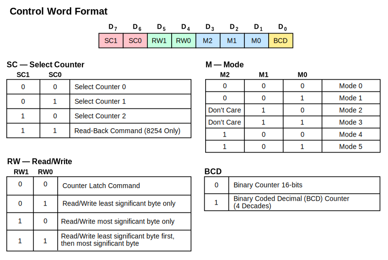
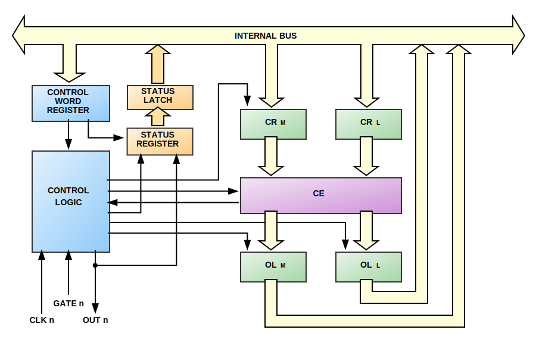
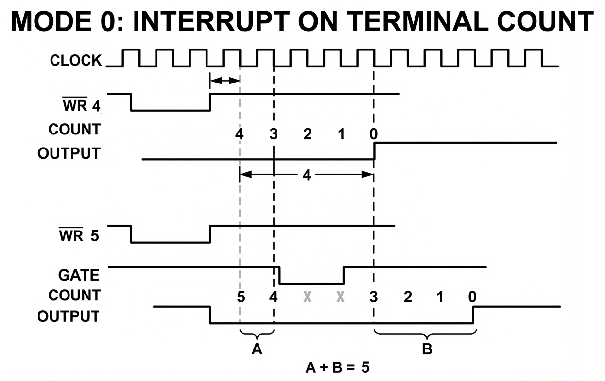
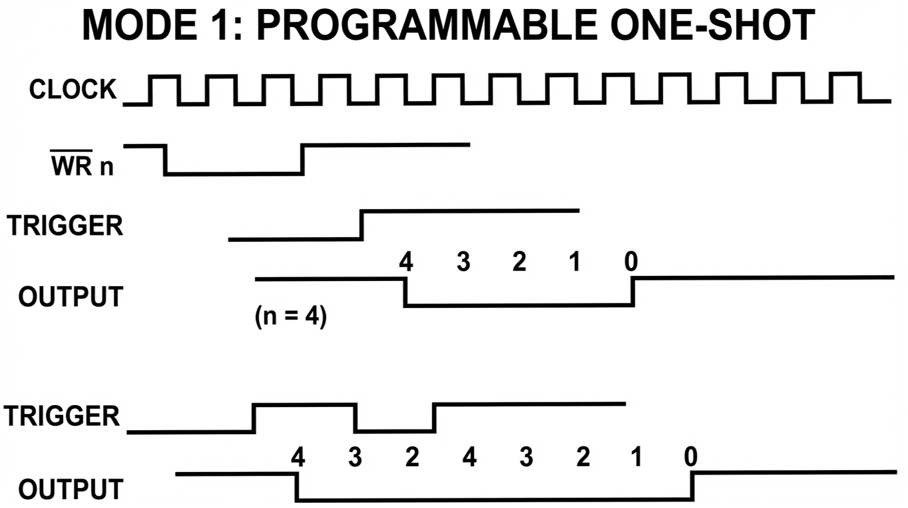
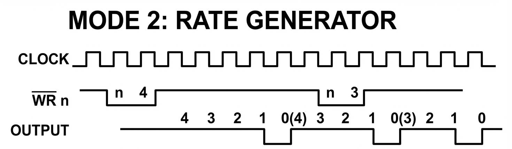
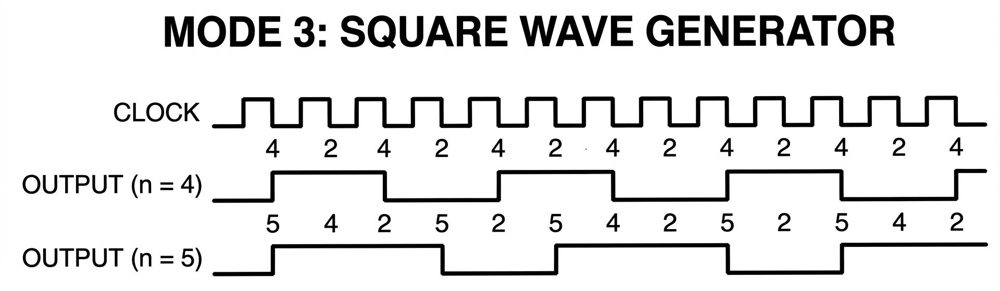
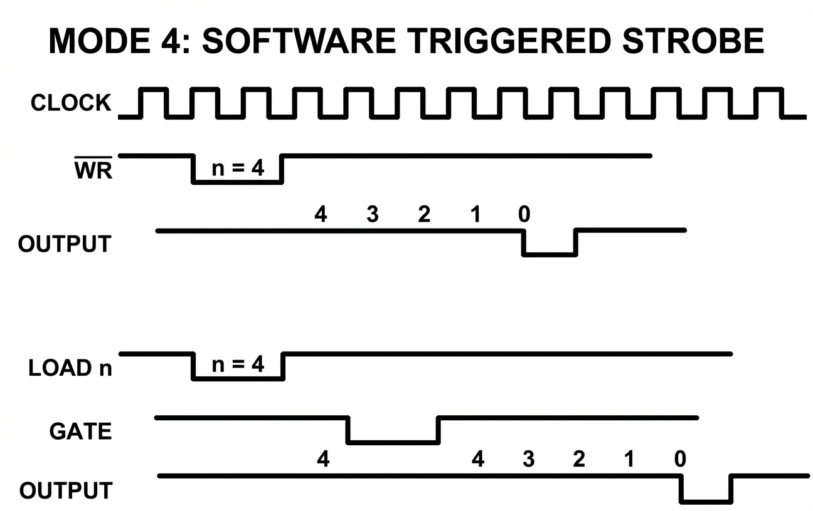
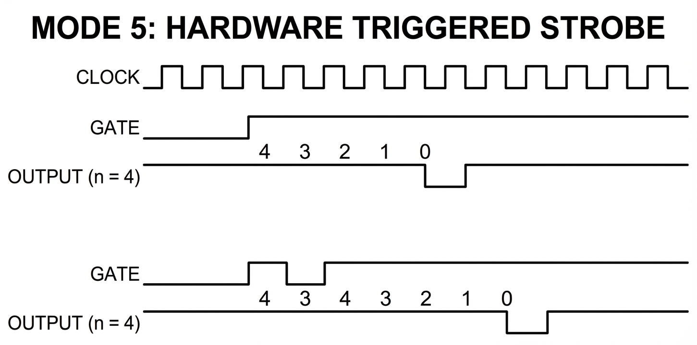

# The Intel 8253 Programmable Interval Timer

The 8253 Programmable Interval Timer (PIT) is responsible for a number of tasks on the IBM PC. It maintains the system time, drives DRAM refresh, and controls the PC speaker to generate sound.

## Overview

The PIT contains three independently operating 16-bit counters or 'channels', each capable of operating in different modes. 

Physically, each timer channel is assigned a clock input, a gate pin, and an output pin (OUT). The gate pin can be used to control or disable counting in specific modes.

Counters are operated by first configuring them by writing a [Control Word](#control-word-format) to the 8253's Control Word Register.  Then, an initial count - often referred to as a 'reload value' - is written directly to the timer channel port. A counter has a full 16-bit range, as an initial count of 0 is treated as a count of 65,536 in binary mode or \\(10^4\\) in BCD mode.

Once configured and running, on each tick of the channel's clock input, the channel's internal **Counting Element** decrements. When the counter reaches 0 (or 1 in some modes), some specific behavior will be triggered (depending on mode), usually changing the state of the channel's output pin.

The current value of a counter channel can be read at any time by reading from the channel's specified port.

## Pinout

  
  
<em>Figure 1: Intel 8253 Pinout</em>

The 8253 has an 8-bit data bus by which you read and write the chip's registers, which are selected by the `A0` and `A1` pins.

## IBM PC Timer Configuration

The 8253 has three independent clock input pins, allowing each counter to be driven at a different frequency. The IBM PC ties all three clock inputs to the same clock line, which runs at the system crystal frequency divided by 12.

$$f_{timer} = \frac{\frac{315}{22}}{12} \text{ MHz} = 1.19318\overline{18} \text{ MHz}$$

> **Note:** Other systems that use the 8253 can connect these timer clock inputs in different ways - even connecting one timer channel output to the clock input of another to act as a clock divisor.

| Timer   | Purpose      | Frequency | Connection                        |
|---------|--------------|-----------|-----------------------------------|
| Timer 0 | System Timer | 18.2 Hz   | System Timer Interrupt            |
| Timer 1 | DRAM Refresh | 15 μs     | DMA Controller for memory refresh |
| Timer 2 | Speaker      | Variable  | PC Speaker output                 |

### Timer 0

Timer 0's OUT pin is directly connected to the IR0 pin of the [8259A Programmable Interrupt Controller](pic-8259.md). When the Timer 0 OUT pin has a low-to-high transition, this will trigger an IRQ0. This causes an interrupt 8, which normally is configured to maintain the system's time of day clock by the BIOS. 

The BIOS initializes Timer 0 to a reload value of 0 (65,536)

$$
T = \frac{65536}{1.19318\overline{18}\times 10^{6}}
\approx 0.0549254\ \text{s}
$$

$$
T \approx 54.93\ \text{ms}
$$

$$
\frac{1\text{s}}{54.93\text{ms}} \approx 18.2Hz
$$

This will cause an Interrupt 8 to execute 18.2 times per second.

Many applications, especially games, will use Timer 0 for their own purposes, and so the time of day clock was notoriously inaccurate without being synchronized to a realtime clock module.

Timer 0's GATE pin is tied to +5v. 

### Timer 1

Timer 1's OUT pin connects to a 74LS74 flip-flop which latches its output. The output of this flip flop is connected to the DRQ0 pin of the [8237 DMA Controller](dma-8237.md), and is reset by the \\(\overline{\text{DACK0}}\\) signal. This causes one DMA transfer to occur in read mode, which refreshes the system's DRAM.

The BIOS initializes Timer 1 to a reload value of 18:

$$
T = \frac{18}{1.19318\overline{18}\times 10^{6}}
\approx 0.0000151\ \text{s}
$$

$$
T \approx 15.1\ \text{μs}
$$

$$
\frac{1\text{s}}{15.1\times 10^{-6}\text{s}} \approx 66.2\text{KHz}
$$

This will cause a DMA refresh request approximately every 15 microseconds, or every 72 clock cycles. If this sounds like a lot, it is. The DRAM refresh process robs the 8088 of about 5-6% of its performance, depending on bus activity.

> **Note:** You can ignore this channel if you are not interested in cycle-accuracy. However, the IBM PC BIOS does check that Timer 1 is running by checking that the DMA channel 0 is counting. You can hack your way around this test by just making the DMA channel 0 count on read.

Timer 1's GATE pin is tied to +5v. 

### Timer 2

Timer 2's OUT pin connects to the PC's speaker and cassette interface circuitry. Timer 2 is typically configured to produce square waves to drive the speaker to play notes of specific frequencies, and Timer 2's GATE input can be used to silence the speaker when desired.

For more details, see the [PC Speaker chapter](../io-devices/speaker.md).

Timer 2's GATE pin is tied to the 8255 PPI's Port B, Bit 0 (Pin #18).

### I/O Ports

The 8253 has two address lines, `A0` and `A1`, which allow selection of four ports.
These four ports are decoded by the PC at the following addresses:

| PC Port | 8253 Port | RW | Description             |
|---------|-----------|----|-------------------------|
| 0x40    | 0         | RW | Timer 0 Count Register  |
| 0x41    | 1         | RW | Timer 1 Count Register  |
| 0x42    | 2         | RW | Timer 2 Count Register  |
| 0x43    | 3         |  W | Control Word Register   |

## Control Word Format

The 8253's control word can be written to at port `0x43` and is used to configure one of the three counters, each of which can be configured with different modes. 

  
  
<em>Figure 2: Intel 8253 Control Word Format</em>

The specified channel's counting mode, IO mode, and whether or not it should count in BCD, is configured with a single 8-bit write. Note that using `0b11` as the timer selection is invalid on the 8253. On the 8254, it selects the read-back command, which will not be covered here.

## Counter Channel Configuration

### Binary vs BCD Mode

A timer channel can be configured to count in either binary or Binary Coded Decimal (BCD) mode. I have not seen any software that actually uses BCD mode. When writing your initial 8253 implementation, you can probably ignore BCD mode.

### RW Mode

A timer channel can be configured for 16-bit read/writes in `LSBMSB` mode using `0b11` in the `RW` field, or in one of two 8-bit read/write modes:

- `LSB` (`0b01`): 
  - On write, an 8-bit value is used to initialize the \\(\text{CR}_l\\) register, which holds the least significant 8 bits of the initial 16-bit count.
  - On read, the contents of the \\(\text{O}_l\\) register are returned. See [Counter Channel Operation](#counter-channel-operation).
- `MSB` (`0b10`): 
  - On write, an 8-bit value is used to initialize the \\(\text{CR}_m\\) register, which holds the most significant 8 bits of the initial 16-bit count.
  - On read, the contents of the \\(\text{O}_m\\) register are returned. See [Counter Channel Operation](#counter-channel-operation).

The 8-bit RW modes allow programming a timer channel with fewer writes. In `MSB` mode, the full range of a timer channel is available, with reduced granularity.

> **Note:** The RW mode of a channel does not affect its basic counting operation. It remains a full 16-bit counter internally regardless of input mode.

In `LSBMSB` mode, it takes two 8-bit writes to read or write to the timer channel. An internal latch keeps track of whether the initial `LSB` has been written. On a write, the first byte written is used to initialize the \\(\text{CR}_l\\) register. The second byte initializes the \\(\text{CR}_m\\) register. On a read, the first read returns the \\(\text{O}_l\\) register, the second read returns the \\(\text{O}_m\\) register.

> **Warning:** The 8253 cannot handle interleaved 16-bit read and write operations. In `LSBMSB` mode if you write one byte and then read one byte without completing the write operation, you will receive random data. Some software has been observed improperly operating the 8253 in this way, especially software designed for the 8254 which did not have this limitation. Ensure that your 8253 can recover in this scenario - what value you decide to return is up to you - the actual value is nondeterministic "open bus" behavior internal to the chip.

### Counter Latch Command

There is a small matter of concern when a channel is configured for `LSBMSB` mode. Since it takes two bytes to read the full 16-bit counter value, it is possible that the counter can decrement between the time the first byte is read and the second. Therefore, a **Counter Latch** command is provided. The Counter Latch command is sent by setting the `RW` field of the control word to `0b00`. This does not change the counter channel's configuration otherwise - the `Mode` and `BCD` bits are ignored when sending the counter latch command. See the [Counter Latch Operation](#counter-latch-operation) section below for how the latching is implemented.

## Counter Channel Operation

  
  
<em>Figure 3: Intel 8253 Counter Block Diagram</em>

There are a few important things to note in the channel block diagram above. The heart of the counter is the **Counting Element (CE)**. This is a 16-bit synchronous down-counter that contains the current count value. Above the CE are \\(\text{CR}_m\\) and \\(\text{CR}_l\\), two halves of the **Count Register (CR)**. The CR holds the initially configured count, and is used to reload the CE on terminal count in modes that do so.

The count value is transferred from the CR to the CE when a full write of the CR is complete. This may require one or two bytes, depending on the configured [RW Mode](#rw-mode).

Both Count Registers are **initialized to 0** whenever a channel's mode is set. This avoids leaving either of the CR registers in an indeterminate state when using either byte RW mode. 

### Counter Loading

Counter loading is not instantaneous on write. A CR is not loaded until the 8253 sees a full clock cycle with a rising and falling edge after the write occurs. If the specific mode requires that the CE be loaded immediately from the CR, all 16-bits are transferred at once.

A count can be loaded with any 16-bit value from `0-65,535`. To allow a full 16-bit range, **a count value of `0` is interpreted by the 8253 as a count value of `65536`**.

### Counter Latch Operation

Below the CE are \\(\text{O}_m\\) and \\(\text{O}_l\\), two halves of the **Output Latch**. When reading the count value from a channel, we are actually reading from the output latch. Typically, the output latch is updated each time the CE changes. When the **Counter Latch Command** is issued, the CE simply stops updating the Output Latch, essentially "freezing" the value inside at the point in which the latch command was issued.

When the Output Latch is fully read, which may take one or two bytes depending on the configured [RW Mode](#rw-mode), the Output Latch is "unfrozen" and will resume being updated by the CE on every tick.

The Output Latch operation can only be reset by fully reading the Output Latch. Issuing a new Counter Latch command will be ignored until the Output Latch is fully read.

### Clocking Logic

An 8253 timer channel generally takes an action, such as transferring the CR to CE or decrementing the CE on the next **falling edge** of its input clock. 

## Counter Operating Modes

Timer channels can be set to any of 6 different modes.

- **Mode 0**: [Interrupt on Terminal Count](#mode-0--interrupt-on-terminal-count)
- **Mode 1**: [Hardware Retriggerable One-Shot](#mode-1--hardware-retriggerable-one-shot)
- **Mode 2**: [Rate Generator](#mode-2--rate-generator)  
- **Mode 3**: [Square Wave Generator](#mode-3--square-wave-generator)
- **Mode 4**: [Software Triggered Strobe](#mode-4--software-triggered-strobe)
- **Mode 5**: [Hardware Triggered Strobe (Retriggerable)](#mode-5--hardware-triggered-strobe)

### Mode 0 — Interrupt on Terminal Count  

Upon setting this mode, OUT is initially LOW. This is the only mode where the initial OUT state is LOW after a mode is set.

In Mode 0, the counter counts down once per tick from the initial count until it reaches 0. When it reaches 0, **OUT goes high and stays high** until reprogrammed. The counter will continue to count, rolling over from 0 to `0xFFFF`, but no longer affects the state of the OUT pin.

> **Note:** The word "Interrupt" in this mode name can be a little misleading. Nothing about this mode is specific to generating interrupts. Interrupts are generated whenever timer channel 0's output has a rising edge. Therefore, any operating mode can generate interrupts with timer channel 0. Additionally, using the Interrupt on Terminal Count mode on any other timer channel will not generate an interrupt. 

#### Count Loading
- After setting the mode and initial count, the CR will be loaded into the CE on the next clock edge after the final write of the initial count.

#### Output Behavior
- **After mode set:** OUT → LOW
- **When countdown reaches 0:** OUT → HIGH (and remains HIGH)  
- **Upon writing new count:** OUT → LOW

#### GATE Behavior
- Level-triggered
- **GATE HIGH**: enables counting  
- **GATE LOW**: inhibits counting (freezes the countdown)  

#### Reload Behavior
- In 8-bit RW modes:
  - Writing either the `LSB` or `MSB` while the counter is running **forces OUT low** immediately.  
  - The CR will be loaded into the CE on the next clock edge.
- In `LSBMSB` RW mode:  
  - Writing the `LSB` while the counter is running **disables counting** and **forces OUT low** immediately.  
  - Writing the `MSB` will load the CR into the CE on the next clock edge.

#### Timing
- For initial count = N, OUT will go high up to N+1 timer clock cycles after the write.

  
  
<em>Figure 4: Timer Mode 0 - Interrupt on Terminal Count Timing</em>

---

### Mode 1 — Hardware Retriggerable One-Shot  

### Summary
This mode allows a low pulse of the OUT pin of a configurable length, triggerable via the GATE pin. This mode is inoperable on the IBM PC except on timer channel 2.

Upon setting this mode, OUT is initially HIGH. A rising edge of the GATE input will trigger OUT → LOW on the next clock edge. When the count reaches 0, OUT → HIGH. The counter will continue to count, rolling over from 0 to `0xFFFF`, but will not affect the state of the OUT pin until the counter is re-triggered.

We refer to a "trigger" as a LOW → HIGH transition of the GATE pin.

> **Note:** The count starts running as soon as Mode 1 is selected - but you'll note that the CE is not loaded until a GATE trigger. Presumably, the counting element still contains whatever it had in it when the mode was set, but this has not been verified.

#### Count Loading
- After setting the mode and initial count, the CR will hold the initial count but will NOT write it into the CE until a trigger occurs.

#### Output Behavior
- **After mode set:** OUT → HIGH 
- **After GATE LOW → HIGH:** OUT → LOW
- **At terminal count:** OUT → HIGH 

#### GATE Behavior
- Edge-triggered
- **GATE LOW -> HIGH:** Trigger. The CR is loaded into the CE on the next clock edge.
  - Since the trigger reloads the CE, another trigger will **restart** any count in progress.

#### Reload Behavior
- Writing a new count during an active count will not affect the current count until the next trigger, as the trigger controls loading of the CE from CR.

#### Timing

  
  
<em>Figure 5: Timer Mode 1 - Hardware Retriggerable One-Shot Timing</em>

---

### Mode 2 — Rate Generator  

### Summary
In this mode, OUT normally remains HIGH, but produces regular **one-clock-wide low pulses**. This mode is useful when a periodic LOW → HIGH transition is required. 

On the IBM PC, timer channel 1 is typically configured for Mode 2 to repeatedly generate the \\(DREQ0\\) signal.

#### Output Behavior
- **After mode set:** OUT → HIGH 
- **When count reaches 1:** OUT → LOW
- **When count reaches 0:** OUT → HIGH 

#### GATE Behavior
- Edge-triggered
- **GATE LOW -> HIGH:** Trigger. The CR is loaded into the CE on the next clock edge. Counting enabled.
- **GATE LOW:** OUT is forced HIGH, **counting disabled**.

#### Reload Behavior
- Writing a new count during an active count will not affect the current count until either a terminal count or a GATE trigger.
- CR is automatically loaded into the CE after terminal count is reached, restarting the count.

#### Constraints
- A count of 1 is invalid and will cause the timer channel not to function.

#### Timing

  
  
<em>Figure 5: Timer Mode 2 - Rate Generator Timing</em>

---

### Mode 3 — Square Wave Generator  

#### Summary
Similar to Mode 2, but produces a **square wave**: OUT alternates high and low with a 50% duty cycle (if the initial count is even). This is a general-purpose mode with many applications. The IBM BIOS sets timer channel 0 to Mode 3 to run the BIOS time-of-day clock. This mode can also be used to drive a tone of a specific frequency to the PC speaker on timer channel 2.

This mode is a bit more complex than the other modes. The 8253 creates a square wave of a period determined by the initial count by **decrementing the counting element by 2** instead of 1. This presents a problem if the initial count is odd, as we need to reach 0 to trigger the terminal count condition.

#### Odd Count Logic
Within the counter is a flip-flop I will call the **1/3 flip-flop**. This flip-flop is initially **0**.

- If the CE is odd, the 8253 will decrement it as follows:
  - If the 1/3 flip-flop is **0**, the CE will be decremented by 1. This sets the CE to an even value.
  - If the 1/3 flip-flop is **1**, the CE will be decremented by 3. This sets the CE to an even value.
- If the CE is even, the 8253 will decrement it by 2. 
- When the counter reaches terminal count (0), CE is reloaded by CR, and the **1/3 flip-flop is toggled**.

This is a somewhat awkward way of accounting for the one missed clock period per cycle we would otherwise accumulate over time with an odd count. The result of this logic is that the resulting square wave is HIGH for \\(\frac{N+1}{2}\\) clocks and LOW for \\(\frac{N-1}{2}\\) clocks.

> **Note:** The 8254 implements the logic for Mode 3 differently than the 8253. Refer to the 8254 datasheet for an accurate description if you are emulating an 8254.

The counter also has an **output flip-flop** that it uses in this mode to toggle the state of the OUT pin when terminal count is reached.

#### Output Behavior
- **After mode set:** OUT → HIGH 
- **At terminal count:** OUT toggles state

#### GATE Behavior
 - Edge-triggered
 - **GATE HIGH:** Trigger. The CR is loaded into the CE on the next clock edge. Counting enabled.
 - **GATE LOW:**  OUT → HIGH. Counting disabled.

#### Reload Behavior
 - Writing a new count during an active count will not affect the current count until either a terminal count or a GATE trigger.
 - CR is automatically loaded into the CE after terminal count is reached, restarting the count.

#### Timing

  
  
<em>Figure 6: Timer Mode 3 - Square Wave Generator Timing</em>

---

### Mode 4 — Software Triggered Strobe  

#### Summary
When the initial count reaches 0, OUT produces a **one-clock-wide low pulse**. This is similar to Mode 2, but with a distinct difference - in Mode 2, OUT goes low on a  count of 1, and HIGH again on a count of 0. In Mode 4, OUT goes low on a count of 0, then HIGH again on the next clock edge. The counter will continue to count, rolling over from 0 to `0xFFFF`, but will not affect the state of the OUT pin until the next count value is written.

Counting begins when the initial count is written (the "software trigger").

#### Output Behavior
- **After mode set:** OUT → HIGH 
- **At terminal count:** OUT → LOW for one clock period

#### Count Loading
- After writing the count, the CR is loaded into the CE on the next clock edge. Counting begins automatically on the following clock edge.
- Writing a new count during an active count will trigger a CR to be loaded into the CE at the next clock edge.
  - In `LSBMSB` mode, writing the first byte only has no effect.

#### GATE Behavior
 - Level-triggered
 - **GATE HIGH:** Counting enabled.
 - **GATE LOW:** Counting disabled.
 - GATE does not affect OUT.
 - GATE does not trigger a reload of the counter.

#### Timing

  
  
<em>Figure 7: Timer Mode 4 - Software Triggered Strobe Timing</em>

---

### Mode 5 — Hardware Triggered Strobe

#### Summary
Similar to Mode 4, but triggered by a LOW → HIGH transition of GATE. In Mode 5, OUT goes low on a count of 0, then HIGH again on the next clock edge. The counter will continue to count, rolling over from 0 to `0xFFFF`, but will not affect the state of the OUT pin until the counter is retriggered by the GATE pin.

> **Note:** The count starts running as soon as Mode 5 is selected - but you'll note that the CE is not loaded until a GATE trigger. Presumably, the counting element still contains whatever it had in it when the mode was set, but this has not been verified.

#### Output Behavior
- **After mode set:** OUT → HIGH 
- **At terminal count:** OUT → LOW for one clock period

#### GATE Behavior
- Edge-triggered
- **GATE LOW -> HIGH:** Trigger. The CR is loaded into the CE on the next clock edge. Counting enabled.
- GATE does not affect OUT,

#### Reload Behavior
 - Writing a new count value during an active count will not affect the current count until either a terminal count or a GATE trigger.

#### Timing

  
  
<em>Figure 7: Timer Mode 5 - Hardware Triggered Strobe Timing</em>

---

## Mode Summary Table

| N | Mode                             | OUT after Mode set | GATE mode        | Writing count reloads next clk | Automatic Reload | GATE initiates counting | GATE controls counting |
|---|----------------------------------|--------------------|------------------|-------------------------------|------------------|-------------------------|-------------------------|
| 0 | Interrupt on Terminal Count      | LOW                | Level-triggered  | YES                           | NO               | NO                      | YES                     |
| 1 | Hardware Retriggerable One Shot  | HIGH               | Edge-triggered   | NO                            | NO               | YES                     | NO                      |
| 2 | Rate Generator                   | HIGH               | Both             | NO                            | YES              | YES                     | YES                     |
| 3 | Square Wave Generator            | HIGH               | Both             | NO                            | YES              | YES                     | YES                     |
| 4 | Software Triggered Strobe        | HIGH               | Level-triggered  | YES                           | NO               | NO                      | YES                     |
| 5 | Hardware Triggered Strobe        | HIGH               | Edge-triggered   | NO                            | NO               | YES                     | NO                      |

---

## Edge Cases

Some interesting edge cases have been observed.  Consider the following scenario:

 - A timer channel is set to Mode 2 - Rate Generator, RW mode `LSBMSB`, and an initial count written, starting the count.
 - Only the `LSB` of a new count is written.
 - The timer reaches terminal count.  What value is loaded into the **Counting Element**?
 - Once the **Counting Element** has been reloaded, what happens when the `MSB` of the new count is then written?

If you have studied the counter channel block diagram, you may be able to figure out what should happen. The \\(\text{CR}_m\\) and \\(\text{CR}_l\\) registers are used to hold the programmed initial count, and the CE is reloaded from these registers. In addition, the counter keeps a flip-flop to keep track of the progress of writing a new count, and will write the contents of the CR registers to the CE when the write is complete (depending on mode). 

---

## The Intel 8254

The 8254 is an improved model of the 8253 and was used in the IBM AT. It would become the standard timer chip in PC compatible systems for many years.

### Changes in the 8254

- Faster clock inputs
- A channel state read-back command
- Resolves the issue with the 8253 where reads and writes to the same channel could not be interleaved without leaving the chip in an undefined state.
- Modified the logic of Mode 3 - Square Wave Generator.

If you wish to emulate the 8254 instead of the 8253, there's no real problem with doing so. 

## Emulation Tips

### Implementation Priority 

 - Implement these modes first:
   - Mode 3, Square Wave Generator
   - Mode 2, Rate Generator   
   - Mode 0, Interrupt on Terminal Count
 - Connect the output of Timer Channel 0 to IRQ0
 - Connect the 8255 PPI Port B bit 0 to the GATE of Timer Channel 2

## Primary Emulation Resources
 - (alldatasheet.com) [8253 Datasheet](https://www.alldatasheet.com/datasheet-pdf/pdf/66098/INTEL/8253.html)
 - (alldatasheet.com) [8254 Datasheet](https://www.alldatasheet.com/datasheet-pdf/pdf/66099/INTEL/8254.html)
 - (wiki.osdev.org): [Programmable Interval Timer](https://wiki.osdev.org/Programmable_Interval_Timer) - Mostly describes the 8254
 
## Further Reading
 - (wikipedia.org): [Intel 8253](https://en.wikipedia.org/wiki/Intel_8253)
 - (intel.com @ archive.org): [8254/82C54 Programmable Interval Timer](https://web.archive.org/web/20160617133551/http://www.intel.com:80/design/archives/periphrl/docs/7178.htm)

## References

<!-- [^8253-datasheet] [^8254-datasheet] -->

[^8253-datasheet]: *8253/8253-5 Programmable Interval Timer*. Intel Corporation, November 1986. Document Number: 231306-001. Available at: [8253/8253-5 Programmable Interval Timer](https://www.alldatasheet.com/datasheet-pdf/pdf/66098/INTEL/8253.html)

[^8254-datasheet]: *8254 Programmable Interval Timer*. Intel Corporation, August 1987. Document Number: 231164-004. Available at: [8254 Programmable Interval Timer](https://www.alldatasheet.com/datasheet-pdf/pdf/66099/INTEL/8254.html)
